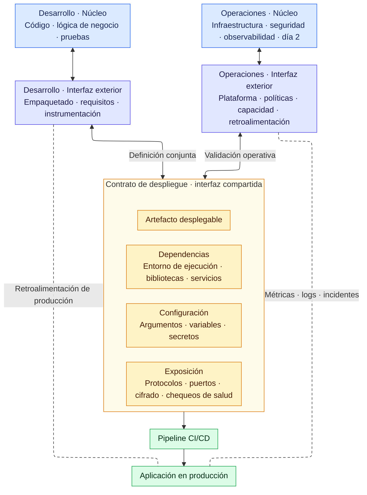

+++
title = "Introducción"
+++

:::inline-slide
## Bienvenida
:::

El objetivo de este curso es presentar las herramientas que AWS ofrece para desplegar aplicaciones con buenas prácticas
de integración y despliegue continuos (`CI/CD`).

Primero definiremos los conceptos que usaremos durante el curso. Luego explicaremos la mecánica del taller y la forma
de trabajo para las próximas semanas.

## La narrativa del taller

Durante cuatro semanas se desplegará y operará una aplicación web real de principio a fin,
sobre infraestructura de AWS. No se trata de ejercicios aislados: cada sesión avanza un paso
concreto de la misma historia. Al terminar la Semana 4, se contará con un flujo completo
para el despliegue de una aplicación, desde su desarrollo hasta su operación:

**CodeCommit → CodeBuild → ECR → ECS → CloudWatch**

{#tabla-servicios}
| Servicio | Rol en el pipeline |
| --- | --- |
| CodeCommit | Repositorio de código fuente |
| CodeBuild | Construcción de la imagen |
| ECR | Registro de imágenes Docker |
| CloudFormation | Infraestructura como código |
| ECS + Fargate | Ejecución de contenedores |


:::slide light
## La narrativa del taller

Una sola historia a lo largo de cuatro semanas:

**CodeCommit → CodeBuild → ECR → ECS → CloudWatch**
:::

:::slide
## Servicios utilizados durante el curso

{{tabla-servicios}}
:::

:::inline-slide
## Semana 1
:::

La primera semana establece los cimientos que el resto del taller supone conocidos. Al
terminar la sesión del viernes se contará con:

- Un **repositorio de código** en CodeCommit, con el código de la aplicación ya cargado.
- Un **pipeline de integración continua** en CodeBuild que, cada vez que se ejecuta,
  compila la imagen y la publica en Amazon ECR.
- La **aplicación en línea**: accesible desde el navegador a través de un Application
  Load Balancer, desplegada con un template de CloudFormation provisto por el instructor,
  sobre ECS/Fargate, conectada a una tabla de DynamoDB.

El template de CloudFormation se usa esta semana como una caja negra: se lanza y se
obtiene un ambiente funcional en minutos. Cómo está construida por dentro es el tema de
la Semana 2.

## El mecanismo de recuperación

Desde el primer día se practica destruir el ambiente completo y recrearlo desde cero.
Esto no es un ejercicio de destrucción: es el seguro del taller. Si algo sale mal en
cualquier sesión posterior (una configuración equivocada, un recurso corrompido) se
borra el stack de CloudFormation, se espera a que termine, y se lo vuelve a lanzar con los mismos
parámetros, dejándolo en el punto de partida anterior. El costo de un error se reduce a
minutos de espera.

::: warning
Si algo sale mal, borramos el `stack` de CloudFormation, esperamos a que termine, y lo volvemos a
lanzar con los mismos parámetros. El costo de un error se reduce a minutos de espera.
:::

:::slide
## El mecanismo de recuperación

Desde el primer día se practica **destruir y recrear** el ambiente completo.

::: warning
Si algo sale mal, borramos el `stack` de CloudFormation, esperamos a que termine, y lo volvemos a
lanzar con los mismos parámetros. El costo de un error se reduce a minutos de espera.
:::

:::

## Cómo usar esta guía

Cada sección combina teoría breve con práctica guiada paso a paso. El esquema es
siempre el mismo:

1. **Teoría** (10–15 min): el instructor presenta el problema del día y el servicio de
   AWS que lo resuelve. El instructor utilizará diapositivas directamente conectadas a
   esta guía, por lo que se puede seguir al instructor en cualquiera de las dos vistas.
2. **Práctica guiada**: seguir los pasos numerados en la guía. Intentar cada ejercicio
   antes de revelar la solución.
3. **Solución oculta**: si se producen bloqueos, pulsar el botón **Ver solución** bajo
   cada ejercicio. Aparecerán los clics exactos. Al final de cada sesión todos los
   participantes quedan en el mismo punto.
4. **Preguntas puente**: al terminar la sesión del miércoles (presencial), aparecen dos
   o tres preguntas que conectan lo construido con lo que viene el viernes (remota).
   Pensarlas antes de la siguiente sesión.

:::slide
## ¿Cómo utilizar esta guía?

1. **Teoría** — el problema del día y el servicio de AWS que lo resuelve.
2. **Práctica guiada** — seguir los pasos numerados; intentar antes de ver la solución.
3. **Solución oculta** — pulsar **Ver solución** si se producen bloqueos.
4. **Preguntas puente** — conectan el miércoles (presencial) con el viernes (remota).
:::

:::slide
## Requisitos previos

- **Cuenta AWS** con permisos para CodeCommit, CodeBuild, ECR, CloudFormation,
  ECS/Fargate y DynamoDB.
- **Navegador** actualizado (Chrome o Firefox).
- **Template** `taller-semana1.yaml`, provisto por el instructor.
:::

## Requisitos previos

Antes de comenzar, confirmar que se cuenta con lo siguiente:

- **Cuenta AWS** con permisos para CodeCommit, CodeBuild, ECR, CloudFormation, ECS y
  Fargate, y DynamoDB. En caso de duda, consultar con el instructor.
- **Navegador web** actualizado (Chrome o Firefox recomendados).
- **Template de CloudFormation** `taller-semana1.yaml`, también provisto por el
  instructor. Se utiliza en la sección 4.

:::inline-slide light
## Objetivos de la sesión

1. Crear el repositorio, clonarlo desde su origen y subir el código a CodeCommit
2. Construir la imagen con CodeBuild
3. Publicar la imagen en ECR
4. Desplegar el template de CloudFormation para el despliegue inicial

Cada ejercicio incluye su solución oculta — botón **Ver solución** en la guía.
:::

---

:::inline-slide light
## ¿Qué es DevOps?

Una combinación de prácticas culturales, servicios y herramientas que aumentan la
capacidad de entregar software a alta velocidad.

El objetivo es unificar las áreas de desarrollo y operaciones, las cuales comúnmente
suelen estar completamente separadas, para conseguir un mejor flujo desde el código
a la aplicación desplegada.
:::
:::slide light
### Contrato de Despliegue

:::

## La interfaz entre Desarrollo y Operaciones

Podemos representar la relación entre Desarrollo y Operaciones mediante una analogía con modelos por capas, como OSI
o núcleo/capa exterior (`core/shell`). Cada equipo concentra ciertas responsabilidades en su núcleo (`core`), pero
necesita una interfaz exterior (`shell`) para comunicarse con el otro.

Usaremos esta analogía para identificar los puntos de contacto y analizar las conversaciones que ambos equipos
necesitan para mantener un flujo continuo de información y evitar bloqueos.

Operaciones trabaja en la frontera entre la aplicación y su entorno de ejecución; no se limita a ejecutarla. Desarrollo
y Operaciones deben definir en conjunto cómo se expone la aplicación a los clientes. Estas decisiones incluyen los
protocolos de comunicación, la arquitectura, los chequeos de salud, el cifrado, los controles de seguridad y la
conectividad.

Ambos equipos deben participar en estas decisiones desde la definición del **artefacto desplegable**.

### El artefacto desplegable

El artefacto desplegable es la unidad que el pipeline entrega al entorno de ejecución. En el caso más simple, puede ser
el propio código fuente, entregado a Operaciones para su despliegue. Este modelo aparece con lenguajes interpretados o
de scripting, como Python, Ruby, PHP o JavaScript.

Sin embargo, entregar solo el código fuente deja una pregunta abierta: ¿requiere la aplicación algún proceso de
construcción antes del despliegue? El código fuente resulta suficiente cuando el despliegue consiste en copiarlo y
ejecutarlo; en los demás casos, el proceso necesita una definición explícita.

Una opción más sólida incorpora un proceso de construcción descrito mediante un script o una tarea, como un
`Makefile`. Este proceso puede producir un directorio, un archivo `tar`, un paquete o un binario. El script no es el
artefacto desplegable: define una forma reproducible de generarlo.

Aun así, el resultado de la construcción no siempre describe el despliegue completo. El contrato de despliegue también
debe especificar:

1. **Configuración:** argumentos, variables de entorno y secretos.
2. **Dependencias:** runtimes, bibliotecas, paquetes del sistema y servicios externos de red.

Desarrollo y Operaciones deben definir estos requisitos y acordar cómo los consume la aplicación. Muchas decisiones
dependen del entorno corporativo, su historia y las aplicaciones que ya están en producción. La solución correcta es
la que se ajusta a ese contexto, no necesariamente la más nueva, la más popular o la mejor en términos aislados.

Este punto genera fricción cuando Desarrollo queda fuera de las tareas del día 2 y no participa en la operación de los
sistemas en producción, y cuando Operaciones no tiene entrada en el día 1, durante el desarrollo del producto.

### Imágenes como artefactos desplegables

Las imágenes de contenedor y de máquina virtual también pueden servir como artefactos desplegables. Herramientas como
Packer y, según el flujo de trabajo, Ansible permiten construirlas o configurarlas.

Estas imágenes facilitan la gestión de las dependencias internas de la aplicación. El equipo de Desarrollo puede
definirlas y probarlas durante su propio flujo de trabajo en un entorno representativo de producción.

Sin embargo, adoptar imágenes como artefactos desplegables exige la participación de Operaciones en su diseño. Ambos
equipos deben acordar las imágenes base, el tamaño, las actualizaciones, las prácticas de seguridad, los puertos
expuestos, el tiempo de construcción, el tiempo de arranque y el rendimiento durante la ejecución.

:::inline-slide light
## Pipeline de entrega continua (CI/CD)

Busca automatizar el flujo desde los últimos cambios realizados a la aplicación
hasta su despliegue en producción, asegurando que cumple con los requisitos básicos
de calidad, así como con el contexto necesario para su monitoreo continuo en día 2.

```
+-------------------------+     +-------------------+
|           CI            |     |        CD         |
| Código -> Build -> Test | --> | Deploy -> Monitor |
|          Day 1          |     |       Day 2       |
+-------------------------+     +-------------------+
```
:::

