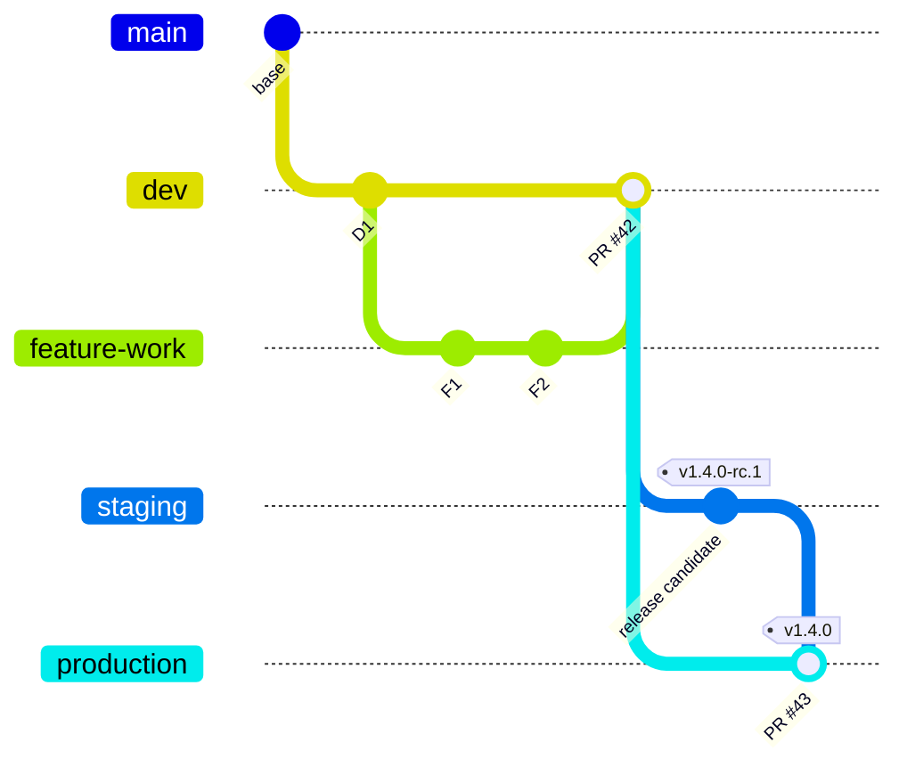
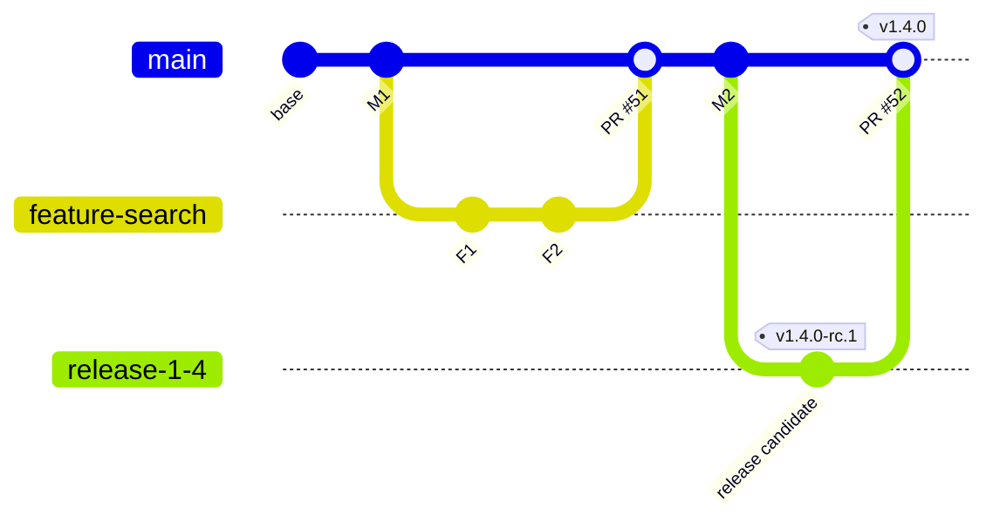
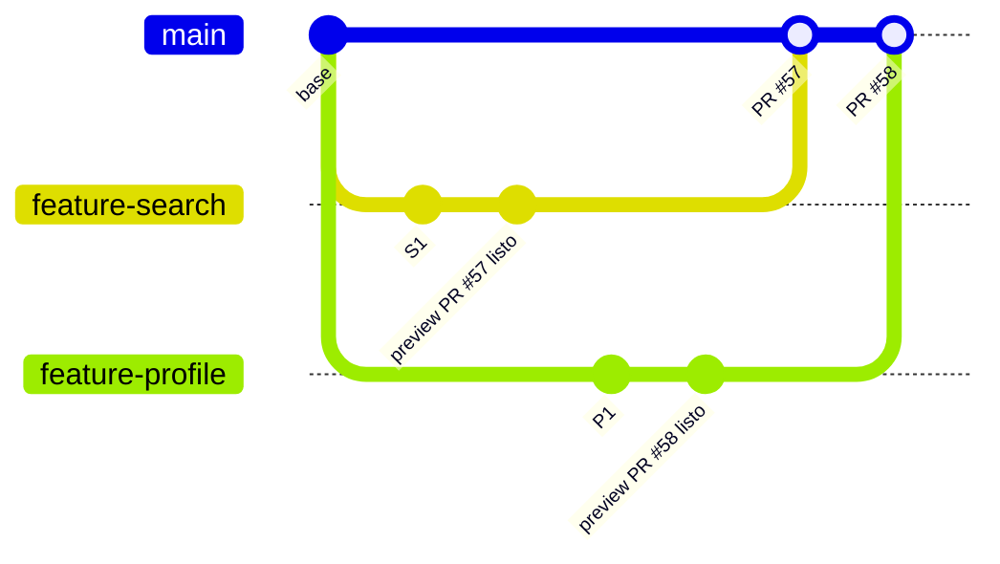

+++
title = "El origen del código — CodeCommit"
+++

::: warning
En julio de 2024 AWS cerró CodeCommit a clientes nuevos: solo las cuentas que ya
tenían repositorios podían crear más. Tras el reclamo de los clientes, AWS revirtió
la decisión y el **24 de noviembre de 2025** el servicio volvió a estar disponible
para todo el mundo. Hoy cualquier cuenta puede crear repositorios desde la consola,
la CLI o la API, y se pueden replicar los laboratorios en una cuenta personal.
:::

:::inline-slide light
## Pre-requisitos
:::

Completar estos pasos **antes de la sesión**.

:::inline-slide
### 1. Instalar git
:::

:::inline-slide
Obtener el cliente:

- **Windows**: descargar e instalar [Git for Windows](https://git-scm.com/download/win).
- **Mac**: ejecutar `xcode-select --install` en la Terminal, o si se tiene Homebrew:
  `brew install git` ([git-scm.com/download/mac](https://git-scm.com/download/mac)).

Verificar la instalación:

```bash
git --version
```
:::

:::inline-slide
### 2. Configuración mínima

```bash
git config --global user.name "Su Nombre"
git config --global user.email su-correo@ejemplo.com
```
:::

Hay tres vías de acceso. Elegir la que corresponda a la cuenta.

::: warning
**Las opciones 3 y 4 requieren un usuario IAM.** Si la organización usa AWS Identity
Center (SSO) para iniciar sesión, la identidad es federada y no existe un usuario IAM
— esas dos opciones no estarán disponibles. En ese caso, ir directamente a la
opción 5.
:::

:::inline-slide
::: warning
Existent múltiples formas de acceder a CodeCommit en AWS, las cuales dependen del tipo
de autenticación que usen.
:::
:::

:::slide light
Por favor, utilicen aquella que se adapta a su usuario.

1. Cuenta con usuario IAM: Acceso `HTTPS` o `SSH`
2. Cuenta con SSO y IAM Identity Center: `git-remote-codecommit`
:::


### 3. Acceso HTTPS (cuenta con usuario IAM)

En la [consola de IAM](https://console.aws.amazon.com/iam/home) → el usuario → pestaña **Security credentials** → sección
**HTTPS Git credentials for AWS CodeCommit** → pulsar **Generate credentials**.
Guardar el usuario y la contraseña generados; se necesitarán al hacer `git push`.

### 4. Acceso SSH (cuenta con usuario IAM)

Generar un par de claves si aún no se tiene uno:

```bash
ssh-keygen -t rsa -b 4096
```

Luego, en la [consola de IAM](https://console.aws.amazon.com/iam/home) → el usuario → **Security credentials** →
**SSH keys for AWS CodeCommit** → **Upload SSH public key**. Copiar el contenido
de `~/.ssh/id_rsa.pub` y pegarlo. Anotar el **SSH key ID** que IAM asigna
(comienza con `APKA…`).

Configurar `~/.ssh/config`:

```
Host git-codecommit.*.amazonaws.com
  User APKA................
  IdentityFile ~/.ssh/id_rsa
```

### 5. Acceso con IAM Identity Center (SSO)

Si se inicia sesión con **AWS IAM Identity Center** (antes AWS SSO), la identidad es
federada y **no existe un usuario IAM**, por lo que las opciones 3 y 4 no aplican.
Usar `git-remote-codecommit`, que autentica con las credenciales del perfil del
AWS CLI.

1. Instalar **AWS CLI v2** ([guía oficial](https://docs.aws.amazon.com/cli/latest/userguide/getting-started-install.html)).
2. Configurar un perfil con SSO y anotar el **nombre del perfil** asignado:

   ```bash
   aws configure sso
   ```

3. Instalar el ayudante de git (requiere Python):

   ```bash
   pip install git-remote-codecommit
   ```

4. Con esta vía, las URLs de CodeCommit toman la forma
   `codecommit::<región>://<perfil>@<nombre-del-repositorio>`; no se necesitan
   credenciales HTTPS ni claves SSH.

Elegir la vía que corresponda a la cuenta. Si se dispone de un usuario IAM, cualquiera de las
opciones 3, 4 o 5 funciona; si se usa Identity Center, usar la opción 5.

::: extra HTTPS, SSH o Identity Center: ¿cuál elegir?
**HTTPS** es la más simple de configurar (solo usuario y contraseña generados en
IAM), pero pide credenciales en cada operación salvo que se use un *credential helper*.
**SSH** requiere generar y registrar una clave, pero después autentica de forma
transparente. Ambas necesitan un **usuario IAM**. Si la cuenta usa **Identity
Center**, no existe usuario IAM: la única vía es `git-remote-codecommit` (opción 5),
que reutiliza la sesión del AWS CLI. Para el taller, usar la que corresponda a cómo
se inicia sesión en AWS.
:::

## El problema del código sin versionar

Imagine que se trabaja en equipo sobre los mismos archivos: ¿cómo saber quién cambió qué
y cuándo? ¿Cómo volver al estado de ayer si algo se rompió hoy? ¿Cómo trabajar en una
nueva funcionalidad sin afectar el código que ya funciona? Estos son los problemas que
el control de versiones resuelve.

Un sistema de control de versiones registra cada cambio en el código como un **commit**:
un punto en el tiempo con un autor, una fecha y un mensaje que describe qué se modificó.
El historial completo de commits forma el repositorio. Con él se puede navegar hacia
cualquier punto del pasado, comparar estados, y trabajar en paralelo sobre distintas
líneas de desarrollo llamadas **ramas** (*branches*).

:::inline-slide
## CodeCommit: repositorios Git administrados en AWS

**AWS CodeCommit** es un servicio de control de versiones compatible con Git, alojado
completamente en AWS. No requiere instalar ni operar ningún servidor: se crea el
repositorio desde la consola, y AWS se encarga de la disponibilidad, la seguridad, y
los respaldos.
:::

:::inline-slide
::: info
En este taller cada participante trabaja sobre su **propio repositorio individual**. Eso
evita conflictos entre participantes y permite avanzar a ritmo propio. El nombre
del repositorio sigue la convención `taller-aws-<su-nombre>`, donde `<su-nombre>` es
el primer nombre en minúsculas y sin acentos (por ejemplo: `taller-aws-maria`).
:::
:::


:::slide light
## Capacidades de la consola de CodeCommit
:::
### Herramientas

:::inline-slide light
#### 1. Code

Permite explorar los archivos y las carpetas de una rama, abrir su contenido y copiar
la URL para clonar el repositorio.
:::

:::inline-slide light
#### 2. Pull requests

Permite proponer la fusión de una rama en otra, revisar los cambios y registrar la
discusión antes de integrar el trabajo.
:::

:::inline-slide light
#### 3. Commits

Muestra el historial de cambios de la rama seleccionada. Cada commit identifica quién
hizo el cambio, cuándo lo realizó y qué archivos modificó.
:::

:::inline-slide light
#### 4. Branches

Lista las líneas de desarrollo del repositorio y permite crear una rama a partir de
otra, por ejemplo `dev` desde `main`.
:::

:::inline-slide light
#### 5. Git tags

Permite identificar un commit con un nombre estable, como `v1.0.0`, para señalar una
versión, una entrega o un punto importante del historial.
:::

:::inline-slide light
#### 6. Settings

Centraliza la configuración del repositorio, como los disparadores (*triggers*), las
reglas de aprobación y las notificaciones. Las opciones disponibles dependen de los
permisos de IAM.
:::

### Eventos, controles y pipelines

Cada acción relevante en Git —un *push*, la apertura o actualización de un PR, un
*merge* o la creación de un tag— puede publicar un evento. Operaciones puede suscribirse
a esos eventos mediante *webhooks*, triggers o servicios de eventos para iniciar un
pipeline. Así se automatizan tareas como `fmt`, `lint`, `build`, pruebas y despliegues,
pero también controles de seguridad: detectar secretos expuestos, verificar
dependencias y confirmar que las migraciones de base de datos se ejecutan sin errores.

Estos controles pueden intervenir antes de la integración: una regla de aprobación o
un pipeline que falla debe impedir el *merge* hasta que el cambio cumpla los requisitos
del equipo. En las próximas secciones configuraremos estas herramientas para convertir
el flujo acordado en integración y despliegue continuos.

## GitOps

GitOps conecta el flujo de desarrollo con la operación de los ambientes. La idea no es
que Operaciones controle cada cambio manualmente, sino acordar cómo los cambios de Git
avanzan hasta un despliegue seguro. Para ello, Desarrollo y Operaciones necesitan
compartir el significado de las ramas, los *pull requests* (PRs), las etiquetas y los
eventos que desencadenan automatizaciones.

:::slide light
## GitOps

### Del cambio al despliegue controlado

1. **Branches** definen dónde se integra y prueba el código.
2. **PRs** hacen visible la revisión y la aprobación.
3. **Tags** identifican una versión concreta que se puede desplegar.
4. **Eventos** conectan los cambios con los pipelines y los controles operativos.
:::

### El flujo de desarrollo es un acuerdo

La rama `dev` del ejemplo anterior es un punto de integración, no una regla universal.
Cada empresa elige un flujo según sus equipos, su infraestructura y los ambientes de
prueba disponibles. Lo importante es que Desarrollo y Operaciones entiendan el mismo
acuerdo: qué representa cada rama, quién aprueba un PR, qué cambio puede ir a cada
ambiente y qué versión está en producción.

### Estrategia con ramas por ambiente

Un enfoque frecuente mantiene ramas que representan ambientes: `dev`, `qa` y
`production`. Los desarrolladores crean ramas de trabajo a partir de `dev` y abren PRs
contra ella. Otros desarrolladores revisan el código, los criterios de aceptación y las
reglas del equipo. Cuando el PR se aprueba y fusiona, el cambio entra en `dev`.

{#diagrama-flujos-de-aprobacion}


{#info-flujos-de-aprobacion}
::: info
Cada círculo representa un **commit** y cada carril, una **branch**. La rama
`feature-work` se integra en `dev` con el *merge* del **PR #42**; después, el commit
promovido a `staging` recibe el tag `v1.4.0-rc.1`. Finalmente, el **PR #43** promueve
esa versión a `production` y la identifica con el tag `v1.4.0`.
:::

Luego se promueven los cambios a `staging` para probar un *release candidate* y, cuando
están listos para producción, a `production`. Este modelo hace muy visible qué código
corresponde a cada ambiente. A cambio, hay que evitar que las ramas se alejen entre sí
y definir con cuidado cómo se propagan las correcciones urgentes.

:::slide light
## Flujos de Aprobación

{{diagrama-flujos-de-aprobacion}}

:::

### Estrategia de trunk-based development

Otra alternativa es trabajar con una única rama principal, o *trunk*, normalmente
`main`. Cada desarrollador abre un PR contra `main` y, al fusionarlo, su punta se
considera código listo para desplegar en desarrollo. Para probar una versión en
`staging` se puede crear una rama de *release*, o se puede marcar el commit con un tag,
por ejemplo `v1.4.0`. Ese tag identifica exactamente qué versión se está promoviendo y
puede ser la entrada del despliegue a producción.

{#diagrama-trunk-based}


::: info
En este flujo, `main` es el *trunk*: las ramas de funcionalidad viven poco tiempo y
se integran mediante PRs. La rama `release-1-4` es opcional; permite validar un
candidato antes de su *merge*. El tag `v1.4.0` señala el commit exacto que se puede
promover a producción.
:::

:::slide light
## Trunk-based development

{{diagrama-trunk-based}}
:::

### Ambientes efímeros por PR

Con más cambios producidos por asistentes y agentes de código, es especialmente útil
validar antes de fusionar. Un patrón cada vez más usado crea un ambiente efímero por
PR: un *sandbox* que emula lo necesario del ambiente productivo para probar esa
funcionalidad sin afectar a los demás equipos. Al fusionar o cerrar el PR, la
automatización elimina los recursos. Esto reduce el riesgo de probar cambios aislados
y da a Desarrollo, QA y Operaciones una evidencia compartida antes del *merge*.

{#diagrama-ambiente-efimero}


::: info
Las dos ramas de funcionalidad y sus PRs existen en paralelo. Cada commit de
`preview ... listo` representa que su pipeline creó un ambiente efímero independiente
para ese PR y superó las validaciones. Al fusionar o cerrar el PR, la automatización
elimina los recursos de su ambiente; no son ramas ni tags permanentes.
:::

:::slide light
## Ambientes efímeros por PR

{{diagrama-ambiente-efimero}}
:::

### Gestión de datos entre ambientes

:::inline-slide light
## Gestión de datos

Los datos y las dependencias externas determinan qué tan fiel puede ser cada ambiente
de prueba, especialmente cuando el ambiente nace para un PR y desaparece al terminar.

::: info
Cuando contamos con _ambientes persistentes_, la información puede crecer de forma
orgánica, ser administrada por un equipo de datos o provenir de una sincronización
controlada desde producción. Con procedimientos repetibles.
:::
:::

En los dos enfoques con ambientes persistentes, cada ambiente suele tener su propia
infraestructura y sus propias bases de datos. La información puede crecer de forma
orgánica, ser administrada por un equipo de datos o provenir de una sincronización
controlada desde producción. Con procedimientos repetibles —migraciones, *seeds*,
enmascaramiento y restauraciones— es posible mantener datos ricos, válidos y seguros
para Desarrollo y QA.

La práctica requiere proteger la información de producción: nunca se deben copiar
secretos ni datos personales sin las políticas, permisos y transformaciones adecuadas.
Los datos sintéticos, anonimizados o seleccionados para cada caso de prueba suelen ser
la opción más segura y fácil de reproducir.

En los ambientes efímeros el desafío cambia. La infraestructura se crea de forma
dinámica para cada PR, por lo que también se debe producir dinámicamente una fuente de
datos útil. La factibilidad del patrón depende, en gran medida, de qué tan fácil sea
crear un equivalente de las fuentes de datos productivas.
:::slide
::: warning
En los ambientes efímeros el desafío cambia. La infraestructura se crea de forma
dinámica para cada PR, por lo que también se debe producir dinámicamente una fuente de
datos útil. La factibilidad del patrón depende, en gran medida, de qué tan fácil sea
crear un equivalente de las fuentes de datos productivas.

Por eso, antes de adoptar ambientes efímeros, Desarrollo, QA, Datos y Operaciones deben
acordar qué datos necesita cada prueba, cómo se generan, cuánto tardan en prepararse y
qué dependencias se pueden emular. Esa conversación define si el ambiente será una
validación confiable o solo una aproximación superficial.
:::
:::

Si la aplicación solo necesita una base SQL, puede bastar con SQLite, un contenedor de
base de datos o un respaldo periódico restaurado al crear el ambiente. A medida que el
sistema incorpora varias bases de datos, colas, índices, archivos y servicios externos,
la preparación de datos y dependencias se vuelve más costosa. Para servicios de
terceros, a menudo se usan *sandboxes*, simuladores (*mocks*) o contratos de prueba.

Por eso, antes de adoptar ambientes efímeros, Desarrollo, QA, Datos y Operaciones deben
acordar qué datos necesita cada prueba, cómo se generan, cuánto tardan en prepararse y
qué dependencias se pueden emular. Esa conversación define si el ambiente será una
validación confiable o solo una aproximación superficial.


## ¿Existe una mejor opción?

No existe un flujo de ramas superior en todos los contextos. La decisión no debería
responder a una preferencia personal, sino al riesgo, la frecuencia de despliegue, la
madurez de las pruebas, los requisitos de auditoría y los ambientes disponibles.

:::slide
## ¿Existe una mejor opción?
No existe un flujo de ramas superior en todos los contextos.

{{texto-mejor-opcion}}
:::

Las ramas por ambiente hacen explícita la promoción entre `dev`, `staging` y
`production`, pero exigen mantenerlas sincronizadas. El *trunk* reduce esa divergencia
y acelera la integración, pero requiere cambios pequeños, pruebas confiables y una
disciplina de despliegue frecuente.

{#texto-mejor-opcion}
Elegir un modelo es acordar un lenguaje común: qué representa cada rama, qué controles
debe pasar un PR, cómo se identifica una versión y cuándo se despliega. Un flujo simple,
visible y entendido por Desarrollo y Operaciones es más valioso que seguir una receta
popular que no encaja con la organización.

:::inline-slide
## Práctica guiada: crear el repositorio y subir el código

## CodeCommit
:::

:::inline-slide light
#### Consola

1. Iniciar sesión en la consola de AWS en [console.aws.amazon.com](https://console.aws.amazon.com).
2. Abrir [**CodeCommit**](https://console.aws.amazon.com/codesuite/codecommit/home).
3. Confirmar que la región seleccionada (esquina superior derecha) es la misma que
   indicó el instructor. El taller usa una única región para todos los recursos.

::: info
Usaremos la región **`us-east-2`**.
:::
:::

:::inline-slide light
### Crear el repositorio

1. Pulsar **Create repository**.
2. En **Repository name**, escribir `taller-aws-<su-nombre>`. Usar el primer nombre en
   minúsculas y sin acentos (por ejemplo: `taller-aws-carlos`).
3. En **Description** (opcional), escribir una descripción breve, por ejemplo:
   `Repositorio del taller AWS DevOps — Semana 1`.
4. Dejar las demás opciones con sus valores predeterminados y pulsar **Create**.

::: info
CodeCommit crea el repositorio vacío en segundos y lleva a la vista principal del
repositorio.
:::
:::


### Clonar el código desde GitHub

::: extra Los comandos de git que se usarán
- `git clone <url>` — copia un repositorio remoto completo a la máquina, con todo su historial.
- `git remote -v` — lista los remotos configurados y sus URLs.
- `git remote add <nombre> <url>` — registra un remoto adicional bajo un nombre.
- `git push -u <remoto> <rama>` — sube los commits de una rama al remoto, y con `-u` recuerda la asociación para futuros `git push`.
- `git status` — muestra el estado del directorio de trabajo.
- `git log` — muestra el historial de commits.
:::

Clonar el repositorio del taller desde GitHub y entrar al directorio:

```bash
git clone https://github.com/cloudbridgeuy/courses
cd courses
```

### Conectar el repositorio de CodeCommit

En la vista del repositorio recién creado en la consola, pulsar el botón **Clone URL**
y copiar la URL correspondiente al método de acceso configurado:

- **HTTPS**: `https://git-codecommit.<región>.amazonaws.com/v1/repos/taller-aws-<su-nombre>`
- **SSH**: `ssh://git-codecommit.<región>.amazonaws.com/v1/repos/taller-aws-<su-nombre>`
- **Identity Center (grc)**: `codecommit::<región>://<perfil>@taller-aws-<su-nombre>`
  (no aparece en el botón **Clone URL**; construirla con la región y el nombre del perfil).

Agregar CodeCommit como remoto adicional:

```bash
git remote add codecommit <url-copiada>
```

Verificar que ambos remotos estén registrados:

```bash
git remote -v
```

Debe verse `origin` (GitHub) y `codecommit`.

::: extra ¿Qué es un repositorio remoto?
Un *remoto* es una copia del repositorio alojada en otro servidor. `origin` es solo
el nombre convencional del remoto desde el que se clonó. Un mismo repositorio local
puede tener varios remotos: aquí GitHub queda como fuente de lectura (`origin`) y
CodeCommit como destino de trabajo (`codecommit`).
:::

### Subir el código

Subir la rama `main` a CodeCommit:

```bash
git push -u codecommit main
```

Con HTTPS, git pedirá el usuario y la contraseña generados en IAM. Con SSH, la
autenticación es transparente gracias al archivo `~/.ssh/config`.

### Explorar la vista del repositorio

1. Una vez subido el código, navegar por las secciones de la vista del repositorio:
    1. **Code**: muestra los archivos y carpetas. Pulsar cualquier archivo para ver su
      contenido.
    2. **Pull requests**: reúne las propuestas de fusión entre ramas y su revisión.
    3. **Commits**: muestra el historial. Pulsar un commit para ver exactamente qué cambió.
    4. **Branches**: muestra las ramas existentes. Por ahora solo existe `main`.
    5. **Git tags**: muestra las etiquetas que marcan versiones o commits importantes.
    6. **Settings**: contiene la configuración y las automatizaciones del repositorio.

## 4. Branches: la rama `dev`

Una rama (*branch*) es una línea paralela de desarrollo. Los cambios en una rama no
afectan a las demás hasta que se fusionan explícitamente. La convención habitual es
mantener `main` siempre con código funcional y trabajar los cambios en ramas
separadas antes de incorporarlos.

### Crear la rama `dev` desde la consola

1. En la pestaña **Branches**, pulsar **Create branch**.
2. En **Branch name**, escribir `dev`.
3. En **Branch from**, seleccionar `main` (la rama de la que derivará).
4. Pulsar **Create branch**.

La rama `dev` aparece ahora en la lista. Comparte todos los commits de `main`
en este momento —es una copia exacta del estado actual.

## 2. Pull requests: revisar e integrar cambios

Un *pull request* propone incorporar los cambios de una rama de origen en una rama de
destino. Por ejemplo, al terminar un cambio en `dev`, se puede abrir un pull request
contra `main`. La pantalla muestra los commits y las diferencias de archivos, permite
dejar comentarios y, si se cumplen las reglas configuradas, fusionar las ramas.

Para crear uno desde la consola:

1. Abrir **Pull requests** y pulsar **Create pull request**.
2. Elegir la rama de origen, por ejemplo `dev`, y la rama de destino, por ejemplo
   `main`.
3. Escribir un título y una descripción que expliquen el cambio; revisar la pestaña
   de diferencias (*Changes*).
4. Crear el pull request. Tras la revisión, pulsar **Merge** para integrar los
   cambios en la rama de destino.

::: info
En un repositorio de equipo, la revisión y las aprobaciones ayudan a proteger `main`.
En este taller el pull request ilustra el flujo, aunque cada participante trabaje en
su propio repositorio.
:::

## 5. Git tags: marcar una versión

Una etiqueta Git (*tag*) asigna un nombre legible a un commit concreto. A diferencia de
una rama, no es una línea de trabajo: sirve para conservar una referencia a una versión
o entrega, por ejemplo `v1.0.0`.

Desde **Git tags**, pulsar **Create Git tag**, indicar el nombre de la etiqueta y
seleccionar el commit que se quiere marcar. Antes de crearla, confirmar que el commit
corresponde a la versión que se desea conservar; luego la etiqueta aparecerá en la
lista y en el historial del repositorio.

## 6. Settings: configurar el repositorio

Abrir **Settings** para consultar y administrar las opciones del repositorio. Allí se
pueden configurar disparadores que reaccionan a eventos de Git, plantillas de reglas
de aprobación para pull requests y notificaciones de actividad. Usar estas opciones
cuando el repositorio necesite automatizar una acción o establecer revisiones antes de
fusionar cambios.

::: warning
No todas las cuentas pueden cambiar la configuración. Si una opción no aparece o AWS
deniega la acción, solicitar al administrador los permisos de CodeCommit necesarios.
:::

## 3. Commits: localizar el ID del commit

1. Pulsar sobre el nombre de la rama `dev` para abrirla.
2. En la pestaña **Commits**, se verá el historial. El **commit ID** es el identificador
    hexadecimal largo que aparece junto a cada commit (por ejemplo:
    `a1b2c3d4e5f6...`). Copiar los primeros 8 caracteres —son suficientes para
    identificar un commit de forma única en este repositorio.

---

{#ejercicio-1}
### Ejercicio 1 — Clonar, conectar y subir el código

Clonar el repositorio `https://github.com/cloudbridgeuy/courses` desde GitHub, crear
un repositorio de CodeCommit llamado `taller-aws-<su-nombre>`, agregarlo como
remoto, y subir la rama `main`.

::: solucion
1. Clonar el código y entrar al directorio:

   ```bash
   git clone https://github.com/cloudbridgeuy/courses
   cd courses
   ```

2. Abrir [**CodeCommit**](https://console.aws.amazon.com/codesuite/codecommit/home), pulsar **Create repository**, y
   crear `taller-aws-<su-nombre>` (el primer nombre en minúsculas, sin acentos).
3. Agregar CodeCommit como remoto, según el acceso configurado en los
   pre-requisitos:

   ```bash
   # Variante HTTPS (usuario IAM) — copiar la Clone URL del repositorio
   git remote add codecommit https://git-codecommit.<región>.amazonaws.com/v1/repos/taller-aws-<su-nombre>

   # Variante SSH (usuario IAM) — copiar la Clone URL del repositorio
   git remote add codecommit ssh://git-codecommit.<región>.amazonaws.com/v1/repos/taller-aws-<su-nombre>

   # Variante Identity Center (grc) — construirla con la región y el perfil
   git remote add codecommit codecommit::<región>://<perfil>@taller-aws-<su-nombre>
   ```

4. Verificar los remotos con `git remote -v` — deben verse `origin` (GitHub) y
   `codecommit`.
5. Subir la rama `main`:

   ```bash
   git push -u codecommit main
   ```
6. En la [consola de CodeCommit](https://console.aws.amazon.com/codesuite/codecommit/home), abrir el repositorio: los archivos aparecen en la
   pestaña **Code**.

::: warning
Puede ser necesario que tengan que configurar el perfil que van a utilizar
con la variable de entorno `AWS_PROFILE`.
:::

::: info
Con HTTPS, git pedirá el usuario y la contraseña generados en IAM. Con
Identity Center (grc), se reutiliza la sesión activa de la `awscli`.
:::
:::

---

{#ejercicio-2}
### Ejercicio 2 — Crear una rama y encontrar su commit

Desde la [consola de CodeCommit](https://console.aws.amazon.com/codesuite/codecommit/home), crear la rama `dev` a partir de `main`. Luego
localizar el ID del commit más reciente en esa rama.

::: solucion
1. En la vista del repositorio, pulsar la pestaña **Branches**.
2. Pulsar **Create branch**.
3. En **Branch name**, escribir `dev`.
4. En **Branch from**, seleccionar `main`.
5. Pulsar **Create branch**. La rama aparece en la lista.
6. Pulsar sobre el nombre `dev` para abrirla.
7. Seleccionar la pestaña **Commits**. El commit más reciente aparece al tope de la
   lista.
8. El **commit ID** es el identificador hexadecimal largo junto al commit. Los primeros
   8 caracteres son suficientes para identificarlo de forma única. Anotarlos — se
   usarán como referencia en la Semana 2.
:::

:::slide light
{{ejercicio-1}}
:::

:::slide light
{{ejercicio-2}}
:::
