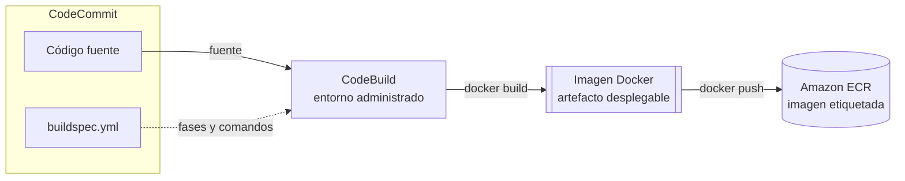
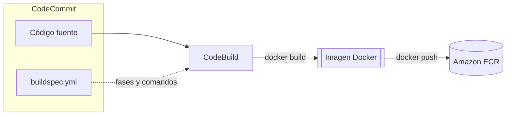

+++
title = "Integración continua — CodeBuild, y ECR"
+++

:::inline-slide
## Problema: ¿Como construir de forma reproducible?

El código fuente no se despliega directamente: primero se transforma en un
**artefacto desplegable**. En este ejemplo, el artefacto es una imagen de contenedor
construida a partir del `Dockerfile` en la raíz del repositorio.
:::

Construirla en la máquina de cada desarrollador parece sencillo, pero incorpora
diferencias difíciles de detectar: sistema operativo, arquitectura del procesador,
versiones de herramientas y dependencias instaladas. Docker reduce esas diferencias,
pero no las elimina. Por ejemplo, una imagen creada en macOS sobre ARM, sin indicar
`--platform linux/amd64`, puede no ejecutarse en un servidor x86.

La integración continua ejecuta el build en un entorno **estándar, limpio y
reproducible**. Así, cada commit o tag produce un artefacto cuyo origen y proceso de
construcción se pueden verificar, sin depender de una máquina local.

:::inline-slide light
## Respuesta en AWS: CodeBuild y Amazon ECR
:::

**AWS CodeBuild** es un servicio de `build` totalmente administrado. Se le indica la
fuente, la imagen del entorno de construcción y los comandos que debe ejecutar.
CodeBuild aprovisiona un entorno limpio, ejecuta el trabajo y libera los recursos al
terminar. No hay servidores de build que mantener.

:::inline-slide
### ¿Qué expresa un `buildspec.yml`?

Un `buildspec.yml` es una especificación YAML que funciona como el pequeño DSL de
CodeBuild: declara las fases del trabajo y los comandos que se ejecutan en cada una.

```yaml
version: 0.2

phases:
  install:
    commands:
      - npm ci
  build:
    commands:
      - npm test
      - docker build -t app:$IMAGE_TAG .
```

- `version` selecciona la versión del formato de *buildspec*.
- `phases` organiza el proceso; las fases permitidas son: `install`, `pre_build`, `build` y
  `post_build`.
- `commands` contiene la lista de órdenes de shell de cada fase, ejecutadas en orden.
- También puede declarar `env`, `artifacts`, `cache` y `reports`.

:::

:::inline-slide light
### ¿Qué es Amazon ECR?

**Amazon Elastic Container Registry (ECR)** es el registro de imágenes de contenedores de AWS. Como [DockerHub](https://hub.docker.com/)

Una vez construida la imagen Docker, hay que guardarla en algún lugar. **Amazon ECR**
(Elastic Container Registry) es el servicio de AWS para almacenar imágenes Docker de
forma privada y segura. Cuando ECS necesite lanzar el contenedor en la Semana 3, irá a
buscar la imagen directamente a ECR.
:::

### Flujo Completo



## Artefactos desplegables: construir una vez, promover muchas veces

El resultado de CodeBuild no es solo una imagen Docker: es el **artefacto desplegable**
que conecta el cambio de código con un despliegue. Debe poder responderse con precisión
qué commit, qué PR o qué tag de Git produjo una imagen, qué validaciones superó y en
qué ambientes se utilizó.

En un pipeline de equipo, un evento de Git inicia el trabajo adecuado: un PR puede
ejecutar `lint`, pruebas, análisis de seguridad y un ambiente efímero; un *merge* o un
tag de release puede construir la imagen candidata. Cuando esa imagen se aprueba para
otro ambiente, se promueve **el mismo artefacto**, sin reconstruirlo. Así, `staging` y
producción prueban y ejecutan exactamente los mismos bytes.

Para lograrlo, conviene identificar las imágenes con una referencia inmutable o
inequívoca: el SHA del commit, un tag de versión como `v1.4.0`, o el *digest* que ECR
asigna a la imagen. Una etiqueta mutable como `latest` es cómoda para un laboratorio,
pero no indica qué versión se está desplegando y puede cambiar entre dos operaciones.

:::inline-slide light
## El artefacto conecta Git y el despliegue

`commit` o `tag` → validaciones → imagen en ECR → promoción del mismo artefacto

**No se vuelve a construir una imagen para cada ambiente.**
:::

:::slide
## Del código a la imagen publicada

Ahora que tenemos el código en un lugar que controlamos, tenemos que producir
el artefacto desplegable de este proyecto: una imagen de contenedor.


:::

## El archivo `buildspec.yml`

El archivo `buildspec.yml` está incluido en el `.zip` de la aplicación, en la raíz del
proyecto. Es el contrato entre el código y CodeBuild: describe exactamente qué comandos
ejecutar en cada fase del build.

El archivo tiene este aspecto:

```yaml
version: 0.2

phases:
  pre_build:
    commands:
      - echo Autenticando con Amazon ECR...
      - aws ecr get-login-password --region $AWS_DEFAULT_REGION |
          docker login --username AWS --password-stdin
          $AWS_ACCOUNT_ID.dkr.ecr.$AWS_DEFAULT_REGION.amazonaws.com
      - IMAGE_URI=$AWS_ACCOUNT_ID.dkr.ecr.$AWS_DEFAULT_REGION.amazonaws.com/$IMAGE_REPO_NAME
  build:
    commands:
      - echo Construyendo la imagen Docker...
      - docker build -t $IMAGE_REPO_NAME:$IMAGE_TAG .
      - docker tag $IMAGE_REPO_NAME:$IMAGE_TAG $IMAGE_URI:$IMAGE_TAG
  post_build:
    commands:
      - echo Publicando la imagen en ECR...
      - docker push $IMAGE_URI:$IMAGE_TAG
      - echo Build completado.
```

Las tres fases y su propósito:

| Fase | Propósito |
|------|-----------|
| `pre_build` | Preparación: autenticar con ECR para tener permiso de publicar imágenes. |
| `build` | Construcción: ejecutar `docker build` y etiquetar la imagen con el URI de ECR. |
| `post_build` | Publicación: subir la imagen etiquetada al repositorio de ECR. |

Las variables de entorno (`$AWS_ACCOUNT_ID`, `$AWS_DEFAULT_REGION`, `$IMAGE_REPO_NAME`,
`$IMAGE_TAG`) se definen en el proyecto de CodeBuild, no en el archivo. Esto permite
reutilizar el mismo `buildspec.yml` en distintos entornos sin modificarlo.

::: info
En este laboratorio se configura `IMAGE_TAG=latest` para simplificar los pasos. En un
pipeline real, usar el SHA del commit o un tag de release como valor de `IMAGE_TAG`, y
registrar también el *digest* publicado por ECR. Esas referencias permiten promover la
misma imagen validada entre Desarrollo, QA y producción.
:::

:::slide
## Las tres fases del build

| Fase | Propósito |
| --- | --- |
| `pre_build` | Autenticar con ECR. |
| `build` | `docker build` y etiquetar la imagen. |
| `post_build` | `docker push` a ECR. |
:::

## Práctica guiada: crear el repositorio ECR

### Abrir Amazon ECR

1. Abrir [**Elastic Container Registry**](https://console.aws.amazon.com/ecr/home).
2. En el panel lateral, asegurarse de estar en **Private registry → Repositories**.

### Crear el repositorio de imágenes

1. Pulsar **Create repository**.
2. En **Repository name**, escribir `taller-aws-<su-nombre>` (el mismo nombre usado
   en CodeCommit, por consistencia).
3. Dejar **Image tag mutability** en **Mutable** — esto permite reutilizar etiquetas
   como `latest` entre builds sucesivos. Es una simplificación para el laboratorio;
   las etiquetas de release que identifican un artefacto desplegable deben ser únicas.
4. Dejar las demás opciones con sus valores predeterminados y pulsar **Create repository**.

El repositorio aparece en la lista. Pulsar sobre su nombre y copiar el **URI** completo
—algo como `123456789012.dkr.ecr.us-east-1.amazonaws.com/taller-aws-maria`. Se
necesitará al configurar CodeBuild.

## Práctica guiada: crear y ejecutar el proyecto de CodeBuild

### Abrir CodeBuild

1. Abrir [**CodeBuild**](https://console.aws.amazon.com/codesuite/codebuild/home).
2. Pulsar **Create build project**.

### Configurar la fuente

1. En **Project name**, escribir `taller-aws-<su-nombre>-build`.
2. En la sección **Source**, seleccionar **Source provider: AWS CodeCommit**.
3. En **Repository**, seleccionar el repositorio `taller-aws-<su-nombre>`.
4. En **Reference type**, seleccionar **Branch** y elegir `main`.

::: info
Aquí el build se inicia manualmente y toma `main` para practicar. En un flujo real, un
evento de CodeCommit o CodePipeline lo iniciaría al abrir un PR, fusionar un cambio o
crear un tag, según las reglas de promoción acordadas por el equipo.
:::

### Configurar el entorno de construcción

1. En la sección **Environment**, seleccionar:
    - **Environment image**: **Managed image**
    - **Compute**: **EC2**
    - **Operating system**: **Amazon Linux**
    - **Runtime(s)**: **Standard**
    - **Image**: seleccionar la versión más reciente disponible (por ejemplo
      `aws/codebuild/standard:7.0`).
2. Activar **Privileged mode** marcando la casilla correspondiente. Este modo es
    **obligatorio** para que CodeBuild pueda ejecutar el daemon de Docker y construir
    imágenes de contenedor.
3. En **Service role**, seleccionar **New service role**. CodeBuild creará
    automáticamente un rol de IAM con los permisos básicos. Anotar el nombre del rol
    —será necesario agregarle permisos de ECR a continuación.

### Agregar permisos de ECR al rol de CodeBuild

El rol creado automáticamente puede acceder a CodeCommit, pero aún no tiene permiso
para publicar en ECR. Seguir estos pasos **antes** de ejecutar el build:

1. En una nueva pestaña del navegador, abrir [**IAM → Roles**](https://console.aws.amazon.com/iam/home#/roles) y buscar el rol recién
    creado (su nombre comienza con `codebuild-taller-aws-<su-nombre>`).
2. Pulsar **Add permissions → Attach policies**.
3. Buscar `AmazonEC2ContainerRegistryPowerUser` y seleccionarlo.
4. Pulsar **Add permissions**. Volver a la pestaña de CodeBuild.

### Configurar las variables de entorno

1. En la sección **Environment**, desplazarse hasta **Additional configuration →
    Environment variables** y agregar las siguientes variables:

    | Name | Value | Type |
    |------|-------|------|
    | `AWS_ACCOUNT_ID` | El ID de la cuenta AWS (12 dígitos, sin guiones) | Plaintext |
    | `IMAGE_REPO_NAME` | `taller-aws-<su-nombre>` | Plaintext |
    | `IMAGE_TAG` | `latest` | Plaintext |

    > **Tip:** el ID de cuenta se encuentra en la esquina superior derecha de la consola,
    > bajo el nombre del usuario o rol.

### Finalizar la configuración

1. En la sección **Buildspec**, dejar seleccionado **Use a buildspec file** —CodeBuild
    buscará automáticamente el archivo `buildspec.yml` en la raíz del repositorio.
2. En la sección **Artifacts**, seleccionar **No artifacts** —el resultado del build
   es la imagen publicada en ECR, no un artefacto de archivo. Esa imagen es el
   artefacto desplegable que usarán las etapas posteriores.
3. Pulsar **Create build project**.

### Ejecutar el build y seguir los logs

1. En la vista del proyecto recién creado, pulsar **Start build**.
2. CodeBuild aprovisiona el entorno y comienza a ejecutar los comandos del
    `buildspec.yml`. La pestaña **Build logs** muestra la salida en tiempo real.
3. Seguir los logs. Se verán las tres fases: autenticación con ECR, `docker build`, y
    `docker push`. El proceso tarda entre 2 y 5 minutos la primera vez.
4. Al terminar, el estado cambia a **Succeeded** (en verde) o **Failed** (en rojo).
    Si falla, el log indica en qué línea ocurrió el error.

### Verificar la imagen en ECR

1. Volver a la [consola de ECR](https://console.aws.amazon.com/ecr/home) y abrir el repositorio `taller-aws-<su-nombre>`.
2. En la pestaña **Images**, se verá la imagen recién publicada con la etiqueta `latest`
   y la fecha y hora del push. Copiar el **Image URI** completo —se necesitará en la
   siguiente sección para lanzar el stack de CloudFormation. También observar el
   *digest*: es la identidad inmutable de la imagen aunque `latest` se actualice.

## Un adelanto: enterarse cuando el build termina

Hoy se lanzó el build a mano y se siguieron los logs en pantalla. En un equipo real nadie se
queda mirando la consola: el build avisa solo cuando termina —en éxito o en error— por
el canal donde el equipo ya conversa. En este curso ese canal es **Microsoft Teams**.

No se configura esta semana, pero conviene ver el flujo desde ahora, porque es la
pieza que cierra el pipeline en la Semana 3.

::: extra Cómo se notifica un build a Microsoft Teams
El evento de fin de build (o de un *stage* de CodePipeline) lo capturan las **reglas
de notificación de los Developer Tools** —llamadas históricamente *CodeStar
Notifications*— y lo publican en un **tema de Amazon SNS**. Desde SNS, **AWS Chatbot**
lo entrega a un canal de Microsoft Teams.

```
CodeBuild / CodePipeline (evento)
    → CodeStar Notifications (regla)
    → Amazon SNS (tema)
    → AWS Chatbot
    → canal de Microsoft Teams
```

Una aclaración de nombres: el servicio **AWS CodeStar** (el de proyectos y dashboards)
fue discontinuado en 2024. Las **reglas de notificación** que se usan aquí son otra
cosa, siguen vigentes, y son parte de los Developer Tools.

En el laboratorio no se conecta Teams por participante —sería inviable. En su lugar,
los eventos de la cuenta llegan a la **aplicación del instructor**, que los muestra como
avisos (*toasts*) en esta misma guía. El mecanismo del lab es un espejo del flujo real:
lo que aquí aparece como un *toast*, en la organización aparecería en un canal de Teams.
:::

---

{#ejercicio-3}
### Ejercicio 3 — Crear el repositorio de imágenes

Crear un repositorio privado en Amazon ECR con el nombre `taller-aws-<su-nombre>`.

::: solucion
1. Abrir [**Elastic Container Registry**](https://console.aws.amazon.com/ecr/home).
2. En el panel lateral, seleccionar **Private registry → Repositories**.
3. Pulsar **Create repository**.
4. En **Repository name**, escribir `taller-aws-<su-nombre>`.
5. Dejar **Image tag mutability** en **Mutable**.
6. Pulsar **Create repository**.
7. En la lista de repositorios, pulsar sobre el nombre del repositorio recién creado.
8. Copiar el **URI** completo que aparece en la parte superior —se necesitará para
   configurar CodeBuild y para el parámetro de CloudFormation en la sección siguiente.
:::

---

{#ejercicio-4}
### Ejercicio 4 — Ejecutar la primera build

Configurar un proyecto de CodeBuild que lea el repositorio de CodeCommit, construya la
imagen Docker usando el `buildspec.yml` incluido en el código, y la publique en el
repositorio de ECR. Ejecutar el build y verificar que la imagen aparece en ECR con la
etiqueta `latest`.

::: solucion
1. En la consola de AWS, abrir [**CodeBuild**](https://console.aws.amazon.com/codesuite/codebuild/home) y pulsar **Create build project**.
2. En **Project name**, escribir `taller-aws-<su-nombre>-build`.
3. En **Source provider**, seleccionar **AWS CodeCommit** y luego el repositorio.
4. En **Reference type**, elegir **Branch → main**.
5. En **Environment → Environment image**, seleccionar **Managed image**.
6. Seleccionar **Operating system: Amazon Linux**, **Runtime: Standard**, la imagen
   más reciente (por ejemplo `aws/codebuild/standard:7.0`).
7. Activar la casilla **Privileged mode** — sin esta opción, Docker no puede ejecutarse
   dentro del build y el proceso falla.
8. En **Service role**, seleccionar **New service role**.
9. En **Additional configuration → Environment variables**, agregar:
   - `AWS_ACCOUNT_ID` = el ID de la cuenta (12 dígitos)
   - `IMAGE_REPO_NAME` = `taller-aws-<su-nombre>`
   - `IMAGE_TAG` = `latest`
10. En **Buildspec**, dejar **Use a buildspec file** seleccionado.
11. En **Artifacts**, seleccionar **No artifacts**.
12. Pulsar **Create build project**.
13. En [IAM](https://console.aws.amazon.com/iam/home), buscar el rol cuyo nombre comienza con `codebuild-taller-aws-<su-nombre>`,
    adjuntarle la política `AmazonEC2ContainerRegistryPowerUser`.
14. Volver a CodeBuild, abrir el proyecto, y pulsar **Start build**.
15. En la pestaña **Build logs**, seguir la ejecución hasta que el estado sea
    **Succeeded**.
16. En ECR, abrir el repositorio y confirmar que aparece una imagen con la etiqueta
    `latest` y la fecha de hace unos minutos.
:::

:::slide light
{{ejercicio-3}}
:::

:::slide light
{{ejercicio-4}}
:::
