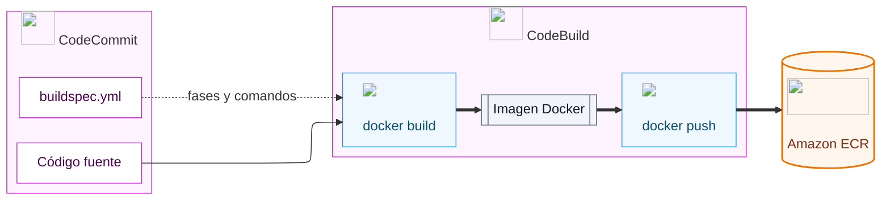
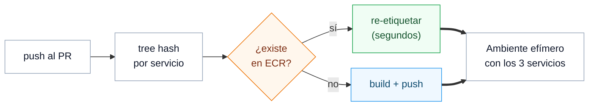
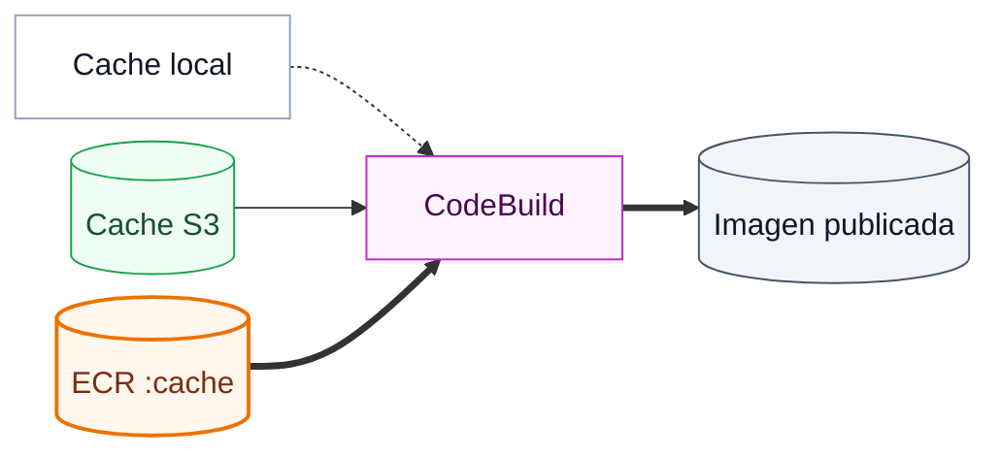
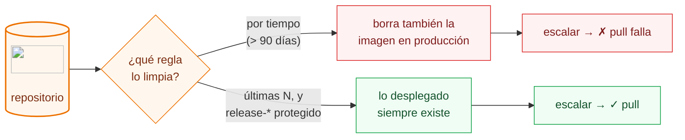
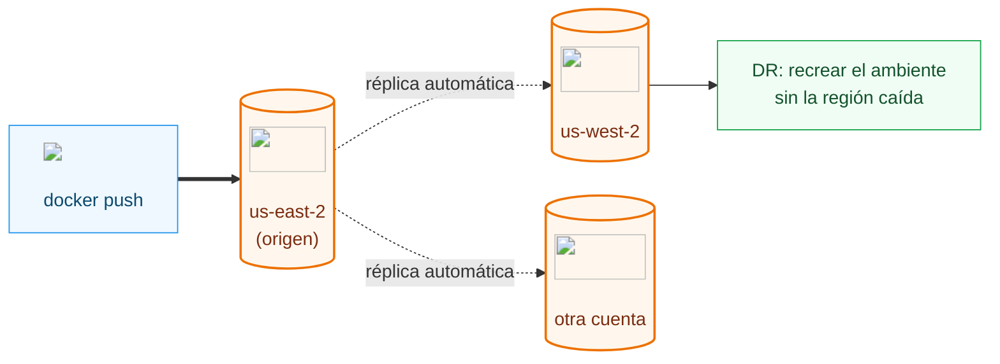
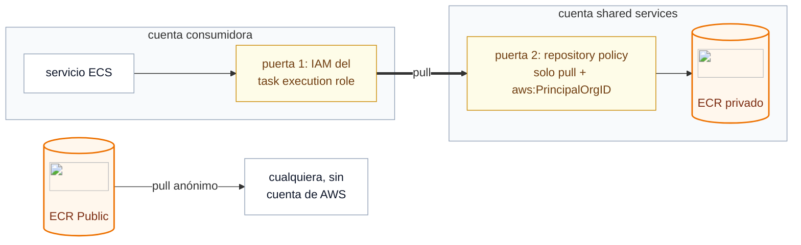
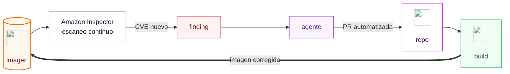

+++
title = "Integración continua — CodeBuild, y ECR"
+++

:::inline-slide
## Problema: ¿Como construir de forma reproducible?

El código fuente no se despliega directamente: primero se transforma en un
**artefacto desplegable**. En este ejemplo, el artefacto es una imagen de contenedor
construida a partir del `Dockerfile` en la raíz del repositorio.
:::

Construirla en la máquina de cada desarrollador parece sencillo, pero incorpora
diferencias difíciles de detectar: sistema operativo, arquitectura del procesador,
versiones de herramientas y dependencias instaladas. Docker reduce esas diferencias,
pero no las elimina. Por ejemplo, una imagen creada en macOS sobre ARM, sin indicar
`--platform linux/amd64`, puede no ejecutarse en un servidor x86.

La integración continua ejecuta el build en un entorno **estándar, limpio y
reproducible**. Así, cada commit o tag produce un artefacto cuyo origen y proceso de
construcción se pueden verificar, sin depender de una máquina local.

## Respuesta en AWS: CodeBuild y Amazon ECR
:::inline-slide light with-title

**AWS CodeBuild** es un servicio de `build` totalmente administrado. Se le indica la
fuente, la imagen del entorno de construcción y los comandos que debe ejecutar.
CodeBuild aprovisiona un entorno limpio, ejecuta el trabajo y libera los recursos al
terminar. No hay servidores de build que mantener.

**Amazon Elastic Container Registry (ECR)** es el registro de imágenes de contenedores de AWS. Como [DockerHub](https://hub.docker.com/)
:::

:::inline-slide with-title
### CodeBuild

CodeBuild utiliza una especificación definida en un archivo YAML, conocido como
`buildspec.yml`. Funciona como el pequeño DSL de CodeBuild: declara las fases
del trabajo y los comandos que se ejecutan en cada una.

```yaml
version: 0.2

phases:
  install:
    commands:
      - npm ci
  build:
    commands:
      - npm test
      - docker build -t app:$IMAGE_TAG .
```

- `version` selecciona la versión del formato de *buildspec*.
- `phases` organiza el proceso; las fases permitidas son: `install`, `pre_build`, `build` y
  `post_build`.
- `commands` contiene la lista de órdenes de shell de cada fase, ejecutadas en orden.
- También puede declarar `env`, `artifacts`, `cache` y `reports`.
:::

:::inline-slide light
### Amazon ECR

Una vez construida la imagen Docker, hay que guardarla en algún lugar. **Amazon ECR**
(Elastic Container Registry) es el servicio de AWS para almacenar imágenes Docker de
forma privada y segura. Cuando ECS necesite lanzar el contenedor en la Semana 3, irá a
buscar la imagen directamente a ECR.
:::

## Construir una vez, promover muchas veces
:::inline-slide with-title

:::skip
El resultado de CodeBuild no es solo una imagen Docker: es el **artefacto desplegable**
que conecta el cambio de código con un despliegue. Debe poder responderse con precisión
qué commit, qué PR o qué tag de Git produjo una imagen, qué validaciones superó y en
qué ambientes se utilizó.
:::

En un pipeline de equipo, un evento de Git inicia el trabajo adecuado: un PR puede
ejecutar `lint`, pruebas, análisis de seguridad y un ambiente efímero; un *merge* o un
tag de release puede construir la imagen candidata.

Cuando esa imagen se aprueba para otro ambiente, se promueve **el mismo
artefacto**, sin reconstruirlo. Así, `staging` y producción prueban y ejecutan
exactamente los mismos bytes.
:::

:::inline-slide light with-title
Para lograrlo, conviene identificar las imágenes con una referencia inmutable o
inequívoca: el SHA del commit, un tag de versión como `v1.4.0`, o el *digest* que ECR
asigna a la imagen. Una etiqueta mutable como `latest` es cómoda para un laboratorio,
pero no indica qué versión se está desplegando y puede cambiar entre dos operaciones.

::: info
La realidad es que no siempre se sigue esta práctica, y lo que termina pasando es
que se termina reconstruyendo el artefacto en cada fase de su ciclo de vida. Algunas
veces hay alguna razón para hacerlo, pero otras veces es simplemente un error.

Lo ideal, es que promovamos un mismo artefacto a través de distintos ambientes. Si es
necesario que se comporte distinto en cada ambiente (se conecte a distintos servicios
de terceros, bases de datos, nivel de logging, etc.) estos cambios de comportamiento
deben producirse a través de cambios en su configuración, las cuales puede absorber de
diversas maneras: variables de entorno, argumentos, archivos de configuración, etc.
::: #info
::: #inline-slide

:::slide light
## Del código a la imagen publicada

Ahora que tenemos el código en un lugar que controlamos, tenemos que producir
el artefacto desplegable de este proyecto: una imagen de contenedor.


:::

## Nuestro archivo `buildspec.yml`
:::inline-slide light with-title

El archivo `buildspec.yml` vive en la raíz del repositorio que se clonó y subió a
CodeCommit en la sección anterior, junto al `Dockerfile`. Es el contrato entre el
código y CodeBuild, y usa las cuatro fases:

:::app
<cb-file path="./buildspec.yml" type="yaml"></cb-file>
:::

:::skip
De más está decir que cada `command` puede invocar cualquier herramienta o script dentro
del ambiente de CodeBuild, o dentro del repositorio. Los `commands` se ejecutan desde
un directorio con la revisión de código que disparó el proceso de `build`.
:::

Es común utilizar comandos de `bash` directamente, pero no es necesario. Podemos, por
ejemplo, ejecutar un `script` de `python` almacenado dentro del repositorio:

```yaml
version: 0.2

phases:
  install:
    runtime-versions:
      python: 3.12
  build:
    commands:
      - python --version
      - python -m pip install -r requirements.txt
      - python scripts/build_image_metadata.py
```

:::skip
Por defecto, el archivo `buildspec.yml` es leído por CodeBuild desde la revisión que lanzó
el `build`. Esto tiene la ventaja de que podemos probar cambios en el `buildspec.yml` sin
necesidad de desplegar nada.

Por otro lado, podemos fijarlo si seleccionamos una ruta alternativa como fuente, o
mediante la opción `buildSpecOverride` al momento de iniciar el build. Colocar una fuente
externa para el `buildspec.yml` puede ser útil si contamos con un repositorio centralizado
donde gestionamos las especificaciones de ejecución.

En `install` se confirma que las herramientas del entorno están disponibles.
Aquí no hay nada que instalar porque la imagen administrada de CodeBuild ya
trae Docker y la CLI de AWS. En `pre_build` se corre `hadolint` sobre el
`Dockerfile` (volvemos sobre esto más adelante), se autentica con ECR para
poder empujar la imagen construida al repositorio correcto, y se crea un
*builder* de BuildKit con `docker buildx create --use`: el driver por defecto
de Docker no puede exportar cache hacia un registro, y este paso lo habilita.
El porqué del cache lo vemos al final de la sección [Cache de build en
CodeBuild](#cache-de-build-en-codebuild).
::: #skip
:::

:::inline-slide light with-title
Las cuatro fases y su propósito:

| Fase | Propósito |
|------|-----------|
| `install` | Preparación del entorno: instalar o verificar las herramientas del build. |
| `pre_build` | Preparación del trabajo: lint del `Dockerfile`, autenticación con ECR y creación del *builder*. |
| `build` | Construcción y publicación: `docker buildx build` etiqueta la imagen con el URI de ECR y la empuja (`--push`), junto con su cache. |
| `post_build` | Verificación: confirmar con `aws ecr describe-images` que la imagen quedó publicada. |

:::skip
Las variables de entorno (`$AWS_ACCOUNT_ID`, `$AWS_DEFAULT_REGION`, `$IMAGE_REPO_NAME`,
`$IMAGE_TAG`) se definen en el proyecto de CodeBuild, no en el archivo. Esto permite
reutilizar el mismo `buildspec.yml` en distintos entornos sin modificarlo.
`SOURCE_BRANCH` y `CODECOMMIT_REPOSITORY_ARN` son opcionales: un pipeline puede
proporcionarlos explícitamente para mantener la trazabilidad incluso cuando el origen
llega como un commit en lugar de una rama.
::: #skip

::: info
Es _muy_ común que utilicemos una cuenta para centralizar todas las imágenes de la empresa,
desde la cual luego se consumen en los demás ambientes.
:::

::: #inline-slide

### ¿Por qué estos labels?

Los *tags* permiten seleccionar una imagen al publicarla; los *labels* guardan dentro
de la imagen datos de procedencia que ayudan a reconstruir su historia. Docker los
almacena como metadatos y pueden inspeccionarse sin cambiar el contenido del artefacto.

El prefijo `org.opencontainers.image` es parte de las [annotations de OCI][oci-annotations].
OCI (*Open Container Initiative*) define especificaciones abiertas para que las
imágenes de contenedor puedan ser creadas, almacenadas y ejecutadas por herramientas
distintas. En particular, `org.opencontainers.image.revision` identifica la revisión
del control de código y `org.opencontainers.image.source` la URL de su fuente. Usamos
esas claves estándar para asociar la imagen con el SHA exacto y el repositorio desde el
que se construyó.

Los labels que empiezan por `com.amazonaws` son metadatos propios: usan un namespace
de AWS para no chocar con las claves OCI ni con las de otras herramientas. Las
[variables de entorno de CodeBuild][codebuild-env-vars] proporcionan los valores para
seguir el recorrido de la imagen:

| Label | Valor | Qué permite identificar |
| --- | --- | --- |
| `org.opencontainers.image.revision` | `GIT_SHA` | El commit exacto incluido en la imagen. |
| `org.opencontainers.image.source` | `CODEBUILD_SOURCE_REPO_URL` | El repositorio desde el que se obtuvo el código. |
| `com.amazonaws.codebuild.build-arn` | `CODEBUILD_BUILD_ARN` | La ejecución concreta que construyó la imagen. |
| `com.amazonaws.codebuild.project-arn` | `CODEBUILD_PROJECT_ARN` | El proyecto y su configuración de build. |
| `com.amazonaws.codebuild.initiator` | `CODEBUILD_INITIATOR` | Quién o qué inició la ejecución, por ejemplo un pipeline. |
| `com.amazonaws.codecommit.repository-arn` | `CODECOMMIT_REPOSITORY_ARN` | El recurso de CodeCommit que originó el flujo. |

`CODECOMMIT_REPOSITORY_ARN` es una variable definida por el proyecto o por el pipeline;
CodeBuild no la genera automáticamente. Esta combinación permite partir de una imagen
en ECR y responder qué commit, repositorio y ejecución la produjeron.

[oci-annotations]: https://specs.opencontainers.org/image-spec/annotations/
[codebuild-env-vars]: https://docs.aws.amazon.com/codebuild/latest/userguide/build-env-ref-env-vars.html

## Nuestro archivo `Dockerfile`
:::inline-slide with-title

El `Dockerfile` es la otra mitad del contrato: el `buildspec.yml` declara *cuándo* y
*con qué contexto* se construye; el `Dockerfile` declara *cómo*. El nuestro también
vive en la raíz del repositorio:

:::app
<cb-file path="./Dockerfile" type="dockerfile" toggleable open></cb-file>
::: #app
::: #inline-slide

:::inline-slide light with-title
:::skip
Lo mejor de trabajar con un `Dockerfile` es que nos garantiza un artefacto
desplegable que corre igual en la máquina de un desarrollador que en un ambiente
productivo: mismos bytes, mismas dependencias, mismo comportamiento.

Sin embargo, es muy común caer en la realización de múltiples `build` durante los
flujos de despliegue, desaprovechando esta oportunidad. Cada build repetido cuesta
tiempo de pipeline, y es una chance de producir bytes distintos: una
dependencia que cambió de versión, una imagen base que se actualizó entre un build y
el siguiente. Terminamos desplegando en producción algo que *no* es lo que probamos.

Una forma de remediar esto es mediante la buena utilización de etiquetas. Tanto las
que definimos nosotros, como los tags y labels de la sección anterior, asi como la información
que expone AWS: el *digest* que asigna ECR, los ARNs de CodeBuild. La idea es
reutilizar estas fuentes de información para evitar realizar el proceso de build
nuevamente, y en cambio **re-etiquetar** la imagen correcta a medida que nos movemos
dentro del ciclo de vida del despliegue: la imagen que pasó las pruebas del PR es la
que recibe el tag de `staging`, y esa misma es la que recibe el tag de release.
:::

:::add visibility=slide
- **Un Dockerfile garantiza un artefacto desplegable que se comporta igual en
  desarrollo y en producción**: mismos bytes, mismas dependencias.
- **Repetir el build en cada etapa del despliegue desperdicia esa garantía**:
  cuesta tiempo de pipeline y puede producir bytes distintos, con lo que se
  despliega algo que no es lo que se probó.
- **El remedio es aprovechar las etiquetas y metadatos existentes** para identificar la imagen
  ya construida en lugar de volver a hacer build.
- **La imagen se re-etiqueta conforme avanza en el ciclo de despliegue**: la que
  pasó las pruebas del PR recibe el tag de staging, y esa misma recibe el tag
  de release.
:::

::: info
Re-etiquetar no requiere descargar ni volver a subir la imagen. ECR permite agregar
un tag a una imagen existente manipulando solo su manifiesto:

```bash
MANIFEST=$(aws ecr batch-get-image --repository-name "$IMAGE_REPO_NAME" \
  --image-ids imageTag="$GIT_SHA" --query 'images[0].imageManifest' --output text)
aws ecr put-image --repository-name "$IMAGE_REPO_NAME" \
  --image-tag "v1.4.0" --image-manifest "$MANIFEST"
```

La operación tarda segundos, sin importar el tamaño de la imagen.
:::
:::

:::inline-slide light
## Mono-repo: build único por servicio

:::skip
En repositorios donde el resultado es una única imagen, esto es relativamente fácil:
hay un solo artefacto que seguir, y su historia es la historia del repositorio. El
problema ocurre cuando trabajamos con un mono-repositorio, en donde se gestionan
varias aplicaciones que pueden ser desplegadas en distinto orden, a través de
diferentes PR. Evitar múltiples builds en estos escenarios, garantizando a la vez que
todas las aplicaciones se prueben y ejecuten junto a los demás servicios, es difícil.
:::

:::add visibility=slide
Seguir un único artefacto por repositorio es fácil, pero en un
mono-repositorio con varias aplicaciones que se despliegan en distinto orden
por diferentes PR, evitar builds repetidos y a la vez garantizar que todas se
prueben junto a los demás servicios es difícil.
:::

- La identidad no es el commit: es el **tree hash** del contenido.
- ¿Ya existe en ECR? **Re-etiquetar**. ¿No existe? Construir.
- En el `merge`, solo se despliega lo que realmente cambió.


:::

::: extra Build único en un mono-repositorio de microservicios
Supongamos un mono-repositorio con tres servicios: `api` (el servidor web que oficia
de API), `payments` (la plataforma de pago) y `gateway` (centraliza autenticación y
autorización, y envía los requests permitidos a alguno de los servicios
*downstream*). Por política de la empresa, en cada `push` a un PR es necesario
garantizar que los tres servicios pasan por el `build` de forma exitosa,
independientemente de si sufrieron cambios. Además, el sistema trabaja con ambientes
efímeros: cada PR despliega las versiones compiladas de los tres servicios.

La clave es dejar de identificar las imágenes por el commit del repositorio y pasar a
identificarlas por el **contenido del servicio**. Git ya calcula esta identidad por
nosotros: cada directorio tiene un *tree hash* que solo cambia si cambia algo dentro
de él.
:::

### Como obtener el tree-hash
:::inline-slide with-title

```bash
❯ TREE_SHA=$(git rev-parse "HEAD:crates/server" | cut -c1-12)
❯ echo $TREE_SHA
303776a4ed6a
```

```bash
❯ git rev-parse "HEAD:crates/server" "HEAD:crates" "HEAD:crates/apps"
303776a4ed6ace5e887a17c3f464607601929bfb
5d43ec0a9ceb0cc60fe160f0e501beafb88567fc
b4067697c8594c8cdce9e37e4fc8e4512a837853
```

```bash
❯ TREE_SHA=$(git rev-parse "HEAD:crates/server" "HEAD:crates" "HEAD:crates/apps" \
  | git hash-object --stdin \
  | cut -c1-12)
❯ echo $TREE_SHA
78eb2d011698
```
:::

:::inline-slide with-title
Con esa identidad, el flujo en cada `push` al PR es, para cada servicio:

1. Calcular su `TREE_SHA` (si el servicio depende de código compartido, por ejemplo
   librerías en `lib/`, el hash debe combinar ambos árboles, de lo contrario un
   cambio en la librería pasaría inadvertido).
2. Preguntarle a ECR si ya existe una imagen con el tag `tree-$TREE_SHA`.
3. Si existe, el build ya ocurrió: solo se re-etiqueta esa imagen
   con el tag del PR (`pr-123-abc123`), en segundos.
4. Si no existe, se construye, se publica con ambos tags, y queda disponible para el
   próximo `push`.

::: info
En el caso de que aun así, por `SOC2` o cualquier otra política, fuese obligatorio
correr el proceso de `build`, este se realiza, pero no se publican cambios en
el repositorio remoto. De más está decir que si no se siguen buenas prácticas,
algunas de ellas mencionadas a continuación, es posible que estos builds fallen,
lo cual puede producir información valiosa o falsos positivos difíciles de
investigar.
:::
:::

:::inline-slide with-title
Es posible hacer esto utilizando la `awscli`.

```bash
if aws ecr describe-images --repository-name "$SVC" \
     --image-ids imageTag="tree-$TREE_SHA" >/dev/null 2>&1; then
  MANIFEST=$(aws ecr batch-get-image --repository-name "$SVC" \
    --image-ids imageTag="tree-$TREE_SHA" \
    --query 'images[0].imageManifest' --output text)
  aws ecr put-image --repository-name "$SVC" \
    --image-tag "pr-$PR_NUMBER-$GIT_SHA_SHORT" --image-manifest "$MANIFEST"
else
  docker build -f "services/$SVC/Dockerfile" \
    -t "$IMAGE_URI:tree-$TREE_SHA" \
    -t "$IMAGE_URI:pr-$PR_NUMBER-$GIT_SHA_SHORT" .
  docker push --all-tags "$IMAGE_URI"
fi
```
:::

Así se cumple la política: cada `push` termina con **tres imágenes etiquetadas con la
identidad del PR**. Algunas recién construidas, otras re-etiquetadas. Y el ambiente
efímero despliega exactamente ese conjunto. La integración se prueba con las tres
versiones reales, pero solo se paga el costo de build de lo que efectivamente cambió.

Al momento del `merge` a `main`, el mismo mecanismo decide qué se despliega a
producción: se recalculan los tree hashes y se comparan contra los que producción
está ejecutando (que quedaron registrados como label de la imagen, o en un Parameter
Store). Solo los servicios cuyo hash cambió se promueven —otra vez por re-etiquetado,
nunca por rebuild. Si el cambio fue únicamente en el proceso de autenticación, solo
el tree hash del `gateway` difiere, y solo el `gateway` se despliega en producción.

Una advertencia: el tree hash solo ve el contenido *commiteado* de esa ruta. Si el
`Dockerfile` de un servicio consume archivos fuera de su directorio (un lockfile en
la raíz, un `Dockerfile` compartido), esos paths deben formar parte del hash.

::: info
Supongamos que los tres servicios comparten librerías en `lib/`, y que el build
consume el lockfile de la raíz. `git rev-parse` acepta varias rutas a la vez y
devuelve un hash por línea; combinamos esas líneas en una única identidad
volviéndolas a pasar por `git hash-object`:

```bash
TREE_SHA=$(git rev-parse "HEAD:services/gateway" "HEAD:lib" "HEAD:Cargo.lock" \
  | git hash-object --stdin | cut -c1-12)
```

Si cambia cualquiera de las tres rutas (el código del `gateway`, una librería en
`lib/`, o el lockfile cambia alguna de las líneas) cambia con ella el hash combinado.
El `cut -c1-12` solo lo acorta para que el tag resulte legible.
:::

## El `Dockerfile` no es solo de los desarrolladores
:::inline-slide with-title

:::skip
Es importante que el equipo de DevOps esté involucrado en el proceso de escribir los
`Dockerfile`s. Son archivos muy flexibles, y es común que los desarrolladores se
preocupen solamente de que su aplicación corra, sin tener en cuenta requerimientos
que maximicen recursos y apliquen buenas prácticas de seguridad.

El primer ejemplo es el uso de **multi-stage builds**, como en nuestro `Dockerfile`:
las etapas `chef`, `planner` y `builder` compilan el binario con toda la *toolchain*
de Rust (compilador, `cmake`, `build-essential`, `lld`); la última parte de una imagen
mínima y copia solamente el binario y los certificados para TLS. La imagen final solo
cuenta con lo mínimo necesario para ejecutar: se reduce la superficie de ataque —nada
de compiladores ni herramientas de build en producción— y el espacio de almacenamiento.

Las tres primeras etapas existen por una segunda razón, que es de DevOps y no de
desarrollo: **el orden de las capas decide qué se puede cachear**. Si copiáramos todo
el repositorio antes de compilar, cualquier cambio en el contenido del curso
invalidaría la capa del `build`, y cada pipeline recompilaría las más de 240
dependencias del proyecto (el SDK de AWS, `axum`, la librería de TLS). Con
[`cargo-chef`](https://github.com/LukeMathWalker/cargo-chef), `planner` extrae la
lista de dependencias a un `recipe.json`, y `builder` las compila *antes* de copiar
las fuentes. Esa capa depende solo de `Cargo.toml` y `Cargo.lock`, así que sobrevive a
cualquier edición de `content/`, y el *registry cache* que configuramos en el
`buildspec.yml` la reutiliza entre builds.

Lo segundo es **la forma en que se descargan las dependencias**. No es lo mismo
depender de un PPA público que utilizar el *Artifact Registry* de la compañía. Un
registro interno evita exponer dependencias con vulnerabilidades conocidas, y
elimina la dependencia de terceros para poder realizar los builds: si el mirror
público está caído, el pipeline sigue funcionando.
:::

:::add visibility=slide
- **Multi-stage**: la imagen final lleva solo lo mínimo.
- **Dependencias**: registro interno antes que PPA público.
- **Imágenes base**: ECR Public o registro propio, no Docker Hub.
- **Pins**: *digest* de la base + versiones de `apt`, siempre juntos.
- **Imagen base corporativa**, pre-cargada en CI.
:::
:::

:::inline-slide with-title light
### Un registro de artefactos administrado

::: warning
Mantener un Artifact Registry interno tampoco es una tarea sencilla, pero de
realizarlo correctamente, es algo muy poderoso. AWS nos puede ayudar con la gestión.
:::

- **[AWS CodeArtifact](https://aws.amazon.com/codeartifact/)**: registry interno administrado: npm, PyPI, Maven, NuGet, Cargo
- *External connections*: el paquete se descarga del upstream público una sola vez, y queda retenido
- **[ECR pull-through cache](https://docs.aws.amazon.com/AmazonECR/latest/userguide/pull-through-cache.html)**: lo mismo para imágenes base: Docker Hub, ECR Public, GHCR
- Los paquetes de sistema (`apt`) quedan fuera — para eso, la imagen base corporativa
:::
:::

Lo mismo aplica a las **imágenes base**. Es muy usual depender de imágenes públicas
ubicadas en [Docker Hub](https://hub.docker.com/) e inmediatamente tener que lidiar
con problemas de *rate limiting* en CI: los límites de descarga se comparten por IP,
y los runners de CI los agotan rápido. Además, usualmente apuntamos las etiquetas a
`latest`, perdiendo el control de qué estamos introduciendo cada vez que hacemos un
nuevo `build`. Es mejor utilizar la [galería pública de ECR](https://gallery.ecr.aws/),
que no impone los límites agresivos de Docker Hub. O, mejor aún, nuestro propio
repositorio: con un *pull-through cache* logramos ambas cosas a la vez, y es
exactamente lo que se propone configurar en el siguiente ejercio.

En cualquier caso, conviene fijar las imágenes base por su *digest* y
no solamente por etiqueta, en pos de asegurar que siempre hacemos el build con la
misma imagen base:

```dockerfile
FROM rust:1.95-slim-bookworm@sha256:d7482085ff5b415f84dba5647ae71606650bdef00db7aeb69f4b3d170c3e4082 AS chef
```

::: warning
Los dos tipos de pin van juntos. Fijar las versiones de los paquetes
(`apt-get install build-essential=12.9`) sin fijar el SHA de la imagen base es una
invitación al desastre: es común que la imagen base avance, sus mirrors dejen de
servir las versiones fijadas, y el build (que ayer funcionaba) falle hoy sin que
nadie haya tocado el repositorio. Lo mismo aplica a los repositorios de dependencias
externos: un PPA o mirror público puede dejar de servir una versión en cualquier
momento. Si fijamos versiones, fijamos también la imagen base por su *digest* o
asumimos que ambos se actualizan juntos, en el mismo commit.
:::

Por último, una buena práctica es contar con una **imagen base de uso general** para
la organización: una sola imagen, curada por DevOps, que ya incluye los certificados,
la configuración del registro interno y las herramientas comunes. Puede tenerse
pre-cargada en los sistemas de CI para evitar los tiempos de `pull`, y concentra
todos los beneficios anteriores en un único lugar que se audita y actualiza de forma
centralizada.

::: extra Automatizar estas prácticas con hadolint
No hace falta que todas estas reglas vivan solo en la memoria del equipo:
[`hadolint`](https://github.com/hadolint/hadolint) es un linter de `Dockerfile`s que
las codifica como reglas verificables. Cada una tiene un código; por ejemplo,
nuestro `Dockerfile` sin los pins de versión dispara esta:

```
Dockerfile:12 DL3008 warning: Pin versions in apt get install. Instead of
`apt-get install <package>` use `apt-get install <package>=<version>`
```

También detecta imágenes base sin fijar (`DL3006`, `DL3007` para `latest`), capas de
apt sin limpiar (`DL3009`), `sudo` innecesario (`DL3004`), y decenas de reglas más —
incluyendo las de [ShellCheck](https://www.shellcheck.net/) sobre el shell de cada
`RUN`.

Conviene usarlo en dos lugares:

- **En el editor**, para que el desarrollador vea las advertencias mientras escribe.
  Existen integraciones como extensión del IDE (VS Code) o como servidor LSP /
  fuente de diagnósticos en Neovim y otros editores, de la misma forma en que
  `clippy` nos acompaña en Rust.
- **Como tarea de CI**, para que la regla sea un contrato y no una sugerencia. En
  CodeBuild alcanza con una fase:

  ```yaml
  pre_build:
    commands:
      - docker run --rm -i hadolint/hadolint < Dockerfile
  ```

  El comando termina con código distinto de cero si hay advertencias, y el build
  falla antes de construir nada.

Cuando una regla no aplica, la excepción también queda documentada: un comentario
`# hadolint ignore=DL3008` sobre la línea, o un archivo `.hadolint.yaml` con las
reglas ignoradas a nivel repositorio. Lo importante es que ignorar una regla sea una
decisión visible en el código, revisable en un PR — no una omisión silenciosa.
:::

:::slide
## Linting de Dockerfiles con `hadolint`

- Codifica estas prácticas como reglas verificables: por ejemplo `DL3008` (pins de apt),
  `DL3006`/`DL3007` (imagen base sin fijar), y ShellCheck en cada `RUN`.
- **En el editor**: extensión del IDE o LSP, mientras se escribe.
- **En CI**: una línea en `pre_build`; cualquier advertencia corta el build antes
  de construir nada.
- Las excepciones quedan **visibles y revisables**: `# hadolint ignore=…` o
  `.hadolint.yaml` en el repositorio.
:::


## Cache de build en CodeBuild
:::inline-slide light with-title

- **Local**: capas del host anterior — simple, pero *best effort*.
- **S3**: rutas del `buildspec.yml` — entre hosts, con transferencia.
- **Registro**: BuildKit publica el cache en ECR (`:cache`) — cualquier host.


:::

En el laboratorio, el primer build tarda entre 10 y 20 minutos porque compila el
proyecto desde cero. CodeBuild ofrece varias capas de cache para que los siguientes
no paguen ese precio:

- **Cache local**: en la configuración del proyecto (**Artifacts → Additional
  configuration → Cache**) se puede activar `Local`, con el modo
  `DockerLayerCache` para reutilizar las capas de Docker del build anterior. Es la
  opción más simple, pero es *best effort*: solo funciona si el build cae en el
  mismo host que el anterior, algo frecuente con builds seguidos y raro con builds
  espaciados.
- **Cache en S3**: la sección `cache` del `buildspec.yml` declara rutas que
  CodeBuild guarda y restaura desde S3 entre builds. Sirve para directorios de
  dependencias (`~/.cargo`, `node_modules`), aunque subir y bajar el cache también
  toma tiempo.
- **Cache en un registro (externo)**: BuildKit puede publicar el cache de capas como
  un artefacto más dentro de ECR, y consumirlo desde cualquier host —incluso desde
  la máquina de un desarrollador. Es lo que hace [nuestro
  `buildspec.yml`](#nuestro-archivo-buildspec-yml):

:::inline-slide light with-title
  ```yaml
  build:
    commands:
      - |
        docker buildx build \
          --cache-from type=registry,ref=$IMAGE_URI:cache \
          --cache-to type=registry,ref=$IMAGE_URI:cache,mode=max,image-manifest=true,oci-mediatypes=true \
          -t $IMAGE_URI:$IMAGE_TAG \
          --push .
  ```

:::skip
  `mode=max` guarda el cache de todas las etapas del multi-stage build (no solo la
  final), y `image-manifest=true,oci-mediatypes=true` es necesario para que ECR
  acepte el manifiesto de cache. Es la opción más robusta: el cache deja de depender
  del host y pasa a ser un artefacto compartido del equipo. Requiere el *builder*
  que creamos en `pre_build` — y en el primer build, `--cache-from` avisa que el tag
  `:cache` todavía no existe y sigue sin él; a partir del segundo, lo encuentra.
:::

Combinadas con una imagen base propia en ECR (misma región, sin *rate limiting*, sin
salir de la red de AWS) estas capas convierten un build de 20 minutos en uno de
segundos cuando el código no cambió, y de pocos minutos cuando sí.
:::

## Práctica guiada: crear el repositorio ECR
:::inline-slide with-title
:::app
<cb-goto path="Práctica guiada: crear el repositorio ECR"></cb-goto>
::: #app
:::

### Abrir Amazon ECR

1. Abrir [**Elastic Container Registry**](https://console.aws.amazon.com/ecr/home).
2. En el panel lateral, asegurarse de estar en **Private registry → Repositories**.

### Crear el repositorio de imágenes

1. Pulsar **Create repository**.
2. En **Repository name**, escribir `taller-aws-` (el mismo nombre usado
   en CodeCommit, por consistencia).
3. Dejar **Image tag mutability** en **Mutable** — esto permite reutilizar etiquetas
   como `latest` entre builds sucesivos. Es una simplificación para el laboratorio;
   las etiquetas de release que identifican un artefacto desplegable deben ser únicas.
4. Dejar las demás opciones con sus valores predeterminados y pulsar **Create repository**.

El repositorio aparece en la lista. Pulsar sobre su nombre y copiar el **URI** completo
—algo como `123456789012.dkr.ecr.us-east-1.amazonaws.com/taller-aws-maria`. Se
necesitará al configurar CodeBuild.

## Práctica guiada: crear y ejecutar el proyecto de CodeBuild

### Abrir CodeBuild

1. Abrir [**CodeBuild**](https://console.aws.amazon.com/codesuite/codebuild/home).
2. Pulsar **Create build project**.

### Configurar la fuente

1. En **Project name**, escribir `taller-aws--build`.
2. En la sección **Source**, seleccionar **Source provider: AWS CodeCommit**.
3. En **Repository**, seleccionar el repositorio `taller-aws-`.
4. En **Reference type**, seleccionar **Branch** y elegir `main`.

::: info
Aquí el build se inicia manualmente y toma `main` para practicar. En un flujo real, un
evento de CodeCommit o CodePipeline lo iniciaría al abrir un PR, fusionar un cambio o
crear un tag, según las reglas de promoción acordadas por el equipo.
:::

### Configurar el entorno de construcción

1. En la sección **Environment**, seleccionar:
    - **Environment image**: **Managed image**
    - **Compute**: **EC2**
    - **Running mode**: **Container** (en el Ejercicio 4 se explica esta opción)
    - **Operating system**: **Amazon Linux**
    - **Runtime(s)**: **Standard**
    - **Image**: seleccionar la versión más reciente disponible (por ejemplo
      `aws/codebuild/amazonlinux-x86_64-standard:6.0`).
    - **Image version**: **Always use the latest image for this runtime version**.
2. En **Service role**, seleccionar **New service role**. La consola propone el
    nombre en **Role name** (`codebuild-taller-aws--build-service-role`).
    Anotarlo —será necesario agregarle permisos de ECR a continuación.
3. Expandir **Additional configuration** y:
    - En **Privileged**, activar la casilla **Enable this flag if you want to build
      Docker images or want your builds to get elevated privileges**. Es
      **obligatoria** para que CodeBuild pueda ejecutar el daemon de Docker y
      construir imágenes de contenedor.
    - En **Host kernel**, seleccionar `kernel-6 (Amazon Linux 2023)`. Este campo elige el
      sistema operativo del *host* donde corre el contenedor del build (la imagen
      curada ya es Amazon Linux 2023). El valor predeterminado, Amazon Linux 2,
      sigue soportado, pero la consola muestra un aviso en el proyecto
      recomendando migrar.
    - En **Compute**, seleccionar **4 vCPUs, 8 GiB memory** —la compilación de Rust
      dentro del build aprovecha los núcleos adicionales.
    - Dejar **Docker server configuration** sin activar (en el Ejercicio 4 se explica
      esta opción).

> **Nota:** si el proyecto ya fue creado con el valor predeterminado, la consola
> muestra un aviso azul recomendando el cambio. Se corrige en **Edit project →
> Environment → Additional configuration → Host kernel → Amazon Linux 2023**.

### Agregar permisos de ECR al rol de CodeBuild

El rol creado automáticamente puede acceder a CodeCommit, pero aún no tiene permiso
para publicar en ECR. Seguir estos pasos **antes** de ejecutar el build:

1. En una nueva pestaña del navegador, abrir [**IAM → Roles**](https://console.aws.amazon.com/iam/home#/roles) y buscar el rol recién
    creado (su nombre comienza con `codebuild-taller-aws-`).
2. Pulsar **Add permissions → Attach policies**.
3. Buscar `AmazonEC2ContainerRegistryPowerUser` y seleccionarlo.
4. Pulsar **Add permissions**. Volver a la pestaña de CodeBuild.

### Configurar las variables de entorno

1. En la sección **Environment**, desplazarse hasta **Additional configuration →
    Environment variables** y agregar las siguientes variables:

    | Name | Value | Type |
    |------|-------|------|
    | `AWS_ACCOUNT_ID` | El ID de la cuenta AWS (12 dígitos, sin guiones) | Plaintext |
    | `IMAGE_REPO_NAME` | `taller-aws-` | Plaintext |
    | `IMAGE_TAG` | `latest` | Plaintext |

    > **Tip:** el ID de cuenta se encuentra en la esquina superior derecha de la consola,
    > bajo el nombre del usuario o rol.

### Finalizar la configuración

1. En la sección **Buildspec**, bajo **Build specifications**, seleccionar
    **Use a buildspec file** —la opción preseleccionada, **Insert build commands**,
    guarda los comandos en la configuración del proyecto en lugar de leerlos del
    repositorio.
2. Dejar **Buildspec name** vacío: CodeBuild buscará automáticamente el archivo
    `buildspec.yml` en la raíz del repositorio.
3. En la sección **Artifacts**, seleccionar **No artifacts** —el resultado del build
   es la imagen publicada en ECR, no un artefacto de archivo. Esa imagen es el
   artefacto desplegable que usarán las etapas posteriores.
4. Pulsar **Create build project**.

### Ejecutar el build y seguir los logs

1. En la vista del proyecto recién creado, pulsar **Start build**.
2. CodeBuild aprovisiona el entorno y comienza a ejecutar los comandos del
    `buildspec.yml`. La pestaña **Build logs** muestra la salida en tiempo real.
3. Seguir los logs. Se verán las cuatro fases: verificación de herramientas; lint,
    autenticación con ECR y creación del *builder*; `docker buildx build` (que
    construye y publica en un solo paso); y la verificación en ECR. Al final de
    `pre_build`, el log imprime **los tags resueltos para esta build**, los URIs
    completos con `latest`, `branch-…` y el SHA del commit. Estos deben coincidir con
    lo que luego aparece en ECR. La aplicación se
    compila dentro del build, por lo que la primera vez el proceso tarda entre 10 y
    20 minutos.
4. Al terminar, el estado cambia a **Succeeded** (en verde) o **Failed** (en rojo).
    Si falla, el log indica en qué línea ocurrió el error.

### Repasar los logs completos en CloudWatch

La pestaña **Build logs** muestra solo el tramo final de la salida. El log completo
de cada build queda guardado en **CloudWatch Logs**:

1. Encima del log, pulsar el enlace **View entire log**. Se abre el *log stream* de
    ese build en CloudWatch Logs.
2. El mismo destino se alcanza desde [**CloudWatch → Logs → Log Management**](https://console.aws.amazon.com/cloudwatch/home#logsV2:log-groups):
    CodeBuild crea un grupo por proyecto (`/aws/codebuild/taller-aws--build`)
    y, dentro, un *stream* por build, identificado por el ID del build. En el stream,
    el campo **Filter events** busca texto en todo el log. Por ejemplo,
    `"Tags resueltos"` localiza el bloque impreso al final de `pre_build`.
3. Con la CLI:

    ```bash
    export TALLER=taller-aws-
    aws logs tail "/aws/codebuild/$TALLER-build" --since 1h
    ```

    Con `--follow`, el comando queda esperando y va mostrando las líneas nuevas,
    útil para seguir un build en curso desde la terminal.

### Verificar la imagen en ECR

1. Volver a la [consola de ECR](https://console.aws.amazon.com/ecr/home) y abrir el repositorio `taller-aws-`.
2. En la pestaña **Images**, se verá una fila por etiqueta recién publicada: `latest`,
   `branch-main`, el SHA corto y el SHA completo del commit —los mismos tags que el
   log imprimió al final de `pre_build`, más `cache`. El cache de capas que buildx
   exportó al registro y que acelerará los builds siguientes. Observar el *digest*:
   las cuatro primeras comparten el mismo, porque son la misma imagen con distintos
   nombres; esa es su identidad inmutable aunque `latest` se actualice.

::: info
Copiar el **Image URI** de `latest` (no el de `cache`). Se necesitará en la
siguiente sección para lanzar el stack de CloudFormation.
:::

3. La misma verificación con la CLI —`describe-images` agrupa por *digest*, por lo
   que muestra dos filas: la imagen con todos sus tags, y el cache:

   ```bash
   aws ecr describe-images \
     --repository-name "$TALLER" \
     --query "sort_by(imageDetails,&imagePushedAt)[].{tags:join(', ',imageTags),pushed:imagePushedAt}" \
     --output table
   ```

   Por ejemplo:

   ```bash
   ❯ aws ecr describe-images \
     --repository-name "$TALLER" \
     --query "sort_by(imageDetails,&imagePushedAt)[].{tags:join(', ',imageTags),pushed:imagePushedAt}" \
     --output table
   ---------------------------------------------------------------------------------------------------------------------
   |                                                  DescribeImages                                                   |
   +-----------------------------------+-------------------------------------------------------------------------------+
   |              pushed               |                                     tags                                      |
   +-----------------------------------+-------------------------------------------------------------------------------+
   |  2026-07-31T13:56:49.501000-03:00 |  branch-main, cd5906be4801, latest, cd5906be4801c59a22b7c6816ea2683e85700fd1  |
   |  2026-07-31T13:57:23.661000-03:00 |  cache                                                                        |
   +-----------------------------------+-------------------------------------------------------------------------------+
   ```

## ECR más allá del push: retención, replicación, acceso y escaneo

Con la primera imagen publicada, el repositorio ya cumple su rol mínimo: recibir
imágenes y servirlas. Pero un registro de producción no se administra solo, y ECR
trae cuatro funcionalidades que conviene conocer desde el primer día.

### Políticas de lifecycle: decidir qué se guarda y por cuánto tiempo

Cada build de hoy dejó cuatro tags nuevos en el repositorio; un pipeline activo genera
decenas por semana. El almacenamiento de ECR es barato (alrededor de $0.10 por GB al
mes, un costo casi despreciable frente al resto de la infraestructura,) pero la buena
práctica no pasa por el costo: pasa por definir de forma explícita **cuál es la
política de la empresa para la retención de imágenes**, y expresarla como reglas en el
repositorio en lugar de depender de limpiezas manuales.

Eso se hace con una **Lifecycle policy** (en la consola: dentro del repositorio,
**Lifecycle policy**). Una política es una lista de reglas; cada regla selecciona
imágenes por estado de tag (con tag, sin tag) y por prefijo o patrón (`branch-*`), y
las expira por antigüedad (`sinceImagePushed`) o por cantidad (`imageCountMoreThan`:
"conservar solo las últimas N"). Un detalle importante: una regla selecciona la
imagen completa. El *digest* con todos sus tags, no un tag individual.

::: warning
Hay una trampa conocida: configurar la limpieza **en términos de tiempo** y borrar una
imagen que está corriendo en producción. Mientras las tareas ya lanzadas sigan
corriendo no pasa nada. El runtime ya tiene la imagen descargada. Pero en el momento
en que haga falta escalar, reemplazar una tarea caída, o volver a registrar el
servicio, el *pull* falla porque la imagen ya no existe. El fallo aparece justo cuando
el sistema está bajo presión, que es el peor momento posible. ECR no sabe qué está
desplegado: la política borra lo que las reglas seleccionan, esté en producción o no.
:::

#### Cómo mitigar el borrado de imágenes en producción

- **Preferir cantidad sobre tiempo para las imágenes desplegables.** Una regla de
  "conservar las últimas N" garantiza historial aunque el proyecto pase meses sin
  desplegar; una regla de "borrar lo más viejo que X días", tras una temporada sin
  pushes, se lleva todas las imágenes, incluida la que está en producción.
- **Separar los tags efímeros de los de release.** Aplicar las reglas agresivas solo
  a las imágenes sin tag y a los prefijos efímeros (`branch-*`, SHAs); los tags de
  release (`v*`, `release-*`) reciben una retención larga, o ninguna regla.
- **Promocionar con un re-tag.** Lo que llega a producción recibe un tag del espacio
  protegido (`release-*`), de modo que ninguna regla agresiva pueda seleccionarlo.
- **Ensayar antes de aplicar.** La consola ofrece un *preview* de la política que
  lista qué imágenes borraría cada regla, sin borrar nada. Ninguna política debería
  activarse sin pasar por ahí.

### Replicación entre regiones

En **Private registry → Replication** se configuran reglas de replicación: cada push a
la región de origen se copia automáticamente a otras regiones, o a otras cuentas.
Esto puede ser útil, y hasta necesario, al desarrollar un plan de **Disaster
Recovery**: si la región primaria queda fuera de servicio, los artefactos de deploy ya
existen en la región de recuperación, y el ambiente puede recrearse sin depender de la
región caída. También reduce la latencia de *pull* en despliegues multi-región.

::: warning
Dos detalles a tener en cuenta: la replicación copia los pushes, no los borrados. Una
lifecycle policy de la región de origen no limpia las réplicas, así que cada región
de destino necesita su propia política; y solo se replica lo que se publica después de
crear la regla, lo ya existente no se copia retroactivamente.
:::

### Compartir imágenes fuera de la cuenta

En una organización real, las imágenes rara vez viven en la misma cuenta que las
consume: un patrón común es una cuenta de *shared services* que construye y publica,
y cuentas de desarrollo, staging y producción que solo hacen *pull*. ECR cubre ambos
extremos del espectro: acceso privado entre cuentas conocidas, y publicación abierta
al mundo.

#### De forma privada: repository policy

El acceso entre cuentas no requiere copiar nada. Cada repositorio acepta una
**repository policy** —una política basada en recursos, editable en
**Permissions → Edit policy JSON** dentro del repositorio, que declara quién puede
hacer *pull*. Para que sea segura:

- **Conceder solo las acciones de pull**: `ecr:BatchGetImage`,
  `ecr:GetDownloadUrlForLayer` y `ecr:BatchCheckLayerAvailability`. Nunca `ecr:*`.
- **Nombrar a los consumidores de forma explícita**: el ARN de cada cuenta
  (`arn:aws:iam:::root`) o, mejor dentro de una organización, la condición
  `aws:PrincipalOrgID` — cualquier cuenta de la organización, y nadie más:

  ```json
  {
    "Version": "2012-10-17",
    "Statement": [
      {
        "Sid": "AllowPullFromOrg",
        "Effect": "Allow",
        "Principal": "*",
        "Action": [
          "ecr:BatchGetImage",
          "ecr:GetDownloadUrlForLayer",
          "ecr:BatchCheckLayerAvailability"
        ],
        "Condition": {
          "StringEquals": { "aws:PrincipalOrgID": "o-xxxxxxxxxx" }
        }
      }
    ]
  }
  ```

- **Recordar que el permiso tiene dos puertas.** En un acceso entre cuentas deben
  abrirse ambas: la repository policy del lado del repositorio, y la política de IAM
  del rol consumidor. Por ejemplo, el *task execution role* de un servicio ECS en la
  otra cuenta, que además necesita `ecr:GetAuthorizationToken` para autenticarse.

Cuando las cuentas consumidoras son muchas, o están en otras regiones, la
alternativa es la **replicación cross-account** de la sección anterior: cada cuenta
hace *pull* de su propia copia local, y la policy se reduce a los permisos de
replicación.

#### De forma pública: Amazon ECR Public

Cuando la imagen es para el mundo (ejemplo: una herramienta open source o una imagen base
propia) el mecanismo **no** es abrir el repositorio privado con un
`"Principal": "*"` sin condición. Para eso existe **Amazon ECR Public**: un registro
separado, con URLs de la forma `public.ecr.aws/<alias>/...` y una galería navegable
([gallery.ecr.aws](https://gallery.ecr.aws).) La misma de donde el pull-through
cache del Ejercicio 6 sirve las imágenes oficiales de Docker. Se publica
autenticándose contra `us-east-1`; cualquiera puede hacer *pull*, incluso sin cuenta
de AWS (de forma anónima, con límites de tasa más bajos que autenticado).

::: warning
Publicar una imagen expone **todas sus capas**: cualquier archivo copiado durante el
build, y los valores pasados como `ARG`, quedan descargables por cualquiera (basta
`docker history` para listarlos.) Antes de publicar: revisar que ningún secreto,
credencial o código privado haya entrado en una capa, y asumir que lo publicado ya
fue copiado — despublicar no lo recupera.
:::

### Escaneo de vulnerabilidades

En **Private registry → Scanning** se activa el escaneo de imágenes contra bases de
CVEs conocidos. El nivel básico escanea el sistema operativo de la imagen en cada push;
el **enhanced scanning** delega en **Amazon Inspector** y pasa a ser continuo: cubre
también las dependencias de la aplicación, y re-escanea las imágenes existentes cada
vez que se publica una vulnerabilidad nueva, trayendo los hallazgos al frente sin que
nadie lance nada.

Los *findings* quedan visibles por imagen en la consola y se publican como eventos, lo
que abre la puerta a automatizarlos. Al día de hoy es sencillo combinarlos con
**agentes** que sugieren remediaciones fáciles (actualizar la imagen base, subir una
dependencia) y las vuelcan directamente en el código mediante **PRs automatizadas**.
La revisión sigue siendo humana, pero el ciclo completo (detectar, proponer,
reconstruir, republicar,) corre sobre la misma estructura de CI/CD que se armó en esta
sesión: ese es el valor de haberla construido.

## Un adelanto: enterarse cuando el build termina

Hoy se lanzó el build a mano y se siguieron los logs en pantalla. En un equipo real nadie se
queda mirando la consola: el build avisa solo cuando termina (en éxito o en error) por
el canal donde el equipo ya conversa. Por ejemplo: **Microsoft Teams**.

No se configura esta semana, pero conviene ver el flujo desde ahora, porque es la
pieza que cierra el pipeline en la Semana 3.

::: extra Cómo se notifica un build a Microsoft Teams
El evento de fin de build (o de un *stage* de CodePipeline) lo capturan las **reglas
de notificación de los Developer Tools**, llamadas históricamente *CodeStar
Notifications*, y lo publican en un **tema de Amazon SNS**. Desde SNS, **AWS Chatbot**
lo entrega a un canal de Microsoft Teams.

```
CodeBuild / CodePipeline (evento)
    → CodeStar Notifications (regla)
    → Amazon SNS (tema)
    → AWS Chatbot
    → canal de Microsoft Teams
```

Una aclaración de nombres: el servicio **AWS CodeStar** (el de proyectos y dashboards)
fue discontinuado en 2024. Las **reglas de notificación** que se usan aquí son otra
cosa, siguen vigentes, y son parte de los Developer Tools.

En el laboratorio no se conecta Teams por participante, sería inviable. En su lugar,
los eventos de la cuenta llegan a la **aplicación del instructor**, que los muestra como
avisos (*toasts*) en esta misma guía. El mecanismo del lab es un espejo del flujo real:
lo que aquí aparece como un *toast*, en la organización aparecería en un canal de Teams.
:::

---

{#ejercicio-3}
### Ejercicio 3 — Crear el repositorio de imágenes

Crear un repositorio privado en Amazon ECR con el nombre `taller-aws-`.

::: solucion
1. Abrir [**Elastic Container Registry**](https://console.aws.amazon.com/ecr/home).
2. En el panel lateral, seleccionar **Private registry → Repositories**.
3. Pulsar **Create repository**.
4. En **Repository name**, escribir `taller-aws-`.
5. Dejar **Image tag mutability** en **Mutable**.
6. Pulsar **Create repository**.
7. En la lista de repositorios, pulsar sobre el nombre del repositorio recién creado.
8. Hacer click en la tab `Summary`.
9. Copiar el **URI** completo que aparece en la parte superior. Se necesitará para
   configurar CodeBuild y para el parámetro de CloudFormation en la sección siguiente.
   Con la CLI:

   ```bash
   export TALLER=taller-aws-
   aws ecr describe-repositories \
     --repository-names "$TALLER" \
     --query 'repositories[0].repositoryUri' \
     --output text
   ```

   Por ejemplo:

   ```bash
   ❯ export TALLER=taller-aws-guzman
   aws ecr describe-repositories \
     --repository-names "$TALLER" \
     --query 'repositories[0].repositoryUri' \
     --output text
   410228653321.dkr.ecr.us-east-2.amazonaws.com/taller-aws-guzman
    ```
:::

---

{#ejercicio-4}
### Ejercicio 4 — Ejecutar la primera build

Configurar un proyecto de CodeBuild que lea el repositorio de CodeCommit, construya la
imagen Docker usando el `buildspec.yml` incluido en el código, y la publique en el
repositorio de ECR. Ejecutar el build y verificar que la imagen aparece en ECR con la
etiqueta `latest`.

::: solucion
1. En la consola de AWS, abrir [**CodeBuild**](https://console.aws.amazon.com/codesuite/codebuild/home) y pulsar **Create project**.
2. En **Project name**, escribir `taller-aws--build`.
3. En **Source provider**, seleccionar **AWS CodeCommit** y luego el repositorio.
4. En **Reference type**, elegir **Branch → main**.

::: info
**Reference type** define qué commit del repositorio se convierte en el artefacto:

- **Branch**: el último commit (HEAD) de la rama elegida. Es una referencia *mutable*
  —dos builds de la misma rama pueden construir código distinto.
- **Git tag**: el commit al que apunta un tag (por ejemplo `v1.4.0`). Referencia
  inmutable, típica para releases.
- **Commit ID**: un commit exacto, por SHA. La referencia más precisa de las tres.

El campo **Commit ID – *optional*** que aparece junto a **Branch** permite fijar el
build a un commit específico de esa rama; además, al saber exactamente qué descargar,
CodeBuild puede clonar menos historial y acortar el build. En el taller se deja vacío:
se construye siempre el `HEAD` de `main`.
:::

5. En **Environment → Environment image**, seleccionar **Managed image**.
6. En **Running mode**, dejar **Container** seleccionado.
7. Seleccionar **Operating system: Amazon Linux**, **Runtime: Standard**, la imagen
   más reciente (por ejemplo `aws/codebuild/amazonlinux-x86_64-standard:6.0`) y, en
   **Image version**, **Always use the latest image for this runtime version**.
8. En **Service role**, seleccionar **New service role**.
9. Expandir **Additional configuration** y activar la casilla **Privileged**. Sin
   esta opción, Docker no puede ejecutarse dentro del build y el proceso falla.
   En **Host kernel**, seleccionar `kernel-6 (Amazon Linux 2023)`.

::: info
**Running mode** elige dónde corre el buildspec:

- **Container**: el build corre dentro de una imagen curada de
  CodeBuild (`aws/codebuild/amazonlinux-x86_64-standard:6.0`). Para construir
  imágenes, el daemon de Docker tiene que correr *dentro* de ese contenedor
  (Docker-in-Docker), y eso es exactamente lo que habilita la casilla
  **Privileged**. Es la vía clásica y la más documentada.
- **Instance**: el buildspec corre directamente sobre la instancia EC2, sin contenedor
  intermedio. Docker es el daemon nativo del host: no hay Docker-in-Docker ni casilla
  de Privileged, con algo menos de overhead y una bandera de seguridad menos. A
  cambio, el entorno se elige por versión de máquina en lugar de imagen curada, y es
  un modo más nuevo y menos documentado.
- **Docker server** (al final de **Additional configuration**: **Docker server
  configuration → Enable docker server for this project**): aprovisiona un daemon de
  Docker *remoto* y persistente, dedicado al proyecto, con un cache de capas que
  sobrevive entre builds; los comandos `docker` del build se descargan
  automáticamente a ese servidor
  ([documentación](https://docs.aws.amazon.com/codebuild/latest/userguide/sample-docker-server.html)).
  Se cobra aparte del build: por segundo de servidor activo según el compute elegido,
  más una tarifa menor de *cache at rest* mientras está detenido
  ([pricing](https://aws.amazon.com/codebuild/pricing/)). En el taller no hace falta:
  el cache en el registro (la etiqueta `cache`) ya cumple ese rol.
:::

10. En **Additional configuration → Compute**, seleccionar **4 vCPUs, 8 GiB memory**.
11. En **Additional configuration → Environment variables**, agregar:
    - `AWS_ACCOUNT_ID` = el ID de la cuenta (12 dígitos)
    - `IMAGE_REPO_NAME` = `taller-aws-`
    - `IMAGE_TAG` = `latest`
12. En **Buildspec**, bajo **Build specifications**, seleccionar **Use a buildspec
    file** (la consola preselecciona **Insert build commands**) y dejar **Buildspec
    name** vacío para que use el `buildspec.yml` de la raíz del repositorio.
13. En **Artifacts**, seleccionar **No artifacts**.
14. Pulsar **Create build project**.
15. En [IAM](https://console.aws.amazon.com/iam/home), buscar el rol cuyo nombre comienza con `codebuild-taller-aws-`,
    adjuntarle la política `AmazonEC2ContainerRegistryPowerUser`. Con la CLI:

    ```bash
    export TALLER=taller-aws-
    ROLE=$(aws iam list-roles \
      --query "Roles[?starts_with(RoleName, 'codebuild-$TALLER')].RoleName" \
      --output text)
    aws iam attach-role-policy \
      --role-name "$ROLE" \
      --policy-arn arn:aws:iam::aws:policy/AmazonEC2ContainerRegistryPowerUser
    ```
16. Volver a CodeBuild, abrir el proyecto, y pulsar **Start build**.
17. En la pestaña **Build logs**, seguir la ejecución hasta que el estado sea
    **Succeeded**. El log completo queda en CloudWatch Logs (**View entire log**, o
    el grupo `/aws/codebuild/taller-aws--build`); con la CLI:
    `aws logs tail "/aws/codebuild/$TALLER-build" --since 1h`.
18. En ECR, abrir el repositorio y confirmar las entradas con la fecha de hace unos
    minutos: la imagen con sus cuatro tags (`latest`, `branch-main`, SHA corto y SHA
    completo, todos con el mismo *digest*) y el cache de capas de buildx con la
    etiqueta `cache`. Con la CLI:

    ```bash
    aws ecr describe-images \
      --repository-name "$TALLER" \
      --query "sort_by(imageDetails,&imagePushedAt)[].{tags:join(', ',imageTags),pushed:imagePushedAt}" \
      --output table
    ```

    Por ejemplo:

    ```bash
    ❯ aws ecr describe-images \
      --repository-name "$TALLER" \
      --query "sort_by(imageDetails,&imagePushedAt)[].{tags:join(', ',imageTags),pushed:imagePushedAt}" \
      --output table
    ---------------------------------------------------------------------------------------------------------------------
    |                                                  DescribeImages                                                   |
    +-----------------------------------+-------------------------------------------------------------------------------+
    |              pushed               |                                     tags                                      |
    +-----------------------------------+-------------------------------------------------------------------------------+
    |  2026-07-31T13:56:49.501000-03:00 |  branch-main, cd5906be4801, latest, cd5906be4801c59a22b7c6816ea2683e85700fd1  |
    |  2026-07-31T13:57:23.661000-03:00 |  cache                                                                        |
    +-----------------------------------+-------------------------------------------------------------------------------+
    ```
:::

---

{#ejercicio-5}
### Ejercicio 5 — Activar el cache local del proyecto

Editar el proyecto de CodeBuild para activar el **cache local** con los modos
`SourceCache` y `DockerLayerCache`. Ejecutar dos builds seguidos y comparar sus
duraciones en el historial del proyecto.

::: solucion
1. Abrir [**CodeBuild**](https://console.aws.amazon.com/codesuite/codebuild/home),
   entrar al proyecto `taller-aws--build` y pulsar **Edit**.
2. Desplazarse hasta la sección **Artifacts** y expandir **Additional configuration**.
3. En **Cache**, seleccionar **Local**, y marcar las casillas **Source cache** y
   **Docker layer cache** (esta última requiere **Privileged**, que ya quedó
   activado al crear el proyecto).
4. Pulsar **Update project**.
5. Pulsar **Start build** y esperar a que termine.
6. Pulsar **Start build** otra vez, al finalizar el anterior. El resultado debería ser un
   `build` casi instantaneo.
7. En la pestaña **Build history**, comparar la columna **Duration** de ambos builds:
   el segundo reutiliza la fuente descargada y las capas de Docker del primero.
:::

::: info
El cache local es *best effort*: solo ayuda si el segundo build cae en el mismo host
que el primero, algo probable en builds consecutivos. Parte de la mejora del segundo
build viene además del cache de registro que el `buildspec.yml` publica en ECR bajo
el tag `:cache` — ese funciona desde cualquier host, y puede verse como una imagen
más en el repositorio.
:::

---

{#ejercicio-6}
### Ejercicio 6 — Servir las imágenes base desde nuestro registro

Configurar un **pull-through cache** de la galería pública de ECR, y apuntar a nuestro
registro privado las dos líneas `FROM` del `Dockerfile` que descargan una imagen —las
otras dos parten de la etapa `chef`, que ya es local. Al terminar, ningún build vuelve
a descargar `rust` ni `debian` desde Docker Hub.

::: solucion
1. Abrir [**Elastic Container Registry**](https://console.aws.amazon.com/ecr/home) y,
   en el panel lateral, seleccionar **Features and Settings → Pull through cache**.
2. Pulsar **Add rule**. En **Registry**, seleccionar **Amazon ECR Public**. No
   requiere credenciales. Pulsar **Next**.
3. Dejar el prefijo predeterminado `ecr-public`, pulsar **Next**, y luego **Create**.
   La regla vale para todo el registro privado de la cuenta, una por región: cualquier
   repositorio bajo el prefijo `ecr-public/` pasa a servirse a través del cache.
4. Darle permiso al rol de CodeBuild para importar imágenes a través de la regla —la
   política `AmazonEC2ContainerRegistryPowerUser` no lo incluye. Con la CLI: resolver
   el ID de cuenta y el nombre del rol, y crear sobre él la inline policy
   `pull-through-cache`:

   ```bash
   export TALLER=taller-aws-
   AWS_ACCOUNT_ID=$(aws sts get-caller-identity --query Account --output text)
   ROLE=$(aws iam list-roles \
     --query "Roles[?starts_with(RoleName, 'codebuild-$TALLER')].RoleName" \
     --output text)
   cat > /tmp/pull-through-cache.json <<EOF
   {
     "Version": "2012-10-17",
     "Statement": [
       {
         "Effect": "Allow",
         "Action": ["ecr:BatchImportUpstreamImage", "ecr:CreateRepository"],
         "Resource": "arn:aws:ecr:*:${AWS_ACCOUNT_ID}:repository/ecr-public/*"
       }
     ]
   }
   EOF
   aws iam put-role-policy \
     --role-name "$ROLE" \
     --policy-name pull-through-cache \
     --policy-document file:///tmp/pull-through-cache.json
   ```

   `ecr:CreateRepository` solo hace falta la primera vez, mientras el repositorio
   de cache todavía no existe.
5. En el clon local del repositorio, editar las dos líneas `FROM` que descargan una
   imagen —la de `rust` y la de `debian`; las que dicen `FROM chef` se dejan como
   están— para que apunten al registro privado. La galería pública de ECR publica las
   imágenes oficiales de Docker bajo `docker/library/`, con **el mismo digest** que
   Docker Hub, así que los pins `@sha256:` no cambian —solo cambia el host:

   ```dockerfile
   FROM .dkr.ecr..amazonaws.com/ecr-public/docker/library/rust:1.95-slim-bookworm@sha256:d7482085ff5b415f84dba5647ae71606650bdef00db7aeb69f4b3d170c3e4082 AS chef
   ```

   ```dockerfile
   FROM .dkr.ecr..amazonaws.com/ecr-public/docker/library/debian:bookworm-slim@sha256:7b140f374b289a7c2befc338f42ebe6441b7ea838a042bbd5acbfca6ec875818
   ```

6. Confirmar y publicar el cambio: `git add Dockerfile`, `git commit`, `git push`.
7. En CodeBuild, pulsar **Start build**. En los logs, el pull de las imágenes base
   ahora sale de `dkr.ecr` — la primera vez, ECR las importa del upstream; las
   siguientes, las sirve directo desde el cache.
8. Al terminar, volver a ECR: aparecen dos repositorios nuevos,
   `ecr-public/docker/library/rust` y `ecr-public/docker/library/debian`, con las
   imágenes base cacheadas.
:::

::: info
Con la regla activa, ECR revalida cada etiqueta contra el upstream a lo sumo una vez
cada 24 horas — y si el upstream no responde, sirve la última versión cacheada: el
*rate limiting* de Docker Hub y sus caídas dejan de ser un problema del pipeline.
El pin por digest sigue haciendo su trabajo: aunque la etiqueta avance en el
upstream, el build usa exactamente la imagen fijada.
:::

:::slide light
{{ejercicio-3}}
:::

:::slide light
{{ejercicio-4}}
:::

:::slide light
## ECR más allá del push: lifecycle

La retención de imágenes es una **política de la empresa**.



::: warning
Hay que tener cuidado con la limpieza de imagenes por tiempo.

Mitigación: usar las "últimas N" en vez de días, tags de release protegidos,
re-tag al promocionar, *preview* antes de aplicar.
:::
:::

:::slide light
## ECR más allá del push: replicación

Cada push a la región de origen se copia solo.

::: info
Clave de un plan de **Disaster Recovery**.
:::



Se replican los pushes, no los borrados: cada destino define su propia lifecycle
policy.
:::

:::slide light
## ECR más allá del push: acceso

En un *pull* entre cuentas deben abrirse **dos puertas**; lo público va por
**Amazon ECR Public**.


:::

:::slide light
## ECR más allá del push: escaneo

Búsqueda continua de CVEs conocidos (Amazon Inspector). Findings + agentes →
remediaciones como **PRs automatizadas**, sobre el mismo CI/CD.


:::

:::slide light
{{ejercicio-5}}
:::

:::slide light
{{ejercicio-6}}
:::
