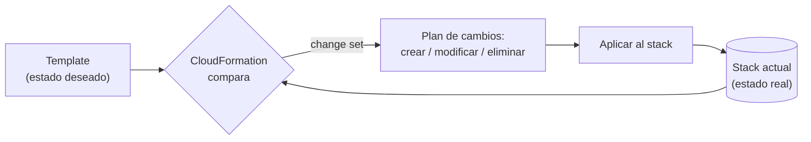

+++
title = "Actualizar un stack con seguridad"
+++

## Cambiar lo que ya está desplegado

Un template no se lanza una sola vez y se olvida: la infraestructura cambia. Se ajusta
la memoria de un contenedor, se agrega un recurso, se sube el número de tareas. En
CloudFormation, cambiar el ambiente no significa borrarlo y recrearlo: significa
**actualizar el stack** con una nueva versión del template, y dejar que CloudFormation
calcule qué modificar.

La pregunta crítica al actualizar es: *¿qué va a hacer exactamente este cambio antes de
aplicarlo?* Esa pregunta la responde un **change set**.

## Change sets: ver antes de aplicar

Un *change set* es una vista previa. Usted sube el template modificado, y CloudFormation
calcula la diferencia contra el estado actual sin tocar nada todavía. El resultado es una
lista de acciones: qué recursos se **modifican**, cuáles se **agregan**, cuáles se
**eliminan**, y —lo más importante— cuáles requieren **reemplazo**.

Este es el ciclo de **reconciliación** de CloudFormation: comparar el estado deseado
(el template) contra el estado real (el stack), calcular la diferencia, y aplicar solo
lo necesario para que coincidan.



El estado real converge hacia el deseado en cada actualización. La misma idea que
encontrará en ECS (un servicio reconcilia las tareas hacia el `DesiredCount`) y, en
general, en toda la infraestructura declarativa.

:::inline-slide light
## Tres formas de aplicar un cambio

| Acción | Qué ocurre |
| --- | --- |
| **Modificación** | El recurso se actualiza en sitio, sin interrupción. |
| **Sin interrupción** | El cambio no afecta el servicio (por ejemplo, una etiqueta). |
| **Reemplazo** | El recurso se destruye y se crea de nuevo — puede causar interrupción. |
:::

El reemplazo es el que hay que vigilar: cambiar ciertas propiedades (por ejemplo, el
nombre físico de una tabla) obliga a CloudFormation a crear un recurso nuevo y borrar el
anterior. El change set lo marca explícitamente con `Replacement: True`, dándole la
oportunidad de detenerse antes de perder datos.

## Práctica guiada: escalar la aplicación a dos tareas

Va a aumentar el número de contenedores en ejecución de uno a dos, modificando el
template y aplicando el cambio con un change set.

### Modificar el template

1. Abra `taller-semana1.yaml` en su editor.
2. Localice el recurso `ServicioApp` (tipo `AWS::ECS::Service`).
3. Cambie la propiedad `DesiredCount` de `1` a `2`:

   ```yaml
   ServicioApp:
     Type: AWS::ECS::Service
     Properties:
       DesiredCount: 2        # antes: 1
   ```

4. Guarde el archivo.

### Crear el change set

1. En la consola de AWS, abra [**CloudFormation**](https://console.aws.amazon.com/cloudformation/home) y seleccione su stack `taller-<su-nombre>`.
2. Pulse **Stack actions → Create change set for current stack**.
3. Seleccione **Replace existing template → Upload a template file**, y suba el
   `taller-semana1.yaml` modificado.
4. Avance por las pantallas (los parámetros siguen igual) hasta llegar a la vista del
   change set. Pulse **Create change set** y déle un nombre, por ejemplo
   `escalar-a-dos`.

### Revisar y aplicar

1. CloudFormation calcula la diferencia y muestra la tabla de cambios. Busque la fila
   correspondiente a `ServicioApp`: la acción debe ser **Modify**, y la columna
   **Replacement** debe decir **False** —el servicio se actualiza en sitio, sin
   recrearse.
2. Confirme que ningún otro recurso aparece como `True` en **Replacement**.
3. Pulse **Execute change set**. CloudFormation aplica solo ese cambio.
4. En la pestaña **Events**, siga la actualización hasta que el stack vuelva a
   **UPDATE_COMPLETE**.

### Verificar el resultado

1. Abra **ECS → Clusters → su clúster → su servicio**. La cuenta de tareas deseadas
   ahora es **2**, y verá dos tareas en estado `RUNNING`.
2. En **EC2 → Target Groups**, el target group del ALB muestra dos destinos sanos
   (*healthy*): el balanceador ya reparte tráfico entre ambas tareas.

## Cuando una actualización falla: el rollback

Si un cambio no puede aplicarse —un valor inválido, un permiso faltante— CloudFormation
no deja el stack a medias. Inicia un **rollback**: deshace los cambios ya aplicados y
devuelve el stack al último estado bueno conocido. El estado pasa por
`UPDATE_ROLLBACK_IN_PROGRESS` y termina en `UPDATE_ROLLBACK_COMPLETE`.

Esto es una red de seguridad: una actualización fallida no rompe el ambiente, lo
devuelve a como estaba. La causa del fallo aparece en la pestaña **Events**, en el
primer evento con estado `..._FAILED`.

::: extra ¿Qué es el drift?
El *drift* ocurre cuando alguien modifica a mano, desde la consola, un recurso que un
stack gestiona —por ejemplo, cambia el `DesiredCount` del servicio directamente en ECS.
El template y la realidad dejan de coincidir. CloudFormation ofrece **Detect drift**
(en **Stack actions**) para comparar el estado real contra el template y listar las
diferencias. La regla práctica: si un recurso lo gestiona un stack, cámbielo solo a
través del stack.
:::

---

{#ejercicio-8}
### Ejercicio 8 — Actualice el stack con un change set

Aumente el número de tareas de su servicio de una a dos. Hágalo modificando el template,
creando un change set, verificando que el servicio se **modifica** sin reemplazo, y
ejecutando el cambio. Confirme que hay dos tareas en ejecución.

::: solucion
1. En `taller-semana1.yaml`, cambie `DesiredCount` de `1` a `2` en el recurso
   `ServicioApp`, y guarde.
2. En [**CloudFormation**](https://console.aws.amazon.com/cloudformation/home), seleccione su stack y pulse
   **Stack actions → Create change set for current stack**.
3. Seleccione **Replace existing template → Upload a template file** y suba el archivo
   modificado.
4. Avance hasta crear el change set; déle un nombre como `escalar-a-dos`.
5. En la tabla de cambios, confirme que `ServicioApp` aparece como **Modify** con
   **Replacement: False**.
6. Pulse **Execute change set** y, en **Events**, espere a **UPDATE_COMPLETE**.
7. En **ECS → Clusters → su servicio**, confirme **Desired tasks: 2** y dos tareas en
   estado `RUNNING`.
:::

:::slide light
{{ejercicio-8}}
:::
