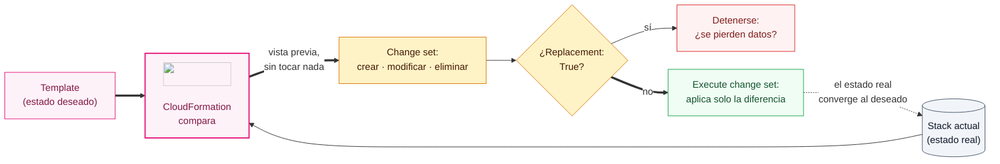

+++
title = "Actualizar un stack con seguridad"
+++

## Cambiar lo que ya está desplegado

Un template no se lanza una sola vez y se olvida: la infraestructura cambia. Se ajusta
la memoria de un contenedor, se agrega un recurso, se sube el número de tareas. En
CloudFormation, cambiar el ambiente no significa borrarlo y recrearlo: significa
**actualizar el stack** con una nueva versión del template, y dejar que CloudFormation
calcule qué modificar.

La pregunta crítica al actualizar es: *¿qué va a hacer exactamente este cambio antes de
aplicarlo?* Esa pregunta la responde un **Change Set**.

:::inline-slide
## Change sets: ver antes de aplicar

Un *change set* es una vista previa. Se sube el template modificado, y CloudFormation
calcula la diferencia contra el estado actual sin tocar nada todavía. El resultado es una
lista de acciones: qué recursos se **modifican**, cuáles se **agregan**, cuáles se
**eliminan**, y cuáles requieren **reemplazo**.

Este es el ciclo de **reconciliación** de CloudFormation: comparar el estado deseado
(el template) contra el estado real (el stack), calcular la diferencia, y aplicar solo
lo necesario para que coincidan.



::: # inline-slide

El estado real converge hacia el deseado en cada actualización. La misma idea que
encontrará en ECS (un servicio reconcilia las tareas hacia el `DesiredCount`) y, en
general, en toda la infraestructura declarativa.

:::inline-slide light
## Tres formas de aplicar un cambio

| Acción | Qué ocurre |
| --- | --- |
| **Modificación** | El recurso se actualiza en sitio, sin interrupción. |
| **Sin interrupción** | El cambio no afecta el servicio (por ejemplo, una etiqueta). |
| **Reemplazo** | El recurso se destruye y se crea de nuevo — puede causar interrupción. |

:::skip
El reemplazo es el que hay que vigilar: cambiar ciertas propiedades (por ejemplo, el
nombre físico de una tabla) obliga a CloudFormation a crear un recurso nuevo y borrar el
anterior. El change set lo marca explícitamente con `Replacement: True`, dando la
oportunidad de detenerse antes de perder datos.

Qué propiedades disparan un reemplazo no es adivinable: está en la columna ***Update
requires*** de la página del recurso, la que se mencionó al leer la referencia oficial.
Tiene tres valores —*No interruption*, *Some interruption*, y *Replacement*— y vale la
pena consultarla **antes** de escribir el cambio, no después de verlo en el change set.
:::

::: warning
Un reemplazo borra el recurso viejo, con sus datos. El atributo
`UpdateReplacePolicy: Retain` evita esa pérdida: le indica a CloudFormation conservar
el recurso original en vez de borrarlo. Es distinto de `DeletionPolicy`, que solo
actúa al borrar el stack. Los dos se ven juntos en la próxima sesión.
::: # warning
::: # inline-slide

:::inline-slide light
## Práctica guiada: escalar la aplicación a dos tareas

Esta práctica aumenta el número de contenedores en ejecución de uno a dos, modificando el
template y aplicando el cambio con un change set.

:::add visibility=slide
:::app
<cb-goto path="Práctica guiada: escalar la aplicación a dos tareas"></cb-goto>
::: # add
::: # app
::: # inline-slide

### Modificar el template

1. Abrir el stack desplegado en la semana anterior en el editor.
2. Localizar el recurso `ServicioApp` (tipo `AWS::ECS::Service`).
3. Cambiar la propiedad `DesiredCount` de `1` a `2`:

   ```yaml
   ServicioApp:
     Type: AWS::ECS::Service
     Properties:
       DesiredCount: 2        # antes: 1
   ```

4. Guardar el archivo.

### Crear el change set

1. En la consola de AWS, abrir [**CloudFormation**](https://console.aws.amazon.com/cloudformation/home) y seleccionar el stack `taller-aws-`.
2. Pulsar **Stack actions → Create a change set**.
3. En **Change set type** seleccionar **Drift aware change set - new**.
4. Seleccionar **Replace existing template → Upload a template file**, y subir el
   archivo modificado.
5. Avanzar por las pantallas (los parámetros siguen igual) hasta llegar a la
   vista del change set, nombrandolo algo como
   `taller-aws--escalar-a-dos`, y aceptando las capabilities durante el
   camino.
6. Pulsar **Create change set**.

Con la `awscli`, subir el template y crear el change set es un solo comando. Cada
parámetro existente se conserva con `UsePreviousValue=true`:

```bash
export TALLER="taller-aws-"

aws cloudformation create-change-set \
   --stack-name $TALLER \
   --change-set-name escalar-a-dos \
   --template-body file://taller-aws-devops-semana1.yaml \
   --parameters \
     ParameterKey=ImageUri,UsePreviousValue=true \
     ParameterKey=RedirigirAHttps,UsePreviousValue=true \
   --capabilities CAPABILITY_IAM

# Esperar a que el change set termine de calcularse
aws cloudformation wait change-set-create-complete \
   --stack-name $TALLER \
   --change-set-name escalar-a-dos
```

Con la variante de VPC existente, agregar también `VpcId`, `SubredAId` y
`SubredBId`, cada uno con `UsePreviousValue=true`.

### Revisar y aplicar

1. CloudFormation calcula la diferencia y muestra la tabla de cambios. Buscar la fila
   correspondiente a `ServicioApp`: la acción debe ser **Modify**, y la columna
   **Replacement** debe decir **False**. El servicio se actualiza en sitio, sin
   recrearse.
2. Confirmar que ningún otro recurso aparece como `True` en **Replacement**.
3. Pulsar **Execute change set**. CloudFormation aplica solo ese cambio.
4. En la pestaña **Events**, seguir la actualización hasta que el stack vuelva a
   **UPDATE_COMPLETE**.

Con la `awscli`, la misma tabla de cambios se obtiene como JSON:

```bash
❯ aws cloudformation describe-change-set \
   --stack-name $TALLER \
   --change-set-name escalar-a-dos \
   --query "Changes[].ResourceChange.{Recurso:LogicalResourceId,Accion:Action,Reemplazo:Replacement}" \
   --output json
[
    {
        "Recurso": "ServicioApp",
        "Accion": "Modify",
        "Reemplazo": "False"
    }
]
```

Sin `--query`, la respuesta completa incluye, en `Details`, qué propiedad dispara
cada cambio (`DesiredCount`, en este caso).

Aplicar el change set y seguir la actualización:

```bash
aws cloudformation execute-change-set \
   --stack-name $TALLER \
   --change-set-name escalar-a-dos

# Ver los eventos más recientes (repetir mientras avanza)
aws cloudformation describe-stack-events \
   --stack-name $TALLER \
   --max-items 5 \
   --query "StackEvents[].[Timestamp,LogicalResourceId,ResourceStatus]" \
   --output table

# Bloquear hasta que el stack vuelva a UPDATE_COMPLETE
aws cloudformation wait stack-update-complete --stack-name $TALLER
```

### Verificar el resultado

1. Abrir [**ECS → Clusters → el clúster → el servicio**](https://console.aws.amazon.com/ecs/home). La cuenta de tareas deseadas
   ahora es **2**, y se verán dos tareas en estado `RUNNING`.
2. En [**EC2 → Target Groups**](https://console.aws.amazon.com/ec2/home#TargetGroups:), el target group del ALB muestra dos destinos sanos
   (*healthy*): el balanceador ya reparte tráfico entre ambas tareas.

## Cuando una actualización falla: el rollback

Si un cambio no puede aplicarse (por ejemplo: un valor inválido o un permiso
faltante) CloudFormation no deja el stack a medias. Inicia un **rollback**:
deshace los cambios ya aplicados y devuelve el stack al último estado bueno
conocido. El estado pasa por `UPDATE_ROLLBACK_IN_PROGRESS` y termina en
`UPDATE_ROLLBACK_COMPLETE`.

Esto es una red de seguridad: una actualización fallida no rompe el ambiente, lo
devuelve a como estaba. La causa del fallo aparece en la pestaña **Events**, en el
primer evento con estado `..._FAILED`.

### Cuando el rollback también falla

El rollback casi siempre termina bien, pero puede fallar. Si al deshacer un
cambio CloudFormation tampoco puede volver al estado anterior (común cuando
alguien borra a mano el recurso original o cuando un permiso desaparece a mitad
de camino) el stack queda en `UPDATE_ROLLBACK_FAILED`. Es el único estado que
**bloquea el stack**: no acepta más actualizaciones hasta resolverlo,
y a diferencia de un fallo común no se sale de él subiendo otro template.

La salida es la acción **Stack actions → Continue update rollback**. Reintenta el
rollback desde donde se quedó. Si vuelve a trabarse en el mismo recurso, la pantalla
ofrece una lista de recursos a **saltear** (*Resources to skip*): CloudFormation los da
por perdidos, termina el rollback, y deja el stack en `UPDATE_ROLLBACK_COMPLETE` con
esos recursos marcados como `UPDATE_ROLLBACK_FAILED_SKIPPED`. Es una salida de
emergencia con precio: el template y la realidad quedan desalineados en esos recursos,
así que después conviene correr **Detect drift** y arreglarlos.

### Investigar un fallo sin perder la evidencia

El rollback tiene un costo cuando lo que se quiere es **entender** el fallo: al
deshacer los cambios, se lleva puesto el recurso que falló, y con él los logs y la
configuración que explicaban por qué. La tarea de ECS que no arrancó ya no está para
mirarla.

Para esos casos, la pantalla de creación ofrece, en **Stack failure options**, la
opción **Preserve successfully provisioned resources**, y la de actualización acepta
deshabilitar el rollback. El stack queda en `CREATE_FAILED` o `UPDATE_FAILED` con todo
lo que sí se creó en pie, listo para inspeccionar.

:::warning
Es una herramienta de diagnóstico, no un modo de trabajo: el stack queda
a medias, y hay que borrarlo o arreglarlo a mano después.
:::

:::slide light
## Estados de un fallo

| Estado | Qué significa |
| --- | --- |
| `UPDATE_ROLLBACK_COMPLETE` | El rollback funcionó. El stack está sano. |
| `UPDATE_ROLLBACK_FAILED` | El rollback falló. Stack **bloqueado** → *Continue update rollback*. |
| `UPDATE_FAILED` (sin rollback) | Rollback deshabilitado a propósito, para investigar. |
:::

::: extra ¿Qué es el drift?
El *drift* ocurre cuando alguien modifica a mano, desde la consola, un recurso que un
stack gestiona —por ejemplo, cambia el `DesiredCount` del servicio directamente en ECS.
El template y la realidad dejan de coincidir. CloudFormation ofrece **Detect drift**
(en **Stack actions**) para comparar el estado real contra el template y listar las
diferencias. La regla práctica: si un recurso lo gestiona un stack, cámbielo solo a
través del stack.
:::
