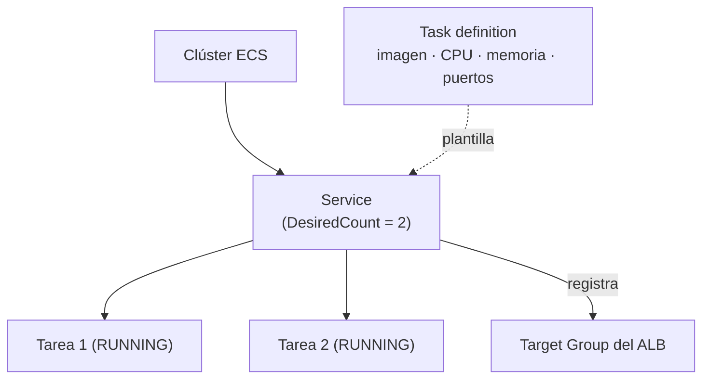

+++
title = "Los primeros contenedores — ECS y Fargate"
+++

## Del recurso en el template al contenedor en ejecución

En el template leyó tres recursos relacionados: un **clúster**, un **servicio**, y una
**task definition**. Esta sección los explica como lo que son cuando el stack ya corre:
las piezas que mantienen su contenedor vivo y accesible. Al terminar, los reconocerá en
la consola de ECS y entenderá qué hace cada uno.

## El modelo de ECS

**Amazon ECS** (Elastic Container Service) es el orquestador de contenedores de AWS:
decide dónde corren los contenedores, los mantiene en ejecución, y los reemplaza si
fallan. Tres conceptos lo estructuran.

:::inline-slide light
## ECS en tres piezas

| Pieza | Qué es |
| --- | --- |
| **Clúster** | El espacio lógico donde corren las tareas. |
| **Task definition** | La plantilla de ejecución de un contenedor (imagen, CPU, memoria, puertos). |
| **Service** | El controlador que mantiene N tareas vivas y las reemplaza si caen. |
:::

### El clúster

El **clúster** es la agrupación lógica donde viven las tareas. Con Fargate no contiene
servidores que usted administre —es solo el contexto bajo el cual ECS organiza lo que
corre. En la consola, es lo que vio en **ECS → Clusters**.

### La task definition

La **task definition** es la plantilla de ejecución de un contenedor: el documento que
dice *cómo* es una tarea. Sus campos principales:

- **Imagen**: el URI en ECR de la imagen a ejecutar (en su caso, el que llegó vía el
  parámetro `ImageUri`).
- **CPU y memoria**: los recursos reservados (en su template, `256` CPU y `512` MB).
- **Puertos** (*port mappings*): el puerto que el contenedor expone (`8080`).
- **Rol de ejecución**: el rol de IAM que permite a Fargate descargar la imagen de ECR
  y escribir logs.
- **Configuración de logs**: a qué grupo de CloudWatch Logs envía la salida del
  contenedor.

Las task definitions son **versionadas**: cada cambio crea una nueva *revisión*
(`taller:1`, `taller:2`, …). Esto permite saber exactamente qué configuración está
corriendo, y volver a una anterior si hace falta.

### El service

El **service** es el controlador que mantiene el número deseado de tareas en ejecución.
Es lo que cambió en la sección anterior cuando subió `DesiredCount` a 2. Sus
responsabilidades:

- Lanzar tantas tareas como indique `DesiredCount`, a partir de la task definition.
- Vigilarlas: si una tarea falla o termina, lanzar una de reemplazo.
- Registrar las tareas en el *target group* del balanceador, para que reciban tráfico.

La distinción clave: la **task definition** describe *cómo es* una tarea; el **service**
decide *cuántas hay y las mantiene vivas*.

::: extra Fargate vs. EC2: ¿quién pone los servidores?
ECS puede ejecutar tareas de dos formas. Con el tipo de lanzamiento **EC2**, usted
administra una flota de servidores donde corren los contenedores. Con **Fargate**, AWS
pone y administra esa capacidad por usted: especifica CPU y memoria por tarea, y no ve ni
mantiene servidores. Este taller usa Fargate porque elimina la administración de
servidores —el foco queda en la aplicación, no en la infraestructura que la ejecuta.
:::

:::slide
## Task definition vs. service

- **Task definition** → *cómo es* una tarea: imagen, CPU, memoria, puertos, logs.
- **Service** → *cuántas hay y las mantiene vivas*; las registra en el balanceador.

Una describe; el otro opera.
:::

## Práctica guiada: reconocer las piezas en la consola

### Abrir el clúster

1. Abra [**ECS**](https://console.aws.amazon.com/ecs/home) y seleccione su clúster.
2. En la pestaña **Services**, verá su servicio con la cuenta de tareas deseadas y en
   ejecución (ahora `2`).

### Inspeccionar el servicio y sus tareas

1. Pulse sobre el nombre del servicio.
2. En la pestaña **Tasks**, verá las tareas en estado `RUNNING`. Pulse una de ellas.
3. En el detalle de la tarea, localice la **task definition** que la originó (con su
   número de revisión) y el **grupo de logs** al que escribe.

### Leer la task definition

1. Pulse sobre el nombre de la task definition para abrir su revisión.
2. Identifique la **imagen** (el URI de ECR), la **CPU y memoria**, y el **port
   mapping** —los mismos valores que leyó en el template.

---

{#ejercicio-9}
### Ejercicio 9 — Reconozca lo que está corriendo

Desde la consola de ECS, identifique para su aplicación: la tarea en ejecución, la
revisión de la task definition que la originó, el URI de la imagen que ejecuta, y el
grupo de CloudWatch Logs al que escribe.

::: solucion
1. Abra [**ECS → Clusters**](https://console.aws.amazon.com/ecs/home) y seleccione su clúster.
2. Entre a su servicio y abra la pestaña **Tasks**. Pulse una tarea en estado
   `RUNNING`.
3. En el detalle de la tarea, anote:
   - La **task definition** y su número de revisión (por ejemplo, `taller:2`).
   - El **grupo de logs** (*Log group*), bajo la sección de logs del contenedor.
4. Pulse la task definition para abrir su revisión, y localice en el contenedor:
   - La **imagen**: el URI de ECR con su etiqueta (el mismo que pasó como `ImageUri`).
   - La **CPU y memoria** reservadas.
5. Compruebe que estos valores coinciden con los que leyó en el template
   `taller-semana1.yaml`: el recurso del template y el contenedor en ejecución son la
   misma cosa, vista desde dos lados.
:::

:::slide light
{{ejercicio-9}}
:::

---

## Dónde estamos

Al cerrar la Semana 2, la caja negra ya no es una caja negra:

- **Lee un template** de CloudFormation: reconoce sus secciones, sigue las funciones
  intrínsecas, y conecta cada recurso con lo que ve en la consola.
- **Actualiza el stack con seguridad**, usando change sets para ver el cambio antes de
  aplicarlo, y sabe leer un fallo desde la pestaña de eventos.
- **Entiende los contenedores por dentro**: el clúster, la task definition que describe
  cada tarea, y el servicio que las mantiene vivas y las pone detrás del balanceador.

Pasó de *lanzar* el ambiente a *entenderlo y modificarlo*.

## Qué sigue en la Semana 3

La próxima semana operamos y automatizamos lo que ya entiende. Vamos a:

- **Operar el workload**: la red que conecta el balanceador con las tareas, el
  **escalado** automático, y el **troubleshooting** cuando una tarea no arranca.
- **Automatizar el flujo completo** con **CodePipeline**: del commit al despliegue, con
  disparo automático y una etapa de **aprobación manual** —y las notificaciones a Teams
  que adelantamos en la Semana 1.
- **Abrir la observabilidad** con las métricas y los logs de CloudWatch.

Llegará al final de la Semana 3 con el ciclo de entrega automatizado y los primeros ojos
puestos sobre cómo se comporta el sistema en ejecución.
