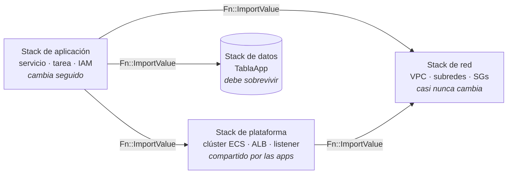

+++
title = "Separar los stacks por ciclo de vida"
+++

## Un stack, tres ciclos de vida

El stack monolítico de la Semana 1 cumplió su función: un archivo, dos parámetros, un
ambiente completo. Pero dentro de ese stack conviven recursos que envejecen a ritmos
muy distintos:

- La **red** (VPC, subredes, grupos de seguridad) casi nunca cambia. Se define una vez
  y varias aplicaciones podrían compartirla.
- Los **datos** (la tabla de DynamoDB) deben sobrevivir. Destruir el ambiente no
  debería tocarlos.
- La **aplicación** (servicio, task definition, balanceador) cambia todo el tiempo, y
  es deliberadamente descartable —el seguro del taller depende de eso.

Mientras los tres viven en un solo stack, comparten un solo destino: no se puede borrar
la aplicación sin borrar la tabla, ni recrear el ambiente sin recrear la red. La
[guía oficial de buenas prácticas de CloudFormation](https://docs.aws.amazon.com/AWSCloudFormation/latest/UserGuide/best-practices.html)
recomienda exactamente esta separación: **organizar los stacks por ciclo de vida y
por responsable**, no por conveniencia de tener todo junto.

## Cómo encontrar el corte

Decir "tres stacks" es fácil cuando alguien ya los dividió. La pregunta útil es la
otra: frente a un template propio de cuatrocientas líneas, ¿cómo se decide **dónde**
cortar? El procedimiento es mecánico, y tiene cuatro pasos.

:::slide
## Cuatro pasos para dividir un stack

1. **Listar** los recursos.
2. **Agrupar** por ritmo de cambio.
3. **Marcar** las referencias que cruzan un grupo.
4. Cada cruce es un **export**.
:::

### Paso 1: listar los recursos

El template de la Semana 1 tiene veintiún recursos. Escritos como lista plana, sin la
estructura del archivo, dejan de esconderse entre las propiedades:

`TablaApp` · `ClusterApp` · `ServicioApp` · `TareaApp` · `GrupoLogs` ·
`RolEjecucion` · `RolTarea` · `VpcApp` · `SubredPublicaA` · `SubredPublicaB` ·
`GatewayInternet` · `VinculoGateway` · `TablaRutas` · `RutaSalida` ·
`AsociacionSubredA` · `AsociacionSubredB` · `GrupoSeguridadALB` ·
`GrupoSeguridadServicio` · `BalanceadorApp` · `GrupoDestino` · `ListenerHTTP`

### Paso 2: agrupar por ritmo de cambio

A cada recurso se le hace una sola pregunta: **¿cada cuánto cambia?** No qué servicio
es, ni a qué capa de la arquitectura pertenece —cada cuánto cambia—. Los que responden
lo mismo van juntos.

| Grupo | Ritmo | Recursos |
| --- | --- | --- |
| **Red** | Casi nunca. Una vez por ambiente. | Los 11 de EC2: VPC, subredes, gateway, rutas, y los dos grupos de seguridad |
| **Datos** | Nunca se recrea. Debe sobrevivir. | `TablaApp` |
| **Aplicación** | En cada despliegue. | Los 9 restantes: ECS, ALB, logs, y los roles |

Los tres grupos salen solos, y ninguno depende de gustos: la VPC no cambia porque se
despliegue una versión nueva, y la tabla no se puede recrear sin perder lo que guarda.

### Paso 3: marcar las referencias que cruzan

Este es el paso que convierte una intuición en un diseño. Se recorren los `!Ref` y
`!GetAtt` del template, y se marcan **solo los que ahora cruzan de un grupo a otro**.
Los que quedan dentro de un mismo grupo no importan: siguen siendo referencias
internas.

En el template de la Semana 1 cruzan siete, y ni una más:

| Referencia que cruza | De | Hacia |
| --- | --- | --- |
| El ID de la VPC (lo usa `GrupoDestino`) | Aplicación | Red |
| El ID de la subred A (la usan el servicio y el ALB) | Aplicación | Red |
| El ID de la subred B (la usan el servicio y el ALB) | Aplicación | Red |
| El ID del grupo de seguridad del ALB | Aplicación | Red |
| El ID del grupo de seguridad del servicio | Aplicación | Red |
| El nombre de la tabla (variable de entorno del contenedor) | Aplicación | Datos |
| El ARN de la tabla (política de `RolTarea`) | Aplicación | Datos |

### Paso 4: cada cruce es un export

La lista del paso 3 **es** el contrato. Cada fila se vuelve un `Export` en el stack de
origen, y un `Fn::ImportValue` en el de destino. Nada más se exporta: lo que no cruza,
no se publica.

Y aquí se puede verificar el método contra la realidad. El stack de red que provee el
instructor tiene exactamente **cinco** exports, y el de datos exactamente **dos**. Son
las siete filas de la tabla, una por una. Los templates no salieron de la intuición de
nadie: salieron de este procedimiento.

::: info
Que la flecha vaya siempre de la aplicación hacia los otros dos no es casualidad. Las
dependencias apuntan de lo que cambia seguido hacia lo que cambia poco, nunca al revés.
Un export del stack de aplicación hacia el de red sería una señal de que el corte está
mal puesto.
:::

## Los otros ejes: quién manda, y qué se rompe

El ciclo de vida alcanza para este taller, y suele alcanzar. Cuando no alcanza, hay
otros dos criterios, y la guía de AWS nombra el primero junto al ciclo de vida.

**Por responsable.** Si dos grupos de recursos los aprueba gente distinta, van en
stacks distintos, aunque cambien al mismo ritmo. La red la administra el equipo de
plataforma, la aplicación su equipo de desarrollo. Separarlos permite que cada uno
despliegue lo suyo sin pedir permiso ni tocar lo ajeno. Un stack compartido convierte
cada cambio en una negociación.

**Por radio de impacto.** ¿Qué se lleva puesto un error? Un stack grande falla entero
y hace rollback entero, así que un error en una etiqueta puede revertir un despliegue
completo. Aislar lo delicado —los datos— limita el daño de un error en lo que no lo es.

En la práctica los tres ejes suelen coincidir: lo que cambia a otro ritmo, lo aprueba
otra gente, y rompe otras cosas. Cuando no coinciden, **el ciclo de vida decide**,
porque es el único de los tres que la plataforma hace cumplir.

:::slide
## Tres ejes para cortar

| Eje | La pregunta |
| --- | --- |
| **Ciclo de vida** | ¿Cada cuánto cambia? |
| **Responsable** | ¿Quién lo aprueba? |
| **Radio de impacto** | ¿Qué se lleva puesto si falla? |

Cuando no coinciden, manda el **ciclo de vida**.
:::

## Dónde va la seguridad

Red, datos, y aplicación son capas fáciles de ubicar. La seguridad no: un rol de IAM no
"pertenece" de manera obvia a ninguna, porque siempre conecta dos cosas. `RolTarea` es
el ejemplo exacto —lo usa la aplicación, y da acceso a la tabla, que vive en otro
stack—.

El template de aplicación resuelve el caso así:

```yaml
  RolTarea:
    Type: AWS::IAM::Role                     # vive en el stack de aplicación
    Properties:
      Policies:
        - PolicyName: acceso-tabla-app
          PolicyDocument:
            Statement:
              - Action: [dynamodb:GetItem, dynamodb:PutItem]
                Resource:
                  Fn::ImportValue: !Sub "${DatosStackName}-tabla-arn"
```

El rol vive con la **aplicación**, no con los datos, y de ahí sale la regla general:

::: info
**Un permiso sigue a quien lo consume, no al recurso que protege.**
:::

La razón es la de siempre, el ciclo de vida. El permiso cambia cuando cambia la
aplicación —una función nueva necesita una acción nueva—, no cuando cambia la tabla.
Ponerlo en el stack de datos obligaría a tocar los datos para cambiar el código, que es
justo lo que la separación quiere evitar. Y la dependencia queda apuntando en la
dirección correcta: la aplicación importa el ARN, el stack de datos no sabe quién lo
usa.

### Cuándo sí conviene un stack de seguridad aparte

La regla anterior no dice "nunca separar la seguridad". Dice que un rol de un solo
consumidor va con su consumidor. Un stack de seguridad propio se justifica cuando
aparece cualquiera de estas tres cosas:

- **Roles compartidos por varias aplicaciones.** Si tres stacks de aplicación usan el
  mismo rol, ya no sigue a un consumidor: es infraestructura común, como la red.
- **Un aprobador distinto.** Cuando el equipo de seguridad revisa los cambios de IAM y
  nadie más los toca, es el eje "por responsable" pidiendo un corte.
- **Recursos de gobierno**: *permission boundaries*, políticas de contraseñas,
  proveedores de identidad, roles de auditoría. No sirven a una aplicación; son la
  cuenta entera.

Ninguna de las tres se da en el taller: dos roles, un solo consumidor, un solo
responsable. Por eso los roles viven con la aplicación, y por eso no hay un stack de
seguridad. La decisión de **no** dividir también se toma con el mismo criterio.

:::slide
## Dónde va la seguridad

**Un permiso sigue a quien lo consume, no al recurso que protege.**

Un stack de seguridad aparte se justifica si hay:

- Roles **compartidos** por varias aplicaciones.
- Un **aprobador distinto** para los cambios de IAM.
- Recursos de **gobierno** de la cuenta entera.
:::

## El cuarto corte: lo que comparten las aplicaciones

El procedimiento de arriba se aplicó a una pregunta concreta: **un** ambiente, **una**
aplicación. Cambiando la pregunta, cambia la respuesta. Supongamos que mañana hay que
poner una segunda aplicación en la misma cuenta —otra imagen, otro equipo, la misma
red—. ¿Alcanza con lanzar el stack de aplicación una segunda vez?

Alcanza, y sale mal. Porque el grupo "Aplicación" del paso 2 escondía una diferencia
que con una sola aplicación no se nota. A cada uno de esos nueve recursos hay que
hacerle ahora una segunda pregunta: **¿cuántas aplicaciones lo usan?**

| Recurso | ¿Cuántas aplicaciones lo usan? |
| --- | --- |
| `ClusterApp` | Todas. Es una agrupación lógica de servicios. |
| `BalanceadorApp` | Todas. Un solo punto de entrada, un solo nombre DNS. |
| `ListenerHTTP` | Todas. Escucha un puerto del balanceador compartido. |
| `ServicioApp`, `TareaApp` | Una. Es *esta* imagen, con *esta* configuración. |
| `GrupoDestino` | Una. Describe el puerto y el health check de *esta* aplicación. |
| `GrupoLogs` | Una. Los logs de *esta* aplicación. |
| `RolEjecucion`, `RolTarea` | Una. Los permisos de *esta* aplicación. |

Tres arriba, seis abajo. Los tres de arriba forman una capa que hasta ahora no tenía
nombre: la **plataforma**, el sustrato de ejecución sobre el que corre cualquier
aplicación.

### El clúster engaña; el balanceador no

Duplicar el clúster no duele, y ese es exactamente el problema. Con Fargate, un clúster
de ECS **no reserva capacidad**: es una agrupación lógica, y no se factura. Diez
clústeres vacíos cuestan lo mismo que uno. Por eso el error sobrevive sin que nadie lo
note —hasta que aparece un inventario con treinta clústeres de una aplicación cada uno,
y ya nadie sabe cuál es cuál.

El balanceador sí duele. Un ALB se factura por **hora de existencia**, además del
tráfico que procesa. Dos balanceadores para el mismo tráfico no reparten el costo: lo
duplican en su parte fija. Y el costo no es lo único: dos balanceadores son dos nombres
DNS, dos certificados, y dos lugares donde configurar lo mismo.

::: info
El clúster compartido tiene un límite que conviene saber: los exports de CloudFormation
viven en **una sola cuenta y una sola región**. Una plataforma compartida sirve a las
aplicaciones de esa cuenta. Entre cuentas, lo que se comparte es la **red** —con AWS
Resource Access Manager, que sí permite compartir subredes— y cada cuenta pone su
propio clúster. Como el clúster es gratis, esa duplicación no cuesta nada; el ALB, sí.
:::

### La regla del listener: el contrato al revés

Sacar el balanceador del stack de aplicación plantea un problema nuevo. Hasta acá cada
cruce se resolvía **importando**: la aplicación lee un valor que otro stack publicó. El
balanceador necesita lo contrario. La aplicación no quiere *leer* el listener: quiere
**agregarle** algo, una entrada que diga "lo que venga por esta ruta, mandámelo a mí".

El recurso que hace eso es `AWS::ElasticLoadBalancingV2::ListenerRule`, y vive en el
stack de aplicación:

```yaml
  ReglaHTTP:
    Type: AWS::ElasticLoadBalancingV2::ListenerRule
    Properties:
      ListenerArn:
        Fn::ImportValue: !Sub "${PlataformaStackName}-listener-http-arn"
      Priority: !Ref Prioridad
      Conditions:
        - Field: path-pattern
          PathPatternConfig:
            Values: [!Ref RutaPath]
      Actions:
        - Type: forward
          TargetGroupArn: !Ref GrupoDestino
```

Lo importante es lo que **no** pasa. El stack de plataforma no menciona ninguna
aplicación, y no cambia cuando aparece una nueva: su listener tiene como acción por
defecto un `fixed-response` con un 404, y todo el tráfico útil lo colocan las reglas.
La dependencia sigue apuntando en la dirección correcta —de lo que cambia seguido hacia
lo que cambia poco—, igual que con la red y los datos.

Esta forma ya apareció en el taller: el template opcional de HTTPS de la Semana 1 le
agrega un listener al ALB de otro stack sin modificarlo. Es el mismo movimiento.

### Prioridades: la más específica primero

Las reglas de un listener se evalúan **de menor a mayor `Priority`**, y gana la primera
que coincide. Si ninguna coincide, corre la acción por defecto. De ahí salen dos
consecuencias prácticas:

- La regla más **general** lleva el número más **alto**. Una aplicación que atiende
  `/*` con prioridad 1 se queda con todo el tráfico, y ninguna otra regla se llega a
  evaluar.
- La prioridad es **única por listener**. Dos stacks de aplicación con el mismo número
  no conviven: el segundo falla al crear la regla, con un mensaje claro.

::: info
El enrutado por ruta exige que la aplicación sepa servirse desde su prefijo: una app que
genera enlaces absolutos a `/estilos.css` se rompe detrás de `/b/*`. Cuando eso no se
puede cambiar, se enruta por **host** en vez de por ruta —`Field: host-header`, un
dominio por aplicación, un solo balanceador— y el problema desaparece.
:::

:::slide
## El cuarto corte

Segunda pregunta sobre el grupo "Aplicación": **¿cuántas aplicaciones lo usan?**

| Todas → **plataforma** | Una → **aplicación** |
| --- | --- |
| Clúster, ALB, listener | Servicio, tarea, target group, logs, roles |

El clúster duplicado es **gratis** con Fargate; el ALB duplicado, no.

La aplicación no importa el balanceador: le **agrega** un `ListenerRule`.
:::

## Cuándo no dividir

Dividir tiene precio, y conviene decirlo antes de que parezca gratis. Tres stacks son
tres despliegues a coordinar, un orden de borrado obligatorio, y valores congelados
mientras alguien los importe. Un ambiente partido en ocho stacks para lo que necesitaba
dos no es más mantenible: es el mismo sistema, con más ceremonia.

Las señales de que un corte sobra:

- Los dos stacks **siempre se despliegan juntos**. Si nunca se actualiza uno sin el
  otro, no tienen ciclos de vida distintos: tienen uno solo, escrito dos veces.
- El contrato es **enorme**. Diez o quince exports entre dos stacks indican que el corte
  pasó por el medio de algo que era una sola pieza. Un contrato sano es chico.
- Los cambios cruzan la frontera **todo el tiempo**. Si cada tarea toca los dos stacks,
  la frontera está estorbando en vez de proteger.

La regla práctica: **empezar junto, y dividir cuando duela**. El dolor es concreto y se
reconoce —no poder borrar el ambiente sin perder los datos es exactamente el dolor que
motiva esta sección—. Dividir antes de sentirlo es adivinar.

:::inline-slide light
## La arquitectura en cuatro stacks


:::

El instructor provee los cuatro templates que salen de ese análisis:

| Template | Stack | Contiene |
| --- | --- | --- |
| `taller-aws-devops-semana2-red.yaml` | `taller-aws-<su-nombre>-red` | VPC, subredes, gateway, grupos de seguridad |
| `taller-aws-devops-semana2-datos.yaml` | `taller-aws-<su-nombre>-datos` | La tabla de DynamoDB, con `DeletionPolicy: Retain` |
| `taller-aws-devops-semana2-plataforma.yaml` | `taller-aws-<su-nombre>-plataforma` | Clúster de ECS, balanceador, listeners |
| `taller-aws-devops-semana2-app.yaml` | `taller-aws-<su-nombre>-app` | Servicio, task definition, target group, regla, logs, roles |

:::app
<cb-file path="./infra/templates/taller-aws-devops-semana2-plataforma.yaml" type="yaml" toggleable full-path></cb-file>
:::

:::app
<cb-file path="./infra/templates/taller-aws-devops-semana2-app.yaml" type="yaml" toggleable full-path></cb-file>
:::

Nótese la única flecha nueva que no sale de la aplicación: **plataforma → red**. El
balanceador necesita las subredes y el grupo de seguridad, así que importa del stack de
red igual que lo hacía antes. Ninguna flecha apunta hacia la aplicación, y esa es la
comprobación de que el corte quedó bien puesto.

## El contrato entre stacks

Separar los stacks obliga a hacer explícito lo que antes era un `!Ref` interno. El
stack de red **exporta** sus valores con nombre:

```yaml
Outputs:
  VpcId:
    Value: !Ref VpcApp
    Export:
      Name: !Sub "${AWS::StackName}-vpc-id"
```

Y el stack de aplicación los **importa** por ese nombre:

```yaml
      VpcId:
        Fn::ImportValue: !Sub "${RedStackName}-vpc-id"
```

Esto es la versión entre stacks de los outputs como contrato que se vio en la sección
anterior. Y como todo contrato, obliga: mientras el stack de aplicación importe un
valor, CloudFormation **impide borrar o modificar** el stack que lo exporta. El orden
de borrado deja de ser una convención y pasa a estar garantizado por CloudFormation:
primero la aplicación, después la plataforma y los datos, al final la red.

### El precio del contrato

Esa garantía tiene un costo que conviene conocer antes de apoyarse en exports para
todo. Mientras alguien importa un export, su valor **no se puede cambiar**: no solo
está protegido el stack, está congelado el valor. Cambiar el CIDR de la VPC del stack
de red, con la aplicación importándolo, exige borrar primero el stack de aplicación,
cambiar la red, y volver a crearla. La rigidez es el precio de la seguridad.

Los otros dos límites son de alcance. Un export vive en **una sola región y una sola
cuenta**: no hay import entre regiones ni entre cuentas. Y el nombre del export es
único en la región, de ahí el prefijo `${AWS::StackName}` que convive con el resto de
los participantes.

La regla práctica que sale de esto: exportar lo que de verdad es un contrato estable
—identificadores de red, ARNs de recursos compartidos— y no exportar valores que se
espera ajustar seguido.

::: extra El contrato en acción: reutilizar una VPC existente
La separación paga un dividendo inmediato. En cuentas donde no se crea una VPC por
participante —por cuota o por política del cliente—, el instructor provee la variante
`taller-aws-devops-semana2-red-existente.yaml`: recibe como parámetros una **VPC
existente** (la VPC por defecto de la cuenta sirve) y **dos subredes públicas en
zonas de disponibilidad distintas**, crea únicamente los grupos de seguridad, y
publica todo bajo los **mismos cinco exports** que el stack de red estándar.

Los stacks de datos, plataforma, y aplicación no cambian ni una línea. Ese es el
punto: quien importa `-vpc-id` no puede distinguir —ni necesita distinguir— si la
red la creó CloudFormation o la adoptó de la cuenta. Un contrato bien definido hace
intercambiable a quien lo cumple.

Si la VPC disponible no tiene subredes públicas utilizables, el template
`taller-aws-devops-extra-subredes-publicas.yaml` —desplegado una sola vez por quien
administra la cuenta— las crea: dos subredes en zonas distintas, su tabla de rutas,
y la salida a internet, con el Internet Gateway existente como parámetro opcional
(si no se indica, lo crea y lo adjunta).
:::

## El problema: la tabla ya tiene datos

Recrear la red y la aplicación es gratis —es lo que se practicó en la Semana 1. La
tabla es distinta: los contadores que la guía fue acumulando viven ahí. Borrar el
stack monolítico y lanzar los tres nuevos destruiría esos datos.

CloudFormation tiene una respuesta específica para esto: **importar recursos**. Un
stack puede *adoptar* un recurso que ya existe —sin tocarlo, sin recrearlo— siempre
que el template lo describa tal como es y declare una `DeletionPolicy` explícita. La
migración completa usa tres piezas que ya se conocen, más el import:

1. `DeletionPolicy: Retain` sobre la tabla, aplicado con un change set.
2. Borrar el stack monolítico —todo muere, salvo la tabla, que queda **huérfana**:
   viva, funcionando, pero sin stack que la gestione.
3. Crear los stacks de red, plataforma, y aplicación como siempre.
4. Crear el stack de datos **importando** la tabla huérfana.

:::slide
## La migración

1. `DeletionPolicy: Retain` en la tabla → change set.
2. Borrar el stack monolítico → la tabla queda **huérfana**.
3. Crear el stack de red, y encima el de plataforma.
4. Crear el stack de datos **importando** la tabla.
5. Crear el stack de aplicación.

La tabla nunca se recrea. Los datos nunca se mueven.
:::

## Práctica guiada: la migración

### Dejar una marca en la tabla

Antes de migrar, escribir un dato que demuestre, al final, que nada se perdió.

1. Resolver el nombre físico de la tabla a partir del stack:

   ```bash
   export STACK=taller-aws-<su-nombre>
   TABLA=$(aws cloudformation describe-stack-resources \
     --stack-name "$STACK" \
     --logical-resource-id TablaApp \
     --query "StackResources[0].PhysicalResourceId" \
     --output text)
   echo "$TABLA"
   ```

2. Incrementar un contador de prueba:

   ```bash
   aws dynamodb update-item \
     --table-name "$TABLA" \
     --key '{"collection": {"S": "counters"}, "key": {"S": "migracion"}}' \
     --update-expression "ADD #v :uno" \
     --expression-attribute-names '{"#v": "value"}' \
     --expression-attribute-values '{":uno": {"N": "1"}}'
   ```

3. Confirmar que el dato está:

   ```bash
   aws dynamodb get-item \
     --table-name "$TABLA" \
     --key '{"collection": {"S": "counters"}, "key": {"S": "migracion"}}'
   ```

### Proteger la tabla con `Retain`

1. Abrir `taller-aws-devops-semana1.yaml` en el editor y agregar la política sobre
   la tabla:

   ```yaml
   TablaApp:
     Type: AWS::DynamoDB::Table
     DeletionPolicy: Retain
   ```

2. En [**CloudFormation**](https://console.aws.amazon.com/cloudformation/home),
   seleccionar el stack `taller-aws-<su-nombre>` y aplicar el cambio con un change set,
   como en la sección anterior: **Stack actions → Create change set for current
   stack**, subir el template modificado, y ejecutarlo. `TablaApp` aparece como
   **Modify** sin reemplazo —la política es metadata del stack, no toca la tabla.

### Borrar el stack monolítico

1. Con el change set aplicado, pulsar **Delete → Delete stack**. Es el mismo
   teardown de la Semana 1, con una diferencia: en la pestaña **Events**, la tabla
   aparece como **DELETE_SKIPPED** —CloudFormation la deja atrás, intacta.
2. Confirmar que la tabla sigue viva, ahora sin stack:

   ```bash
   aws dynamodb describe-table --table-name "$TABLA" \
     --query "Table.TableStatus" --output text
   ```

   Debe responder `ACTIVE`.

### Crear el stack de red

1. Pulsar **Create stack → With new resources (standard)**.
2. Subir `taller-aws-devops-semana2-red.yaml`.
3. En **Stack name**, escribir `taller-aws-<su-nombre>-red`. No tiene parámetros.
4. Pulsar **Next** hasta **Submit**, y esperar a **CREATE_COMPLETE**.

### Crear el stack de plataforma

1. Pulsar **Create stack → With new resources (standard)**.
2. Subir `taller-aws-devops-semana2-plataforma.yaml`.
3. En **Stack name**, escribir `taller-aws-<su-nombre>-plataforma`.
4. En **RedStackName**, escribir `taller-aws-<su-nombre>-red`. Dejar **NombreDominio**
   y **HostedZoneId** vacíos: son la parte opcional de HTTPS, más abajo.
5. Pulsar **Next** hasta **Submit**, y esperar a **CREATE_COMPLETE**.
6. Abrir la **UrlBase** de la pestaña **Outputs**. Responde `404` con el texto
   *Ninguna aplicacion responde en esta ruta.* —es correcto: el balanceador existe y
   todavía no hay ninguna regla que lo enrute a ningún lado.

### Crear el stack de datos, importando la tabla

Este stack no se crea: se crea *alrededor* de la tabla que ya existe.

1. Pulsar **Create stack → With existing resources (import resources)**.
2. Subir `taller-aws-devops-semana2-datos.yaml`.
3. En la pantalla **Identify resources**, CloudFormation lista los recursos del
   template que necesitan un identificador. Para `TablaApp`, pegar en **TableName**
   el nombre físico de la tabla (el valor de `$TABLA`).
4. En **Stack name**, escribir `taller-aws-<su-nombre>-datos`, y pulsar **Next**.
5. Revisar el resumen: la operación es **Import**, y no crea ni modifica nada más.
   Pulsar **Import resources**.
6. En la pestaña **Events**, esperar a **IMPORT_COMPLETE**. La tabla no se reinició
   ni se recreó: solo cambió quién la gestiona.

### Crear el stack de aplicación

1. Pulsar **Create stack → With new resources (standard)**.
2. Subir `taller-aws-devops-semana2-app.yaml`.
3. En **Stack name**, escribir `taller-aws-<su-nombre>-app`.
4. Completar el **URI de la imagen** en ECR, y los nombres de los otros tres stacks:
   `taller-aws-<su-nombre>-red`, `taller-aws-<su-nombre>-datos`, y
   `taller-aws-<su-nombre>-plataforma`. Dejar **RutaPath**, **Prioridad**, y
   **UsarHttps** en sus valores por defecto: esta es la única aplicación, y atiende
   todo el tráfico.
5. Aceptar la capacidad de IAM, pulsar **Submit**, y esperar a **CREATE_COMPLETE**.

### Verificar que nada se perdió

1. Volver a abrir la **UrlBase** del stack de plataforma —la misma URL que antes
   devolvía `404`—. Ahora carga la guía: lo único que cambió es que existe una regla
   que enruta esa ruta al nuevo servicio.
2. Releer el contador escrito antes de la migración:

   ```bash
   aws dynamodb get-item \
     --table-name "$TABLA" \
     --key '{"collection": {"S": "counters"}, "key": {"S": "migracion"}}'
   ```

   El valor sigue ahí. El ambiente se desarmó y se rearmó en cuatro stacks, y los
   datos nunca dejaron de existir.

## Opcional: HTTPS sobre el balanceador compartido

El certificado y el dominio pertenecen al balanceador, y el balanceador ahora es de la
plataforma. Por eso el stack de plataforma acepta dos parámetros opcionales,
`NombreDominio` y `HostedZoneId`, y con ellos agrega cinco recursos que sin ellos no
existen: el certificado de ACM, el listener 443, el registro alias en Route 53, la
regla de entrada del puerto 443, y el export del listener HTTPS.

Es la sección `Conditions` en su uso más típico:

```yaml
Conditions:
  ConHttps: !And
    - !Not [!Equals [!Ref NombreDominio, ""]]
    - !Not [!Equals [!Ref HostedZoneId, ""]]

Resources:
  ListenerHTTPS:
    Condition: ConHttps          # sin dominio, este recurso no se crea
    Type: AWS::ElasticLoadBalancingV2::Listener
```

Para activarlo sobre un ambiente ya desplegado:

1. Actualizar el stack `taller-aws-<su-nombre>-plataforma` con un change set,
   completando los dos parámetros. El change set muestra cinco **Add** y ningún
   reemplazo.
2. Actualizar el stack de aplicación poniendo **UsarHttps** en `si`. Eso agrega su
   regla también al listener 443, con la misma ruta y la misma prioridad.

::: info
Un certificado de ACM validado por DNS bloquea la creación del stack hasta que se
emite. CloudFormation escribe el registro de validación en la hosted zone y espera. Si
el ID de la zona es incorrecto, el stack queda en `CREATE_IN_PROGRESS` hasta agotar el
tiempo: conviene verificarlo antes.
:::

## Agregar una segunda aplicación

Con el clúster y el balanceador fuera del stack de aplicación, agregar una segunda
aplicación deja de ser un problema de diseño y pasa a ser un formulario. **No hay nada
que escribir**: es el mismo archivo, con otros parámetros.

La segunda aplicación del taller es un **servidor de eco**: contesta cada pedido con un
JSON que describe ese mismo pedido —método, ruta, query, headers, cuerpo, de dónde vino,
y por qué red pasó—. No hace falta construir ni publicar otra imagen, porque ya viene
adentro de la que se usó toda la semana: es un subcomando del mismo binario.

1. Pulsar **Create stack → With new resources (standard)** y subir el **mismo**
   `taller-aws-devops-semana2-app.yaml`.
2. En **Stack name**, escribir `taller-aws-<su-nombre>-eco`.
3. Repetir los tres nombres de stack —red, datos, plataforma— sin cambiar ninguno: son
   las mismas dependencias.
4. Cambiar solo cuatro valores:
   - **ImageUri**: la **misma** imagen de siempre.
   - **ComandoContenedor**: `courses_server,echo`.
   - **RutaPath**: `/eco/*`.
   - **Prioridad**: `10`, más bajo que el `100` de la primera. La ruta específica se
     evalúa antes que el `/*` que atiende todo.
5. Aceptar la capacidad de IAM y esperar a **CREATE_COMPLETE**.

Después, un pedido cualquiera bajo `/eco/` devuelve algo así:

```bash
curl -s "<UrlBase>/eco/prueba?x=1" | head -20
```

```json
{
  "received_at": "2026-08-01T21:26:31.074Z",
  "server": { "port": 8080, "public_name": null },
  "request": {
    "method": "GET",
    "path": "/eco/prueba",
    "query": { "x": "1" },
    "host": "taller-alb-123.us-east-1.elb.amazonaws.com"
  },
  "network": {
    "local":  { "address": "10.0.1.100", "port": 8080 },
    "peer":   { "address": "10.0.0.5",   "port": 41234 },
    "client_ip": "203.0.113.7",
    "forwarded_for": ["203.0.113.7"],
    "forwarded_proto": "https",
    "ecs": {
      "cluster": "taller-aws-maria-plataforma",
      "task_id": "158d1c8083dd49d6b527399fd6414f5c",
      "family": "taller-aws-maria-eco",
      "availability_zone": "us-east-1b",
      "network_mode": "awsvpc",
      "private_ipv4": "10.0.1.100",
      "subnet_cidr": "10.0.1.0/24",
      "subnet_gateway": "10.0.1.1/24",
      "dns_servers": ["10.0.0.2"]
    }
  }
}
```

### Tres direcciones distintas, y cuál sirve

El bloque `network` contesta tres veces la pregunta "¿quién llamó?", y las tres
respuestas son distintas a propósito:

- **`peer`** es el otro extremo del socket TCP, lo único que el proceso ve por sí mismo.
  Detrás de un balanceador **es el balanceador**: `10.0.0.5` es una de sus interfaces,
  no el visitante.
- **`forwarded_for`** es la cadena de saltos que el pedido cruzó. El ALB agrega la IP de
  quien lo llamó al final del header `X-Forwarded-For`, así que el **primer** elemento es
  el cliente original.
- **`client_ip`** es la respuesta corta: el primer salto si hubo proxy, y el `peer` si no
  lo hubo. Es el valor que corresponde registrar en un log de acceso.

La advertencia va con el paquete: `X-Forwarded-For` es un header, y cualquiera puede
mandarlo. Solo vale lo que valga la cadena de proxies que lo sobrescribió. Delante del
ALB es confiable; expuesto directo a internet, no.

`local` cierra el cuadro desde el otro lado: en modo `awsvpc` es la **IP privada de la
tarea**, la misma que el target group tiene registrada. Ahí se ve, sin abstracciones,
que la tarea es un miembro más de la VPC.

### La red, desde adentro de la tarea

El bloque `ecs` no sale de ningún header: sale del **endpoint de metadata de la tarea**,
que ECS expone en cada tarea a través de la variable `ECS_CONTAINER_METADATA_URI_V4`. El
servidor lo consulta una vez al arrancar —esos datos no cambian mientras la tarea vive—
y si no está, contesta igual con `"ecs": null`.

Vale la pena porque convierte el dibujo de la Semana 1 en datos verificables:

- `availability_zone` y `subnet_cidr` dicen **en cuál de las dos subredes** cayó esta
  tarea. Con `DesiredCount` en 2 y varios pedidos seguidos, se ven las dos zonas
  alternándose: eso es la alta disponibilidad, medida en vez de prometida.
- `private_ipv4`, `subnet_gateway`, y `dns_servers` muestran que la tarea recibió una
  IP de la subred, la gateway de esa subred, y el resolver de la VPC —la base del rango
  de la VPC más dos, `10.0.0.2` para el `10.0.0.0/16` del taller—.
- `task_id`, `family`, y `revision` identifican **qué** contestó. Al desplegar una
  versión nueva, `revision` cambia sin que cambie nada más, y ese es el pulso del
  deploy.

:::slide
## Tres direcciones, tres respuestas

| Campo | Qué es | Detrás de un ALB |
| --- | --- | --- |
| `peer` | el otro extremo del socket | **el balanceador** |
| `forwarded_for` | la cadena de saltos | el cliente va primero |
| `client_ip` | la respuesta corta | lo que hay que loguear |
| `local` | dónde cayó la conexión | la IP privada de la tarea |

Y `ecs`: zona, subred, gateway, DNS — la VPC vista desde adentro.
:::

### La misma imagen, otro comando

Lo que convierte una imagen en dos aplicaciones distintas es una sola propiedad de la
task definition:

```yaml
Command: !If
  - ConComando
  - !Ref ComandoContenedor
  - !Ref AWS::NoValue
```

`ComandoContenedor` es de tipo `CommaDelimitedList`, así que `courses_server,echo` llega
como una lista de dos elementos y reemplaza el `CMD` del Dockerfile. Si el parámetro
queda vacío, `AWS::NoValue` **borra la propiedad entera** y la imagen arranca con su
comando de siempre. Sin ese `AWS::NoValue` se enviaría una lista vacía, que no es lo
mismo que no enviar nada: ECS la rechaza.

Esto vale más allá del taller. Un mismo artefacto que corre como servidor web, como
worker de una cola, o como tarea programada, según el comando, es un patrón habitual —
y del lado de CloudFormation cuesta cinco líneas.

### Enrutar por nombre en vez de por ruta

`/eco/*` funciona, pero obliga a que la aplicación viva bajo un prefijo. La alternativa
es darle **nombre propio**: `echo.<dominio>`, con el mismo balanceador. El template lo
soporta con el parámetro `NombreHost`, que cambia el tipo de condición de la regla:

```yaml
Conditions:
  - !If
    - ConHost
    - Field: host-header
      HostHeaderConfig:
        Values: [!Ref NombreHost]
    - Field: path-pattern
      PathPatternConfig:
        Values: [!Ref RutaPath]
```

Para que un nombre nuevo funcione hacen falta dos cosas del lado de la plataforma, y las
dos ya están resueltas allí: el certificado se pide **con comodín** (`*.<dominio>` como
`SubjectAlternativeNames`), y Route 53 lleva un registro alias comodín hacia el
balanceador. Con eso, cada aplicación nueva elige su subdominio sin tocar el stack de
plataforma. Con un certificado por nombre, en cambio, agregar una aplicación obligaría a
modificar —y volver a validar— el stack compartido.

Con `NombreHost=echo.<dominio>` y `UsarHttps=si`, el servidor de eco contesta en
`https://echo.<dominio>`. Si además el comando se lanza como
`courses_server,echo,--name,echo.<dominio>`, la respuesta trae
`"matched_public_name": true` cuando el pedido llegó por ese nombre, y `false` cuando
llegó por el DNS crudo del balanceador. Es una forma barata de comprobar que la regla
de host enruta lo que se cree que enruta.

Lo que hay que mirar después vale más que el despliegue en sí:

- En **ECS → Clusters** hay **un** clúster, con **dos** servicios adentro.
- En **EC2 → Load Balancers** hay **un** balanceador. Su listener del puerto 80 tiene
  ahora dos reglas, ordenadas por prioridad, más la acción por defecto.
- En **CloudWatch → Log groups** hay dos grupos, `/ecs/taller-aws-<su-nombre>-app` y
  `/ecs/taller-aws-<su-nombre>-eco`. Salen separados solos, porque el template los
  nombra con `!Sub "/ecs/${AWS::StackName}"`.
- Borrar el stack `-eco` deja el resto intacto. Ninguna otra pieza se enteró de que
  existió.

Y sobre todo: **ni una línea cambió** en los stacks de red, datos, o plataforma. Esa es
la prueba de que el corte quedó donde debía. Un corte mal puesto se delata al revés —
para agregar la segunda aplicación habría que editar el stack de la primera.

:::slide
## Una segunda aplicación

El **mismo** template, y hasta la **misma imagen**:

| Parámetro | App | Eco |
| --- | --- | --- |
| `ImageUri` | igual | igual |
| `ComandoContenedor` | vacío | `courses_server,echo` |
| `RutaPath` | `/*` | `/eco/*` |
| `Prioridad` | `100` | `10` |
| Red, datos, plataforma | iguales | iguales |

Un clúster, un balanceador, dos servicios. Nada más cambió.
:::

## Distribuir el patrón entre proyectos

Lo anterior funcionó porque el template de aplicación quedó **portátil**, y eso no fue
casualidad. Dos propiedades lo hacen distribuible, y las dos se pueden verificar leyendo
el archivo:

- **Nada del ambiente está escrito adentro.** Cada dependencia llega como parámetro —
  cuatro nombres de stack—, no como un ARN fijo. El mismo archivo sirve en otra cuenta,
  otra región, u otro ambiente, sin editarlo.
- **Ningún nombre físico está fijo.** El grupo de logs, y todo lo demás que se nombra,
  derivan de `${AWS::StackName}`. Por eso dos copias del template conviven sin
  colisionar.

Con eso, distribuirlo es publicarlo. El template va a un bucket de S3, versionado, y
cada proyecto lo lanza desde ahí sin copiarlo a su repositorio:

```bash
# Quien mantiene el patrón lo publica, con versión en la ruta
aws s3 cp taller-aws-devops-semana2-app.yaml \
  s3://plantillas-plataforma/app/v3.yaml

# Cada proyecto lo consume, sin copiarlo
aws cloudformation create-stack \
  --stack-name taller-aws-maria-eco \
  --template-url https://plantillas-plataforma.s3.amazonaws.com/app/v3.yaml \
  --parameters ParameterKey=ImageUri,ParameterValue=... \
               ParameterKey=RutaPath,ParameterValue='/eco/*' \
  --capabilities CAPABILITY_IAM
```

La versión en la ruta es lo que hace usable el esquema: `v3.yaml` no cambia bajo los
pies de quien ya lo desplegó, y migrar a `v4` es una decisión de cada proyecto.

El límite es el mismo de siempre: los exports viven en **una cuenta y una región**. Una
plataforma compartida sirve a las aplicaciones de esa cuenta, y no más. Repartir un
mismo patrón entre varias cuentas es distribuir el **template**, no compartir los
recursos.

::: extra Tres formas de ir más allá del archivo en S3
Publicar el template alcanza para un puñado de proyectos. Cuando son muchos, o cuando
hace falta gobernarlos, AWS ofrece tres mecanismos, de menor a mayor ceremonia:

- **Módulos de CloudFormation.** Un fragmento de template se registra en el registro
  privado de la cuenta como un tipo propio —`MiOrg::Taller::App::MODULE`— y desde
  entonces se usa como si fuera un recurso más. A diferencia del archivo en S3, el
  consumidor no ve las piezas de adentro: ve un recurso con sus propiedades. Los
  recursos del módulo terminan en el stack de quien lo usa, así que no hay un stack
  extra que coordinar.
- **Service Catalog.** El patrón se publica como un **producto** dentro de un
  portafolio, y el portafolio se comparte con cuentas u unidades organizativas. Quien
  lo lanza no necesita permisos sobre ECS ni sobre IAM: los toma prestados del rol del
  producto. Es la respuesta de AWS a "que treinta equipos puedan desplegar esto, pero
  solo esto, y solo así".
- **StackSets.** Un mismo template desplegado desde una cuenta central hacia muchas
  cuentas y regiones a la vez, con una sola operación. Sirve justamente para lo que los
  exports no pueden: la red compartida, la plataforma, o las políticas de base en cada
  cuenta de la organización.

Los tres resuelven el mismo problema con distinta rigidez, y los tres siguen
desplegando stacks de CloudFormation. Lo aprendido en esta semana —change sets,
eventos, exports— no cambia.
:::

## A escala: stack refactoring

La secuencia manual —`Retain`, huérfano, import— muestra la mecánica real, y para un
recurso es perfectamente manejable. Para mover decenas de recursos entre stacks, AWS
ofrece una operación que hace los tres pasos de forma atómica: el **stack
refactoring** (`CreateStackRefactor`). Se le entregan los templates finales de ambos
stacks y un mapa de qué recurso va a dónde; CloudFormation valida que ningún recurso
físico se toque, y ejecuta la mudanza completa —incluyendo renombres de IDs lógicos—
en una sola operación revisable, al estilo de un change set.

::: extra Adoptar infraestructura que nació a mano

El import tiene un segundo uso, más frecuente que las migraciones entre stacks: al
mecanismo le da igual *quién* creó el recurso. Una tabla creada a mano en la consola
hace tres años se importa exactamente igual que la tabla huérfana de esta práctica.
Esto convierte al import en la puerta de entrada a IaC para infraestructura que nació
sin templates.

Para no escribir esos templates a mano, la consola de CloudFormation incluye el
**IaC generator**: escanea la cuenta, descubre los recursos que ningún stack
gestiona, y genera el template por ellos, dejándolo listo para el flujo de import.
Advertencias de uso: el template generado sale con valores fijos que conviene
parametrizar, las propiedades de solo escritura (como un secreto) no se pueden leer
de vuelta, no todos los tipos de recurso están soportados, y después de importar
conviene correr **Detect drift** para confirmar que template y realidad coinciden.
:::

::: extra La otra forma de componer: stacks anidados
Exports e imports no son la única manera de partir un template grande. La alternativa
son los **stacks anidados**: un template padre que declara a sus hijos como recursos
de tipo `AWS::CloudFormation::Stack`.

```yaml
  Red:
    Type: AWS::CloudFormation::Stack
    Properties:
      TemplateURL: https://s3.amazonaws.com/mi-bucket/red.yaml

  App:
    Type: AWS::CloudFormation::Stack
    Properties:
      TemplateURL: https://s3.amazonaws.com/mi-bucket/app.yaml
      Parameters:
        VpcId: !GetAtt Red.Outputs.VpcId     # el output del hijo, sin export
```

El hijo pasa sus valores por `!GetAtt <Hijo>.Outputs.<Nombre>`, sin exports de por
medio. Los dos modelos resuelven el mismo problema con filosofías opuestas:

| | Stacks separados (exports) | Stacks anidados |
| --- | --- | --- |
| Se despliegan | Por separado, en su orden | Todos juntos, desde el padre |
| Ciclo de vida | Independiente por stack | Uno solo, el del padre |
| Acoplamiento | Bajo: el contrato es el export | Alto: el padre conoce a todos |
| Templates | En disco, se suben a mano | En S3, obligatorio |

La elección sigue al ciclo de vida, que es el criterio de toda esta sección. Si las
partes cambian a ritmos distintos y las gestionan equipos distintos —red, datos,
aplicación— van en stacks separados. Si son piezas de una sola unidad que siempre se
despliega junta, anidarlas evita coordinar tres operaciones para un solo cambio. El
taller usa stacks separados porque su tema **es** la diferencia de ciclos de vida.
:::

::: extra Acoplamiento flojo con Parameter Store
Hay una tercera vía, entre el export rígido y el anidamiento. El stack productor
escribe su valor en **SSM Parameter Store** como un recurso más, y el consumidor lo lee
como parámetro:

```yaml
  # En el stack de red: publicar el ID de la VPC
  ParametroVpc:
    Type: AWS::SSM::Parameter
    Properties:
      Name: /taller/red/vpc-id
      Type: String
      Value: !Ref VpcApp
```

```yaml
  # En el stack de aplicación: leerlo
Parameters:
  VpcId:
    Type: AWS::SSM::Parameter::Value<String>
    Default: /taller/red/vpc-id
```

El tipo `AWS::SSM::Parameter::Value<String>` hace que CloudFormation resuelva el
parámetro contra Parameter Store al lanzar el stack, y `VpcId` llegue con el valor, no
con la ruta. Frente a los exports gana en flexibilidad: el valor se puede cambiar sin
borrar a nadie, y funciona entre regiones y entre cuentas. Y pierde justo en lo mismo:
nadie impide borrar el stack de red mientras la aplicación depende de él, porque no hay
contrato que hacer cumplir. Se elige según lo que duela más, un cambio bloqueado o un
borrado no detectado.
:::

---

{#ejercicio-11}
### Ejercicio 11 — Migrar la tabla a su propio stack

Partiendo del stack monolítico de la Semana 1, dejar el ambiente corriendo en cuatro
stacks separados —red, plataforma, datos, aplicación— sin perder los datos de la tabla.
Escribir un contador antes de empezar y demostrar, al final, que sigue ahí.

::: solucion
1. Resolver el nombre físico de la tabla con
   `aws cloudformation describe-stack-resources` y guardarlo en `$TABLA`.
2. Escribir un contador de prueba con `aws dynamodb update-item`
   (`collection = counters`, `key = migracion`).
3. Agregar `DeletionPolicy: Retain` a `TablaApp` en
   `taller-aws-devops-semana1.yaml` y aplicarlo con un change set.
4. Borrar el stack `taller-aws-<su-nombre>`. En **Events**, la tabla queda como
   **DELETE_SKIPPED**; verificar con `aws dynamodb describe-table` que sigue
   `ACTIVE`.
5. Crear `taller-aws-<su-nombre>-red` con `taller-aws-devops-semana2-red.yaml`
   (sin parámetros).
6. Crear `taller-aws-<su-nombre>-plataforma` con
   `taller-aws-devops-semana2-plataforma.yaml`, indicando el stack de red y dejando
   los dos parámetros de dominio vacíos. La **UrlBase** de sus outputs debe responder
   `404`: el balanceador existe y ninguna regla lo enruta todavía.
7. Crear `taller-aws-<su-nombre>-datos` con **Create stack → With existing resources
   (import resources)**, subiendo `taller-aws-devops-semana2-datos.yaml` y pegando
   `$TABLA` como **TableName**. Esperar a **IMPORT_COMPLETE**.
8. Crear `taller-aws-<su-nombre>-app` con `taller-aws-devops-semana2-app.yaml`,
   completando el URI de la imagen y los nombres de los stacks de red, datos, y
   plataforma. Aceptar la capacidad de IAM.
9. Volver a abrir la **UrlBase** del stack de plataforma: ahora carga la guía. Releer
   el contador con `aws dynamodb get-item`: el valor escrito en el paso 2 sigue ahí.
:::

:::slide light
{{ejercicio-11}}
:::
