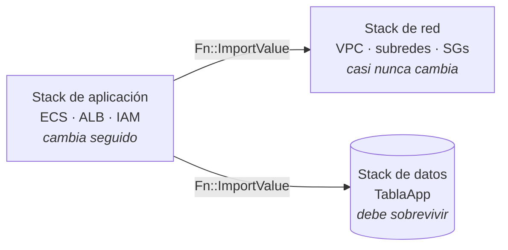

+++
title = "Separar los stacks por ciclo de vida"
+++

## Un stack, tres ciclos de vida

El stack monolítico de la Semana 1 cumplió su función: un archivo, dos parámetros, un
ambiente completo. Pero dentro de ese stack conviven recursos que envejecen a ritmos
muy distintos:

- La **red** (VPC, subredes, grupos de seguridad) casi nunca cambia. Se define una vez
  y varias aplicaciones podrían compartirla.
- Los **datos** (la tabla de DynamoDB) deben sobrevivir. Destruir el ambiente no
  debería tocarlos.
- La **aplicación** (servicio, task definition, balanceador) cambia todo el tiempo, y
  es deliberadamente descartable —el seguro del taller depende de eso.

Mientras los tres viven en un solo stack, comparten un solo destino: no se puede borrar
la aplicación sin borrar la tabla, ni recrear el ambiente sin recrear la red. La
[guía oficial de buenas prácticas de CloudFormation](https://docs.aws.amazon.com/AWSCloudFormation/latest/UserGuide/best-practices.html)
recomienda exactamente esta separación: **organizar los stacks por ciclo de vida y
por responsable**, no por conveniencia de tener todo junto.

:::inline-slide light
## La arquitectura en tres stacks


:::

El instructor provee los tres templates:

| Template | Stack | Contiene |
| --- | --- | --- |
| `taller-aws-devops-semana2-red.yaml` | `taller-<su-nombre>-red` | VPC, subredes, gateway, grupos de seguridad |
| `taller-aws-devops-semana2-datos.yaml` | `taller-<su-nombre>-datos` | La tabla de DynamoDB, con `DeletionPolicy: Retain` |
| `taller-aws-devops-semana2-app.yaml` | `taller-<su-nombre>-app` | Clúster, servicio, task definition, ALB, roles de IAM |

## El contrato entre stacks

Separar los stacks obliga a hacer explícito lo que antes era un `!Ref` interno. El
stack de red **exporta** sus valores con nombre:

```yaml
Outputs:
  VpcId:
    Value: !Ref VpcApp
    Export:
      Name: !Sub "${AWS::StackName}-vpc-id"
```

Y el stack de aplicación los **importa** por ese nombre:

```yaml
      VpcId:
        Fn::ImportValue: !Sub "${RedStackName}-vpc-id"
```

Esto es la versión entre stacks de los outputs como contrato que se vio en la sección
anterior. Y como todo contrato, obliga: mientras el stack de aplicación importe un
valor, CloudFormation **impide borrar o modificar** el stack que lo exporta. El orden
de borrado deja de ser una convención y pasa a estar garantizado por la plataforma:
primero la aplicación, después los datos, al final la red.

## El problema: la tabla ya tiene datos

Recrear la red y la aplicación es gratis —es lo que se practicó en la Semana 1. La
tabla es distinta: los contadores que la guía fue acumulando viven ahí. Borrar el
stack monolítico y lanzar los tres nuevos destruiría esos datos.

CloudFormation tiene una respuesta específica para esto: **importar recursos**. Un
stack puede *adoptar* un recurso que ya existe —sin tocarlo, sin recrearlo— siempre
que el template lo describa tal como es y declare una `DeletionPolicy` explícita. La
migración completa usa tres piezas que ya se conocen, más el import:

1. `DeletionPolicy: Retain` sobre la tabla, aplicado con un change set.
2. Borrar el stack monolítico —todo muere, salvo la tabla, que queda **huérfana**:
   viva, funcionando, pero sin stack que la gestione.
3. Crear los stacks de red y de aplicación como siempre.
4. Crear el stack de datos **importando** la tabla huérfana.

:::slide
## La migración

1. `DeletionPolicy: Retain` en la tabla → change set.
2. Borrar el stack monolítico → la tabla queda **huérfana**.
3. Crear el stack de red.
4. Crear el stack de datos **importando** la tabla.
5. Crear el stack de aplicación.

La tabla nunca se recrea. Los datos nunca se mueven.
:::

## Práctica guiada: la migración

### Dejar una marca en la tabla

Antes de migrar, escribir un dato que demuestre, al final, que nada se perdió.

1. Resolver el nombre físico de la tabla a partir del stack:

   ```bash
   export STACK=taller-<su-nombre>
   TABLA=$(aws cloudformation describe-stack-resources \
     --stack-name "$STACK" \
     --logical-resource-id TablaApp \
     --query "StackResources[0].PhysicalResourceId" \
     --output text)
   echo "$TABLA"
   ```

2. Incrementar un contador de prueba:

   ```bash
   aws dynamodb update-item \
     --table-name "$TABLA" \
     --key '{"collection": {"S": "counters"}, "key": {"S": "migracion"}}' \
     --update-expression "ADD #v :uno" \
     --expression-attribute-names '{"#v": "value"}' \
     --expression-attribute-values '{":uno": {"N": "1"}}'
   ```

3. Confirmar que el dato está:

   ```bash
   aws dynamodb get-item \
     --table-name "$TABLA" \
     --key '{"collection": {"S": "counters"}, "key": {"S": "migracion"}}'
   ```

### Proteger la tabla con `Retain`

1. Abrir `taller-aws-devops-semana1.yaml` en el editor y agregar la política sobre
   la tabla:

   ```yaml
   TablaApp:
     Type: AWS::DynamoDB::Table
     DeletionPolicy: Retain
   ```

2. En [**CloudFormation**](https://console.aws.amazon.com/cloudformation/home),
   seleccionar el stack `taller-<su-nombre>` y aplicar el cambio con un change set,
   como en la sección anterior: **Stack actions → Create change set for current
   stack**, subir el template modificado, y ejecutarlo. `TablaApp` aparece como
   **Modify** sin reemplazo —la política es metadata del stack, no toca la tabla.

### Borrar el stack monolítico

1. Con el change set aplicado, pulsar **Delete → Delete stack**. Es el mismo
   teardown de la Semana 1, con una diferencia: en la pestaña **Events**, la tabla
   aparece como **DELETE_SKIPPED** —CloudFormation la deja atrás, intacta.
2. Confirmar que la tabla sigue viva, ahora sin stack:

   ```bash
   aws dynamodb describe-table --table-name "$TABLA" \
     --query "Table.TableStatus" --output text
   ```

   Debe responder `ACTIVE`.

### Crear el stack de red

1. Pulsar **Create stack → With new resources (standard)**.
2. Subir `taller-aws-devops-semana2-red.yaml`.
3. En **Stack name**, escribir `taller-<su-nombre>-red`. No tiene parámetros.
4. Pulsar **Next** hasta **Submit**, y esperar a **CREATE_COMPLETE**.

### Crear el stack de datos, importando la tabla

Este stack no se crea: se crea *alrededor* de la tabla que ya existe.

1. Pulsar **Create stack → With existing resources (import resources)**.
2. Subir `taller-aws-devops-semana2-datos.yaml`.
3. En la pantalla **Identify resources**, CloudFormation lista los recursos del
   template que necesitan un identificador. Para `TablaApp`, pegar en **TableName**
   el nombre físico de la tabla (el valor de `$TABLA`).
4. En **Stack name**, escribir `taller-<su-nombre>-datos`, y pulsar **Next**.
5. Revisar el resumen: la operación es **Import**, y no crea ni modifica nada más.
   Pulsar **Import resources**.
6. En la pestaña **Events**, esperar a **IMPORT_COMPLETE**. La tabla no se reinició
   ni se recreó: solo cambió quién la gestiona.

### Crear el stack de aplicación

1. Pulsar **Create stack → With new resources (standard)**.
2. Subir `taller-aws-devops-semana2-app.yaml`.
3. En **Stack name**, escribir `taller-<su-nombre>-app`.
4. Completar los tres parámetros: el **URI de la imagen** en ECR, y los nombres de
   los otros dos stacks: `taller-<su-nombre>-red` y `taller-<su-nombre>-datos`.
5. Aceptar la capacidad de IAM, pulsar **Submit**, y esperar a **CREATE_COMPLETE**.

### Verificar que nada se perdió

1. En la pestaña **Outputs** del stack de aplicación, abrir la **ALBUrl**. La guía
   debe cargarse desde el nuevo despliegue.
2. Releer el contador escrito antes de la migración:

   ```bash
   aws dynamodb get-item \
     --table-name "$TABLA" \
     --key '{"collection": {"S": "counters"}, "key": {"S": "migracion"}}'
   ```

   El valor sigue ahí. El ambiente se desarmó y se rearmó en tres stacks, y los
   datos nunca dejaron de existir.

## A escala: stack refactoring

La secuencia manual —`Retain`, huérfano, import— muestra la mecánica real, y para un
recurso es perfectamente manejable. Para mover decenas de recursos entre stacks, AWS
ofrece una operación que hace los tres pasos de forma atómica: el **stack
refactoring** (`CreateStackRefactor`). Se le entregan los templates finales de ambos
stacks y un mapa de qué recurso va a dónde; CloudFormation valida que ningún recurso
físico se toque, y ejecuta la mudanza completa —incluyendo renombres de IDs lógicos—
en una sola operación revisable, al estilo de un change set.

::: extra Adoptar infraestructura que nació a mano

El import tiene un segundo uso, más frecuente que las migraciones entre stacks: al
mecanismo le da igual *quién* creó el recurso. Una tabla creada a mano en la consola
hace tres años se importa exactamente igual que la tabla huérfana de esta práctica.
Esto convierte al import en la puerta de entrada a IaC para infraestructura que nació
sin templates.

Para no escribir esos templates a mano, la consola de CloudFormation incluye el
**IaC generator**: escanea la cuenta, descubre los recursos que ningún stack
gestiona, y genera el template por ellos, dejándolo listo para el flujo de import.
Advertencias de uso: el template generado sale con valores fijos que conviene
parametrizar, las propiedades de solo escritura (como un secreto) no se pueden leer
de vuelta, no todos los tipos de recurso están soportados, y después de importar
conviene correr **Detect drift** para confirmar que template y realidad coinciden.
:::

---

{#ejercicio-11}
### Ejercicio 11 — Migrar la tabla a su propio stack

Partiendo del stack monolítico de la Semana 1, dejar el ambiente corriendo en tres
stacks separados —red, datos, aplicación— sin perder los datos de la tabla. Escribir
un contador antes de empezar y demostrar, al final, que sigue ahí.

::: solucion
1. Resolver el nombre físico de la tabla con
   `aws cloudformation describe-stack-resources` y guardarlo en `$TABLA`.
2. Escribir un contador de prueba con `aws dynamodb update-item`
   (`collection = counters`, `key = migracion`).
3. Agregar `DeletionPolicy: Retain` a `TablaApp` en
   `taller-aws-devops-semana1.yaml` y aplicarlo con un change set.
4. Borrar el stack `taller-<su-nombre>`. En **Events**, la tabla queda como
   **DELETE_SKIPPED**; verificar con `aws dynamodb describe-table` que sigue
   `ACTIVE`.
5. Crear `taller-<su-nombre>-red` con `taller-aws-devops-semana2-red.yaml`
   (sin parámetros).
6. Crear `taller-<su-nombre>-datos` con **Create stack → With existing resources
   (import resources)**, subiendo `taller-aws-devops-semana2-datos.yaml` y pegando
   `$TABLA` como **TableName**. Esperar a **IMPORT_COMPLETE**.
7. Crear `taller-<su-nombre>-app` con `taller-aws-devops-semana2-app.yaml`,
   completando el URI de la imagen y los nombres de los stacks de red y de datos.
   Aceptar la capacidad de IAM.
8. Abrir la **ALBUrl** de los outputs y confirmar que la guía carga. Releer el
   contador con `aws dynamodb get-item`: el valor escrito en el paso 2 sigue ahí.
:::

:::slide light
{{ejercicio-11}}
:::
