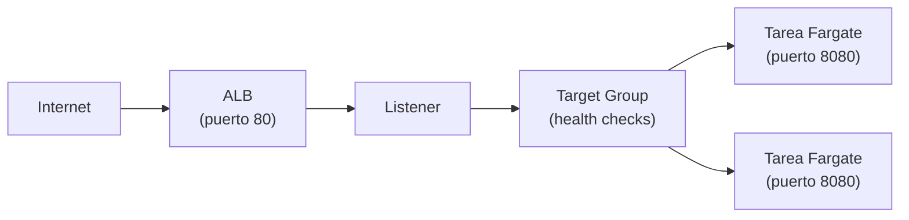

+++
title = "Operar el workload — red, escalado y fallas"
+++

:::title-slide Semana 3
:::

## De entender a operar

La Semana 2 terminó con el ambiente entendido: sabe leer el template, actualizar el
stack, y reconocer el clúster, la task definition, y el servicio. Esta semana lo
**opera**. Tres preguntas guían la sesión: ¿cómo llega el tráfico al contenedor?, ¿cómo
crece el sistema cuando hay más carga?, y ¿qué hace cuando una tarea no arranca?

## El camino del tráfico

Cuando alguien abre la URL de su aplicación, la petición atraviesa una cadena de
recursos antes de llegar al contenedor. Conocer esa cadena es lo que permite diagnosticar
dónde se corta cuando algo falla.

:::inline-slide light
## El camino de una petición

```
Internet
  → Application Load Balancer (puerto 80)
  → Listener
  → Target Group
  → Tarea de Fargate (contenedor, puerto 8080)
```
:::



- El **ALB** recibe el tráfico HTTP en el puerto 80, en subredes públicas.
- El **listener** define en qué puerto escucha el ALB y a qué *target group* reenvía.
- El **target group** agrupa los destinos —sus tareas— y verifica su salud.
- La **tarea** corre en una subred, con un **grupo de seguridad** que permite el tráfico
  del ALB hacia el puerto del contenedor.

Los **grupos de seguridad** son la pieza que conecta —o bloquea— cada salto: uno permite
tráfico de internet hacia el ALB en el puerto 80; otro permite tráfico del ALB hacia la
tarea en el puerto 8080. Si una petición no llega, casi siempre es un grupo de seguridad
o un *health check* fallando.

### Health checks

El target group verifica periódicamente que cada tarea responda en una ruta de salud
(por ejemplo, `GET /`). Una tarea que responde es **healthy** y recibe tráfico; una que
no responde es **unhealthy** y el ALB deja de enviarle peticiones. Si todas las tareas
están unhealthy, el ALB devuelve `503` aunque los contenedores estén corriendo.

## Escalar el servicio

En la Semana 2 cambió `DesiredCount` a mano. En producción la carga varía, y ajustarla
manualmente no escala. El **auto scaling** del servicio ajusta el número de tareas según
una métrica.

La forma más común es **target tracking**: usted fija un objetivo —por ejemplo, "mantén
el uso de CPU promedio en 50%"— y ECS agrega o quita tareas para sostenerlo. Si la CPU
sube por encima del objetivo, lanza más tareas; si baja, las reduce, sin bajar de un
mínimo que usted define.

:::slide
## Auto scaling por seguimiento de objetivo

Fije una métrica objetivo (ej. **CPU 50%**).

- CPU sube → ECS **agrega** tareas.
- CPU baja → ECS **quita** tareas (hasta el mínimo).

El número de tareas sigue la carga, sin intervención.
:::

## Cuando una tarea no arranca

Un servicio que no logra mantener sus tareas sanas es el problema operativo más común.
ECS no oculta el motivo: lo deja escrito en la tarea detenida.

Cuando una tarea termina inesperadamente, aparece en la lista de tareas **detenidas**
(*stopped*), con un campo **`stoppedReason`** que dice por qué. Las causas habituales:

| `stoppedReason` (resumen) | Causa |
| --- | --- |
| `CannotPullContainerError` | El URI de la imagen es incorrecto, o el rol no tiene permiso sobre ECR. |
| `Essential container ... exited` | El contenedor arrancó y se cerró solo —error de la aplicación; revise los logs. |
| `Task failed ELB health checks` | La tarea corre pero no pasa el health check; el ALB la da de baja. |

La regla de diagnóstico: una tarea detenida siempre tiene un `stoppedReason`, y cuando
ese motivo apunta a la aplicación, la respuesta está en sus **logs** —el grupo de
CloudWatch Logs que identificó en la Semana 2.

:::slide
## Por qué falla una tarea

1. Mire la tarea **detenida** y su **`stoppedReason`**.
2. ¿No puede bajar la imagen? → URI o permisos de ECR.
3. ¿El contenedor salió solo? → los **logs** de la aplicación.
4. ¿No pasa el health check? → la ruta de salud, o el puerto.
:::

## Práctica guiada: configurar auto scaling

### Definir la política

1. Abra [**ECS → Clusters → su clúster → su servicio**](https://console.aws.amazon.com/ecs/home).
2. En la pestaña **Configuration and tasks**, busque **Service auto scaling** y pulse
   **Update**.
3. Active **Service auto scaling**, y fije el número **mínimo** de tareas en `1` y el
   **máximo** en `4`.
4. Agregue una política de tipo **Target tracking**, métrica
   **ECSServiceAverageCPUUtilization**, con un valor objetivo de `50`.
5. Guarde los cambios.

### Verificar los destinos sanos

1. Abra [**EC2 → Target Groups**](https://console.aws.amazon.com/ec2/home#TargetGroups:) y seleccione el target group de su aplicación.
2. En la pestaña **Targets**, confirme que sus tareas aparecen como **healthy**. Estos
   son los destinos a los que el ALB reparte el tráfico.

---

{#ejercicio-10}
### Ejercicio 10 — Configure el escalado y verifique la salud

Configure auto scaling para su servicio con seguimiento de CPU (objetivo 50%, mínimo 1,
máximo 4 tareas). Luego, en el target group del ALB, confirme que sus tareas están
registradas como sanas.

::: solucion
1. Abra [**ECS → Clusters → su clúster → su servicio**](https://console.aws.amazon.com/ecs/home).
2. En **Configuration and tasks → Service auto scaling**, pulse **Update**.
3. Active el auto scaling; fije **mínimo 1**, **máximo 4**.
4. Agregue una política **Target tracking** sobre
   **ECSServiceAverageCPUUtilization** con objetivo **50**. Guarde.
5. Abra [**EC2 → Target Groups**](https://console.aws.amazon.com/ec2/home#TargetGroups:), seleccione el target group de su aplicación, y abra la
   pestaña **Targets**.
6. Confirme que las tareas aparecen con estado **healthy** —son los destinos activos
   detrás del balanceador.
:::

:::slide light
{{ejercicio-10}}
:::
