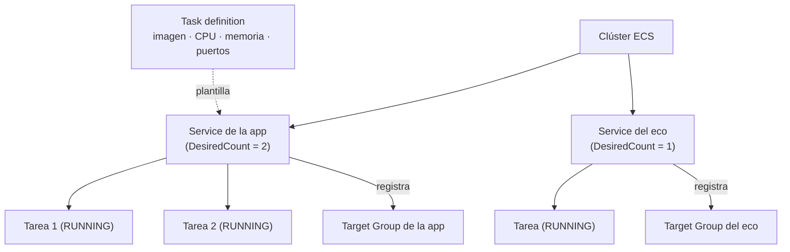

+++
title = "Los primeros contenedores — ECS y Fargate"
+++

## Del recurso en el template al contenedor en ejecución

En el template se ven tres recursos relacionados: un **clúster**, un **servicio**, y una
**task definition**. Esta sección los explica como lo que son cuando el stack ya corre:
las piezas que mantienen el contenedor vivo y accesible. Al terminar, se los reconoce en
la consola de ECS y se entiende qué hace cada uno.

## El modelo de ECS

**Amazon ECS** (Elastic Container Service) es el orquestador de contenedores de AWS:
decide dónde corren los contenedores, los mantiene en ejecución, y los reemplaza si
fallan. Tres conceptos lo estructuran.

:::inline-slide light
## ECS en tres piezas

| Pieza | Qué es |
| --- | --- |
| **Clúster** | El espacio lógico donde corren las tareas. |
| **Task definition** | La plantilla de ejecución de un contenedor (imagen, CPU, memoria, puertos). |
| **Service** | El controlador que mantiene N tareas vivas y las reemplaza si caen. |
:::

### El clúster

El **clúster** es la agrupación lógica donde viven las tareas. Con Fargate no contiene
servidores que administrar —es solo el contexto bajo el cual ECS organiza lo que
corre. En la consola, se accede desde **ECS → Clusters**.

### La task definition

La **task definition** es la plantilla de ejecución de un contenedor: el documento que
dice *cómo* es una tarea. Sus campos principales:

- **Imagen**: el URI en ECR de la imagen a ejecutar (el que llega vía el parámetro `ImageUri`).
- **CPU y memoria**: los recursos reservados (en su template, `256` CPU y `512` MB).
- **Puertos** (*port mappings*): el puerto que el contenedor expone (`8080`).
- **Rol de ejecución**: el rol de IAM que permite a Fargate descargar la imagen de ECR
  y escribir logs.
- **Configuración de logs**: a qué grupo de CloudWatch Logs envía la salida del
  contenedor.
- **Variables de entorno**: pares clave-valor inyectados al contenedor en tiempo de
  ejecución. Hay dos formas de pasarlos, y la diferencia importa.

::: extra Variables de entorno vs. secretos en una task definition
La task definition tiene dos campos distintos para configurar el contenedor con
valores en tiempo de ejecución:

**`environment`** — texto plano, almacenado dentro de la task definition:

```json
"environment": [
  { "name": "CB_APPS_GATED", "value": "all" }
]
```

**`secrets`** — referencia a un secreto en AWS Secrets Manager (o SSM Parameter
Store); ECS lo resuelve y lo inyecta al arrancar la tarea:

```json
"secrets": [
  {
    "name": "CB_APPS_SECRET",
    "valueFrom": "arn:aws:secretsmanager:us-east-1:123456789012:secret:cb-apps-secret-AbCdEf"
  }
]
```

El contenedor recibe `CB_APPS_SECRET` igual que una variable de entorno normal,
pero el valor nunca queda escrito en la task definition.

**Por qué el texto plano es un problema.** Una tarea definida con `environment`
expone su valor en cualquier lugar donde la task definition sea legible:

- `aws ecs describe-task-definition` lo devuelve en claro.
- La consola de ECS lo muestra en la pestaña de configuración del contenedor.
- Un template de CloudFormation con el valor hardcodeado queda en el repositorio.

Para un secreto de acceso —como `CB_APPS_SECRET`, la clave que desbloquea los
escenarios del taller— el texto plano significa que cualquier persona con permiso
`ecs:DescribeTaskDefinition` puede leerlo.

Con `secrets` + `valueFrom`, el valor vive en Secrets Manager. La task definition
solo guarda el ARN. Para leerlo hace falta permiso sobre Secrets Manager, no sobre
ECS.

**Requisito de IAM.** El *execution role* de la tarea debe tener permiso
`secretsmanager:GetSecretValue` (o `ssm:GetParameters`) sobre el recurso
referenciado. ECS usa ese rol —no el task role— al resolver secretos antes de
lanzar el contenedor.
:::

Las task definitions son **versionadas**: cada cambio crea una nueva *revisión*
(`taller:1`, `taller:2`, …). Esto permite saber exactamente qué configuración está
corriendo, y volver a una anterior si hace falta.

### El service

El **service** es el controlador que mantiene el número deseado de tareas en ejecución.
Es lo que cambió en la sección anterior cuando subió `DesiredCount` a 2. Sus
responsabilidades:

- Lanzar tantas tareas como indique `DesiredCount`, a partir de la task definition.
- Vigilarlas: si una tarea falla o termina, lanzar una de reemplazo.
- Registrar las tareas en el *target group* del balanceador, para que reciban tráfico.

La distinción clave: la **task definition** describe *cómo es* una tarea; el **service**
decide *cuántas hay y las mantiene vivas*.



Un clúster sostiene **varios servicios a la vez**, y desde la sección anterior el del
taller sostiene dos: la aplicación principal, y el servidor de eco. Cada uno tiene su
task definition, su target group, y su grupo de logs; lo único que comparten es el
clúster que los contiene, y el balanceador que los publica.

Por eso, de acá en adelante, en la consola hay que fijarse en **cuál** de los dos se
está mirando. El clúster es el contexto, no el sujeto: una métrica de CPU, un despliegue,
o una política de escalado son siempre de un servicio, nunca del clúster.

::: extra Fargate vs. EC2: ¿quién pone los servidores?
ECS puede ejecutar tareas de dos formas. Con el tipo de lanzamiento **EC2**, se administra una flota de servidores donde corren los contenedores. Con **Fargate**, AWS
pone y administra esa capacidad: se especifican CPU y memoria por tarea, y no hay
servidores que mantener. Este taller usa Fargate porque elimina la administración de
servidores —el foco queda en la aplicación, no en la infraestructura que la ejecuta.
:::

:::slide
## Task definition vs. service

- **Task definition** → *cómo es* una tarea: imagen, CPU, memoria, puertos, logs.
- **Service** → *cuántas hay y las mantiene vivas*; las registra en el balanceador.

Una describe; el otro opera.
:::

## Práctica guiada: reconocer las piezas en la consola

### Abrir el clúster

1. Abrir [**ECS**](https://console.aws.amazon.com/ecs/home) y seleccionar el clúster.
2. En la pestaña **Services**, aparece un servicio por cada stack de aplicación
   desplegado —el de la aplicación, y el del eco si se creó—, cada uno con su cuenta de
   tareas deseadas y en ejecución (el de la aplicación, ahora `2`).

### Inspeccionar el servicio y sus tareas

1. Pulsar sobre el nombre del servicio de la aplicación.
2. En la pestaña **Tasks**, aparecen las tareas en estado `RUNNING`. Pulsar una de ellas.
3. En el detalle de la tarea, localizar la **task definition** que la originó (con su
   número de revisión) y el **grupo de logs** al que escribe.

### Leer la task definition

1. Pulsar sobre el nombre de la task definition para abrir la revisión.
2. Identificar la **imagen** (el URI de ECR), la **CPU y memoria**, y el **port
   mapping** —los mismos valores del template.

---

{#ejercicio-12}
### Ejercicio 12 — Reconocer lo que está corriendo

Desde la consola de ECS, identificar para la aplicación: la tarea en ejecución, la
revisión de la task definition que la originó, el URI de la imagen que ejecuta, y el
grupo de CloudWatch Logs al que escribe.

::: solucion
1. Abrir [**ECS → Clusters**](https://console.aws.amazon.com/ecs/home) y seleccionar el clúster.
2. Entrar al servicio de la aplicación y abrir la pestaña **Tasks**. Pulsar una tarea en
   estado `RUNNING`.
3. En el detalle de la tarea, anotar:
   - La **task definition** y su número de revisión (por ejemplo, `taller:2`).
   - El **grupo de logs** (*Log group*), bajo la sección de logs del contenedor.
4. Pulsar la task definition para abrir la revisión, y localizar en el contenedor:
   - La **imagen**: el URI de ECR con su etiqueta (el mismo pasado como `ImageUri`).
   - La **CPU y memoria** reservadas.
5. Comprobar que estos valores coinciden con los del template
   `taller-aws-devops-semana2-app.yaml`: el recurso del template y el contenedor en
   ejecución son la misma cosa, vista desde dos lados.
:::

:::slide light
{{ejercicio-12}}
:::

---

## Dónde estamos

Al cerrar la Semana 2, la caja negra ya no es una caja negra:

- **Lee un template** de CloudFormation: reconoce sus secciones, sigue las funciones
  intrínsecas, y conecta cada recurso con lo que ve en la consola.
- **Actualiza el stack con seguridad**, usando change sets para ver el cambio antes de
  aplicarlo, y sabe leer un fallo desde la pestaña de eventos.
- **Entiende los contenedores por dentro**: el clúster, la task definition que describe
  cada tarea, y el servicio que las mantiene vivas y las pone detrás del balanceador.

Pasó de *lanzar* el ambiente a *entenderlo y modificarlo*.

## Qué sigue en la Semana 3

La próxima semana se opera y automatiza lo que ya se entiende:

- **Operar el workload**: la red que conecta el balanceador con las tareas, el
  **escalado** automático, y el **troubleshooting** cuando una tarea no arranca.
- **Automatizar el flujo completo** con **CodePipeline**: del commit al despliegue, con
  disparo automático y una etapa de **aprobación manual** —y las notificaciones a Teams
  que adelantamos en la Semana 1.
- **Abrir la observabilidad** con las métricas y los logs de CloudWatch.

Llegará al final de la Semana 3 con el ciclo de entrega automatizado y los primeros ojos
puestos sobre cómo se comporta el sistema en ejecución.
