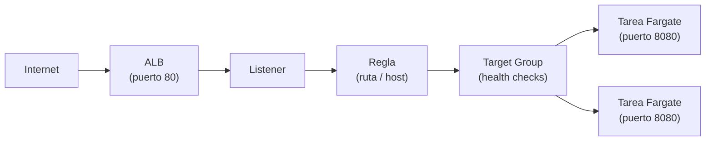

+++
title = "Operar el workload — red, escalado y fallas"
+++

:::title-slide Semana 3
:::

## De entender a operar

La Semana 2 terminó con el ambiente entendido: se lee el template, se actualiza el
stack, y se reconocen el clúster, la task definition, y el servicio. Esta semana se
**opera**. Tres preguntas guían la sesión: ¿cómo llega el tráfico al contenedor?, ¿cómo
crece el sistema cuando hay más carga?, y ¿qué ocurre cuando una tarea no arranca?

:::inline-slide light
### El camino de una petición

Cuando se abre la URL de la aplicación, la petición atraviesa una cadena de
recursos antes de llegar al contenedor. Conocer esa cadena es lo que permite diagnosticar
dónde se corta cuando algo falla.

:::skip
```
Internet
  → Application Load Balancer (puerto 80)
  → Listener
  → Regla (por ruta, o por nombre)
  → Target Group
  → Tarea de Fargate (contenedor, puerto 8080)
```
:::


:::

- El **ALB** recibe el tráfico HTTP en el puerto 80, en subredes públicas.
- El **listener** define en qué puerto escucha el ALB.
- La **regla** decide, por la ruta o por el nombre de host, a qué *target group* va cada
  petición. Con dos aplicaciones sobre el mismo balanceador, es la pieza que las separa.
- El **target group** agrupa los destinos —las tareas— y verifica su salud.
- La **tarea** corre en una subred, con un **grupo de seguridad** que permite el tráfico
  del ALB hacia el puerto del contenedor.

Los **grupos de seguridad** son la pieza que conecta —o bloquea— cada salto: uno permite
tráfico de internet hacia el ALB en el puerto 80; otro permite tráfico del ALB hacia la
tarea en el puerto 8080. Si una petición no llega, casi siempre es un grupo de seguridad
o un *health check* fallando.

### La cadena, vista desde el otro extremo

El diagrama describe la cadena; el servidor de eco de la Semana 2 la **muestra**. Cada
pedido a `/eco/` vuelve con un bloque `network` que es esa misma cadena, leída desde
adentro del contenedor:

```json
"network": {
  "local":  { "address": "10.0.1.100", "port": 8080 },
  "peer":   { "address": "10.0.0.5",   "port": 41234 },
  "client_ip": "203.0.113.7",
  "forwarded_for": ["203.0.113.7"],
  "forwarded_proto": "https"
}
```

- `local` es el último eslabón: la IP privada de la tarea, en el puerto 8080. Es la
  dirección exacta que el target group tiene registrada.
- `peer` es el eslabón anterior, y **no es el navegador**: es el balanceador. La
  dirección es de la VPC, y cambia entre pedidos, porque el ALB tiene un nodo por subred.
- `client_ip` y `forwarded_for` sí son el navegador. El ALB lo anotó en
  `X-Forwarded-For` antes de reenviar.

De ahí sale una regla práctica de operación: una aplicación detrás de un balanceador que
registre `peer` como dirección del cliente va a registrar siempre la del balanceador. Un
log de acceso con dos o tres IPs privadas repitiéndose es ese error, visto de lejos.

Repetir el pedido varias veces alterna el valor de `local` entre las tareas sanas del
target group. Eso es el reparto del balanceador, hecho visible.

:::inline-slide
### Health checks

El target group verifica periódicamente que cada tarea responda en una ruta de salud
(en el template del taller, `GET /health`). Una tarea que responde es **healthy** y
recibe tráfico; una que no responde es **unhealthy** y el ALB deja de enviarle
peticiones. Si todas las tareas están unhealthy, el ALB devuelve `503` aunque los
contenedores estén corriendo.

Conviene notar que el health check **no pasa por la regla**: el target group habla
directo con la tarea, en su IP privada y en el puerto 8080. Por eso una aplicación
publicada bajo `/eco/*` igual necesita contestar en `/health`.
:::

Este es otro punto importante a conversar con el equipo de desarrollo, dado que
ellos, por defecto, pueden no verle valor a esta práctica. Pero para DevOps, u
Operaciones, es imprescindible.

Además, esto puede beneficiar a la aplicación en sí de hacerse correctamente. Los
chequeos de salud garantizan que el tráfico llegue a una instancia saludable de la
aplicación. Esto puede, por ejemplo, evitar peticiones lentas, producidas por un
consumo excesivo de CPU. O evitar peticiones que fallen por problemas con servicios
de terceros, ajenos a la aplicación.

### Más que un `200` fijo

Un `/health` que devuelve `200` siempre, sin mirar nada, es un chequeo decorativo:
nunca detecta una tarea enferma, y da una sensación falsa de cobertura. El extremo
opuesto, un endpoint que verifica todo en cada llamada, tampoco sirve, porque
convierte el chequeo en carga. Las prácticas que resuelven ese punto medio son cuatro.

#### 1. Separar los tipos de chequeo

Un solo endpoint no puede responder tres preguntas distintas. Conviene separarlas,
porque la consecuencia de cada falla es diferente.

| Ruta | Pregunta | Quién la consulta | Qué ocurre si falla |
| --- | --- | --- | --- |
| `/health/live` | ¿El proceso está vivo, y no colgado? | Health check del contenedor (ECS) | La tarea se detiene, y se reemplaza |
| `/health/ready` | ¿Puede atender tráfico **ahora**? | Health check del target group (ALB) | Sale de rotación, y sigue viva |
| `/health/startup` | ¿Terminó de arrancar? | Período de gracia del servicio | Se espera; no se mata |

El error más caro es usar una sola ruta para las tres cosas: una dependencia lenta al
arrancar termina matando tareas que solo necesitaban unos segundos más.

#### 2. Distinguir dependencias duras de blandas

En `/health/ready`, cada dependencia se clasifica:

- **Dura** (sin ella no hay respuesta útil, como la base de datos principal): devuelve
  `503`.
- **Blanda** (admite degradación, como una caché, o un servicio de recomendaciones):
  devuelve `200`, y reporta el estado en el cuerpo de la respuesta.

Marcar todo como duro convierte cualquier hipo de un servicio lateral en una caída
total. Y si varias aplicaciones comparten esa dependencia, caen todas juntas.

#### 3. Verificar en segundo plano, y responder desde memoria

El chequeo no debe ejecutarse dentro del pedido. Una tarea de fondo verifica cada pocos
segundos, con un tiempo límite corto, y guarda el resultado; el endpoint solo lee ese
resultado. Así la respuesta es inmediata, y el health check no agrega carga sobre la
base de datos. Con veinte tareas, y un chequeo cada diez segundos, esa carga no es
despreciable.

#### 4. Drenar antes de apagar

Es el beneficio más concreto, y el que suele cerrar la conversación con desarrollo. Al
recibir la señal de apagado, la aplicación empieza a devolver `503` en `/health/ready`
**antes** de dejar de aceptar conexiones:

```
SIGTERM
  → /health/ready responde 503
  → esperar (intervalo × umbral del target group, más un margen)
  → dejar de aceptar conexiones nuevas
  → terminar las peticiones en curso
  → salir
```

El balanceador necesita dos o tres chequeos fallidos para dar de baja el destino. Si el
proceso cierra el puerto de inmediato, esas peticiones en vuelo se pierden. Este
detalle es lo que elimina los errores `502` en cada despliegue.

::: warning
El health check **no debe medir la carga** (ni CPU, ni memoria, ni profundidad de cola)
para sacarse de rotación. La carga sube en todas las tareas a la vez, así que todas
fallarían el chequeo juntas; ECS las reemplazaría por tareas frías, que consumen todavía
más CPU. Una tarea con la CPU saturada por un defecto se detecta igual, porque deja de
responder dentro del tiempo límite. El exceso de carga legítima se resuelve con **auto
scaling**, no con el health check.
:::

::: extra Cuerpo de respuesta con información útil
El balanceador solo lee el código de estado; las personas, y los tableros, leen el
cuerpo. Un formato útil:

```json
{
  "status": "degraded",
  "version": "1.4.2",
  "commit": "a3f9c21",
  "checks": {
    "database": { "status": "ok",   "latency_ms": 3 },
    "cache":    { "status": "fail", "critical": false, "error": "timeout" }
  }
}
```

La regla: una dependencia blanda cambia el campo `status`, para las alarmas, pero nunca
el código HTTP, que es para el balanceador.

Un endpoint aparte, `/health/deep`, puede hacer verificaciones caras y reales (escribir
y leer un registro de prueba, validar credenciales). Lo consulta el monitoreo, nunca el
balanceador, y conviene no exponerlo, porque revela la topología interna.
:::

### Verlo funcionar

Esta guía la sirve un servidor que implementa las tres rutas, con una dependencia dura
(`dynamodb`), y una blanda (`content`). El control rompe la dependencia elegida durante
el tiempo indicado, y la restaura sola al vencer el plazo. El tablero consulta los tres
endpoints una vez por segundo.

:::app
<cb-health seconds="60"></cb-health>
:::

:::app
<cb-http endpoint="/health/live"></cb-http>
:::

:::app
<cb-http endpoint="/health/ready"></cb-http>
:::

:::app
<cb-http endpoint="/health/startup"></cb-http>
:::

Al romper `dynamodb`, `/health/ready` pasa a `503`, mientras `/health/live` sigue en
`200`: el balanceador saca la instancia de rotación, y nadie reemplaza el contenedor. Al
romper `content`, el código sigue en `200`, y solo cambia el campo `status` a
`degraded`. Es la diferencia entre dependencia dura, y blanda, vista en vivo.

Si el tablero muestra `404`, el servidor tiene la función apagada (se habilita con la
variable `CB_HEALTH_CHECKS`).

### Cablearlo en el template

Que la aplicación tenga las tres rutas no sirve de nada mientras AWS siga consultando
`/health`. Falta el otro lado: decirle al balanceador, y a ECS, cuál ruta mirar. El
template de la Semana 3 es el mismo de la Semana 2, con cuatro cambios.

| Dónde | Semana 2 | Semana 3 |
| --- | --- | --- |
| Target group | `HealthCheckPath: /health` | `/health/ready`, con intervalo y umbrales explícitos |
| Contenedor | `HealthCheck` contra `/health` | la misma, contra `/health/live` |
| Servicio | `HealthCheckGracePeriodSeconds: 60` | `90`, para cubrir el arranque completo |
| Apagado | `StopTimeout: 30`, sin drenaje | `CB_HEALTH_DRAIN_SECS: 25`, y `StopTimeout: 60` |


:::app
<cb-file path="./infra/templates/taller-aws-devops-semana3-app.yaml" type="yaml" toggleable full-path></cb-file>
:::

Los números están encadenados, y ese es el punto de la sección:

```
detectar la falla     intervalo (10) × umbral (2)   = 20 s
drenar                CB_HEALTH_DRAIN_SECS          = 25 s   (mayor que 20)
vaciar en vuelo       deregistration_delay          = 15 s
antes del SIGKILL     StopTimeout                   = 60 s   (mayor que 25 + cola)
```

Bajar el intervalo detecta antes, y cuesta más chequeos por minuto. Subir el umbral
tolera mejor un pico aislado, y demora la baja. Cambiar uno obliga a revisar el drenaje,
porque drenar menos que lo que tarda la detección equivale a no drenar.

#### El problema del `curl`

Los dos chequeos parecen lo mismo, y no lo son. El del balanceador es una petición HTTP
por la red: el target group tiene la IP privada de la tarea, y la consulta desde afuera.
Por eso se configura con una ruta. El del contenedor lo ejecuta ECS **adentro** del
contenedor, sin pasar por la red, así que no se configura con una ruta, sino con un
comando. Y ese comando tiene que existir en la imagen.

La receta que aparece en todos los ejemplos es esta:

```json
"healthCheck": {
  "command": ["CMD-SHELL", "curl -f http://localhost:8080/health || exit 1"]
}
```

Funciona con una imagen `ubuntu`, o `python`, porque traen `curl` adentro. Con una imagen
mínima, no. Y las imágenes de producción tienden a ser mínimas.


| Imagen base | ¿Trae `curl`? | ¿Trae shell? |
| --- | --- | --- |
| `ubuntu`, `debian` | sí | sí |
| `debian:bookworm-slim` (la del taller) | **no** | sí |
| `alpine` | no, trae `wget` de BusyBox | sí |
| `distroless` | **no** | **no** |
| `scratch` | **no** | **no** |


El síntoma cuesta una tarde. El comando falla porque el binario no existe, ECS lo lee
como contenedor enfermo, mata la tarea, y levanta otra, que falla igual. Queda un bucle
de reemplazo, con `stoppedReason` diciendo `Task failed container health checks`, y los
logs de la aplicación **limpios**, porque la aplicación estaba sana todo el tiempo. Se
busca el problema en el lugar equivocado. Las imágenes `distroless`, y `scratch`, suman
la segunda mitad del problema: sin shell, `CMD-SHELL` tampoco arranca.

Hay cuatro salidas.

1. **Instalar `curl` en la imagen.** Es la más rápida, y la peor. Suma peso, suma un
   paquete más que parchear cada vez que aparece un CVE, y deja adentro del contenedor
   una herramienta para descargar archivos de internet. Quien consiga ejecutar código ahí
   la va a usar.
2. **Usar lo que la imagen ya trae.** En Alpine, `wget -q -O /dev/null http://...`.
   Correcto mientras la base sea Alpine, y roto el día que alguien la cambia.
3. **Agregar un binario chico de chequeo**, compilado estático, junto a la aplicación.
   Funciona hasta en `scratch`, y es una dependencia más que versionar, y actualizar.
4. **Que la aplicación se chequee a sí misma.** El binario ya está en la imagen, ya sabe
   hablar HTTP, y se despliega junto con la aplicación, así que nunca queda desfasado.

Este taller usa la cuarta, y la usa desde la Semana 2. El servidor tiene un subcomando
que pide una ruta por loopback, y traduce la respuesta a un código de salida:

```
courses_server healthcheck --path /health/live
```

En el template queda así, con `CMD` en vez de `CMD-SHELL`, porque sin shell de por medio
hay un proceso menos, y una dependencia menos:

```yaml
HealthCheck:
  Command: [CMD, courses_server, healthcheck, --path, /health/live]
  Interval: 15
  Timeout: 5
  Retries: 3
  StartPeriod: 60
```

El bloque ya estaba en el template de la Semana 2, apuntando a `/health`. Lo que cambia
esta semana no es el mecanismo, sino la pregunta: `/health` solo dice si el proceso
contesta, y `/health/live` dice si además está sano. Vale la pena notar que el chequeo
contra un `200` fijo no es decorativo del todo: detecta el proceso **colgado**, que
mantiene el puerto abierto sin atender a nadie. Sin él, ECS solo se entera cuando el
proceso termina.

Tres detalles que suelen morder, sea cual sea la salida elegida:

- **El contrato es el código de salida.** `0` es sano; cualquier otro valor es enfermo.
  Por eso la receta con `curl` lleva `|| exit 1`: sin eso, algunos errores de `curl`
  devuelven códigos que no son `1`, y el comportamiento depende de la versión.
- **`127.0.0.1`, no `localhost`.** En una imagen con IPv6, `localhost` puede resolver a
  `::1` mientras el servidor escucha solo en IPv4. El chequeo falla, la aplicación anda
  bien, y el error no aparece en ningún log.
- **El chequeo consume la CPU de la tarea**, que en el taller es un cuarto de vCPU. Un
  comando pesado, o sin tiempo límite propio, compite con la aplicación a la que dice
  estar cuidando.

:::slide light
## El chequeo que no encuentra `curl`

El del balanceador es una ruta. El del contenedor corre **adentro**, y es un comando.

- `debian-slim`, `distroless`, `scratch`: sin `curl`, y a veces sin shell.
- Falla siempre, la tarea se reemplaza en bucle, y los logs de la aplicación
  salen limpios.
- Salida: que el binario de la aplicación traiga su propio `healthcheck`.

Sano es `exit 0`. Y se pide a `127.0.0.1`, no a `localhost`.
:::

Se despliega como actualización del stack de aplicación que ya existe, no como stack
nuevo:

```bash
aws cloudformation deploy \
  --stack-name taller-aws-<su-nombre>-app \
  --template-file taller-aws-devops-semana3-app.yaml \
  --parameter-overrides ImageUri=... RedStackName=... DatosStackName=... PlataformaStackName=... \
  --capabilities CAPABILITY_IAM \
  --no-execute-changeset
```

Con `--no-execute-changeset` el comando calcula el change set, y se detiene. Conviene
leerlo antes de aplicar: la lista de cambios debe ser corta, y debe coincidir con la
tabla de arriba.

::: warning
El servidor de eco solo tiene `/health`. Desplegarlo con los valores por defecto lo
mata en un bucle: el chequeo de contenedor recibe `404`, ECS reemplaza la tarea, y la
nueva falla igual. Para esa aplicación se despliega con
`RutaSaludBalanceador=/health`, y `RutaSaludContenedor=` vacío. Es la regla general: los
tres niveles se cablean solo si la aplicación los implementa.
:::

:::slide
## Un health check que sirve

1. **Separar**: `live` (¿vivo?), `ready` (¿puede atender?), `startup` (¿ya arrancó?).
2. **Clasificar**: dependencia dura → `503`; dependencia blanda → `200` degradado.
3. **Verificar en segundo plano**, y responder desde memoria.
4. **Drenar** en el apagado: `503` primero, cerrar después. Adiós a los `502` del
   despliegue.

Nunca mirar la carga: para eso está el auto scaling.
:::

## Escalar el servicio

En la Semana 2 cambió `DesiredCount` a mano. En producción la carga varía, y ajustarla
manualmente no escala. El **auto scaling** del servicio ajusta el número de tareas según
una métrica.

La forma más común es **target tracking**: se fija un objetivo (por ejemplo, "mantener
el uso de CPU promedio en 50%") y ECS agrega o quita tareas para sostenerlo. Si la CPU
sube por encima del objetivo, lanza más tareas; si baja, las reduce, sin bajar del
mínimo definido.

:::slide light
## Auto scaling por seguimiento de objetivo

Fije una métrica objetivo (ej. **CPU 50%**).

- CPU sube → ECS **agrega** tareas.
- CPU baja → ECS **quita** tareas (hasta el mínimo).

El número de tareas sigue la carga, sin intervención.
:::

## Cuando una tarea no arranca

Un servicio que no logra mantener sus tareas sanas es el problema operativo más común.
ECS no oculta el motivo: lo deja escrito en la tarea detenida.

Cuando una tarea termina inesperadamente, aparece en la lista de tareas **detenidas**
(*stopped*), con un campo **`stoppedReason`** que dice por qué. Las causas habituales:

| `stoppedReason` (resumen) | Causa |
| --- | --- |
| `CannotPullContainerError` | El URI de la imagen es incorrecto, o el rol no tiene permiso sobre ECR. |
| `Essential container ... exited` | El contenedor arrancó y se cerró solo —error de la aplicación; revise los logs. |
| `Task failed ELB health checks` | La tarea corre pero no pasa el health check; el ALB la da de baja. |

La regla de diagnóstico: una tarea detenida siempre tiene un `stoppedReason`, y cuando
ese motivo apunta a la aplicación, la respuesta está en los **logs**.

:::slide
## Por qué falla una tarea

1. Mire la tarea **detenida** y su **`stoppedReason`**.
2. ¿No puede bajar la imagen? → URI o permisos de ECR.
3. ¿El contenedor salió solo? → los **logs** de la aplicación.
4. ¿No pasa el health check? → la ruta de salud, o el puerto.
:::

## Práctica guiada: configurar auto scaling

### Definir la política

1. Abrir [**ECS → Clusters**](https://console.aws.amazon.com/ecs/home), entrar al clúster,
   y seleccionar el servicio **de la aplicación** —no el del eco: el clúster tiene los
   dos, y la política es de un servicio, no del clúster.
2. En la pestaña **Configuration and tasks**, buscar **Service auto scaling** y pulsar
   **Update**.
3. Activar **Service auto scaling**, y fijar el número **mínimo** de tareas en `1` y el
   **máximo** en `4`.
4. Agregar una política de tipo **Target tracking**, métrica
   **ECSServiceAverageCPUUtilization**, con un valor objetivo de `50`.
5. Guardar los cambios.

### Verificar los destinos sanos

1. Abrir [**EC2 → Target Groups**](https://console.aws.amazon.com/ec2/home#TargetGroups:) y seleccionar el target group de la aplicación.
2. En la pestaña **Targets**, confirmar que las tareas aparecen como **healthy**. Esos
   son los destinos a los que el ALB reparte el tráfico.

---

{#ejercicio-13}
### Ejercicio 13 — Configurar el escalado y verificar la salud

Configurar auto scaling para el servicio con seguimiento de CPU (objetivo 50%, mínimo 1,
máximo 4 tareas). Luego, en el target group del ALB, confirmar que las tareas están
registradas como sanas.

::: solucion
1. Abrir [**ECS → Clusters**](https://console.aws.amazon.com/ecs/home), entrar al clúster,
   y seleccionar el servicio de la aplicación.
2. En **Configuration and tasks → Service auto scaling**, pulsar **Update**.
3. Activar el auto scaling; fijar **mínimo 1**, **máximo 4**.
4. Agregar una política **Target tracking** sobre
   **ECSServiceAverageCPUUtilization** con objetivo **50**. Guardar.
5. Abrir [**EC2 → Target Groups**](https://console.aws.amazon.com/ec2/home#TargetGroups:), seleccionar el target group de la aplicación, y abrir la
   pestaña **Targets**.
6. Confirmar que las tareas aparecen con estado **healthy** —son los destinos activos
   detrás del balanceador.
:::

:::slide light
{{ejercicio-13}}
:::
