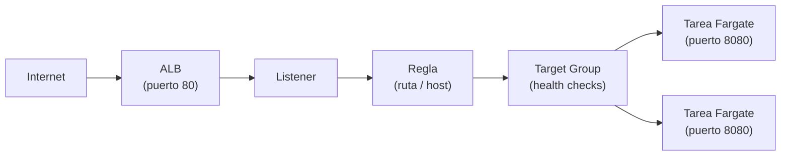

+++
title = "Operar el workload — red, escalado y fallas"
+++

:::title-slide Semana 3
:::

## De entender a operar

La Semana 2 terminó con el ambiente entendido: se lee el template, se actualiza el
stack, y se reconocen el clúster, la task definition, y el servicio. Esta semana se
**opera**. Tres preguntas guían la sesión: ¿cómo llega el tráfico al contenedor?, ¿cómo
crece el sistema cuando hay más carga?, y ¿qué ocurre cuando una tarea no arranca?

## El camino del tráfico

Cuando se abre la URL de la aplicación, la petición atraviesa una cadena de
recursos antes de llegar al contenedor. Conocer esa cadena es lo que permite diagnosticar
dónde se corta cuando algo falla.

:::inline-slide light
## El camino de una petición

```
Internet
  → Application Load Balancer (puerto 80)
  → Listener
  → Regla (por ruta, o por nombre)
  → Target Group
  → Tarea de Fargate (contenedor, puerto 8080)
```
:::



- El **ALB** recibe el tráfico HTTP en el puerto 80, en subredes públicas.
- El **listener** define en qué puerto escucha el ALB.
- La **regla** decide, por la ruta o por el nombre de host, a qué *target group* va cada
  petición. Con dos aplicaciones sobre el mismo balanceador, es la pieza que las separa.
- El **target group** agrupa los destinos —las tareas— y verifica su salud.
- La **tarea** corre en una subred, con un **grupo de seguridad** que permite el tráfico
  del ALB hacia el puerto del contenedor.

Los **grupos de seguridad** son la pieza que conecta —o bloquea— cada salto: uno permite
tráfico de internet hacia el ALB en el puerto 80; otro permite tráfico del ALB hacia la
tarea en el puerto 8080. Si una petición no llega, casi siempre es un grupo de seguridad
o un *health check* fallando.

### Health checks

El target group verifica periódicamente que cada tarea responda en una ruta de salud
—en el template del taller, `GET /health`—. Una tarea que responde es **healthy** y
recibe tráfico; una que no responde es **unhealthy** y el ALB deja de enviarle
peticiones. Si todas las tareas están unhealthy, el ALB devuelve `503` aunque los
contenedores estén corriendo.

Conviene notar que el health check **no pasa por la regla**: el target group habla
directo con la tarea, en su IP privada y en el puerto 8080. Por eso una aplicación
publicada bajo `/eco/*` igual necesita contestar en `/health`.

### La cadena, vista desde el otro extremo

El diagrama describe la cadena; el servidor de eco de la Semana 2 la **muestra**. Cada
pedido a `/eco/` vuelve con un bloque `network` que es esa misma cadena, leída desde
adentro del contenedor:

```json
"network": {
  "local":  { "address": "10.0.1.100", "port": 8080 },
  "peer":   { "address": "10.0.0.5",   "port": 41234 },
  "client_ip": "203.0.113.7",
  "forwarded_for": ["203.0.113.7"],
  "forwarded_proto": "https"
}
```

- `local` es el último eslabón: la IP privada de la tarea, en el puerto 8080. Es la
  dirección exacta que el target group tiene registrada.
- `peer` es el eslabón anterior, y **no es el navegador**: es el balanceador. La
  dirección es de la VPC, y cambia entre pedidos, porque el ALB tiene un nodo por subred.
- `client_ip` y `forwarded_for` sí son el navegador. El ALB lo anotó en
  `X-Forwarded-For` antes de reenviar.

De ahí sale una regla práctica de operación: una aplicación detrás de un balanceador que
registre `peer` como dirección del cliente va a registrar siempre la del balanceador. Un
log de acceso con dos o tres IPs privadas repitiéndose es ese error, visto de lejos.

Repetir el pedido varias veces alterna el valor de `local` entre las tareas sanas del
target group. Eso es el reparto del balanceador, hecho visible.

## Escalar el servicio

En la Semana 2 cambió `DesiredCount` a mano. En producción la carga varía, y ajustarla
manualmente no escala. El **auto scaling** del servicio ajusta el número de tareas según
una métrica.

La forma más común es **target tracking**: se fija un objetivo —por ejemplo, "mantener
el uso de CPU promedio en 50%"— y ECS agrega o quita tareas para sostenerlo. Si la CPU
sube por encima del objetivo, lanza más tareas; si baja, las reduce, sin bajar del
mínimo definido.

:::slide
## Auto scaling por seguimiento de objetivo

Fije una métrica objetivo (ej. **CPU 50%**).

- CPU sube → ECS **agrega** tareas.
- CPU baja → ECS **quita** tareas (hasta el mínimo).

El número de tareas sigue la carga, sin intervención.
:::

## Cuando una tarea no arranca

Un servicio que no logra mantener sus tareas sanas es el problema operativo más común.
ECS no oculta el motivo: lo deja escrito en la tarea detenida.

Cuando una tarea termina inesperadamente, aparece en la lista de tareas **detenidas**
(*stopped*), con un campo **`stoppedReason`** que dice por qué. Las causas habituales:

| `stoppedReason` (resumen) | Causa |
| --- | --- |
| `CannotPullContainerError` | El URI de la imagen es incorrecto, o el rol no tiene permiso sobre ECR. |
| `Essential container ... exited` | El contenedor arrancó y se cerró solo —error de la aplicación; revise los logs. |
| `Task failed ELB health checks` | La tarea corre pero no pasa el health check; el ALB la da de baja. |

La regla de diagnóstico: una tarea detenida siempre tiene un `stoppedReason`, y cuando
ese motivo apunta a la aplicación, la respuesta está en los **logs** —el grupo de
CloudWatch Logs identificado en la Semana 2.

:::slide
## Por qué falla una tarea

1. Mire la tarea **detenida** y su **`stoppedReason`**.
2. ¿No puede bajar la imagen? → URI o permisos de ECR.
3. ¿El contenedor salió solo? → los **logs** de la aplicación.
4. ¿No pasa el health check? → la ruta de salud, o el puerto.
:::

## Práctica guiada: configurar auto scaling

### Definir la política

1. Abrir [**ECS → Clusters**](https://console.aws.amazon.com/ecs/home), entrar al clúster,
   y seleccionar el servicio **de la aplicación** —no el del eco: el clúster tiene los
   dos, y la política es de un servicio, no del clúster.
2. En la pestaña **Configuration and tasks**, buscar **Service auto scaling** y pulsar
   **Update**.
3. Activar **Service auto scaling**, y fijar el número **mínimo** de tareas en `1` y el
   **máximo** en `4`.
4. Agregar una política de tipo **Target tracking**, métrica
   **ECSServiceAverageCPUUtilization**, con un valor objetivo de `50`.
5. Guardar los cambios.

### Verificar los destinos sanos

1. Abrir [**EC2 → Target Groups**](https://console.aws.amazon.com/ec2/home#TargetGroups:) y seleccionar el target group de la aplicación.
2. En la pestaña **Targets**, confirmar que las tareas aparecen como **healthy**. Esos
   son los destinos a los que el ALB reparte el tráfico.

---

{#ejercicio-13}
### Ejercicio 13 — Configurar el escalado y verificar la salud

Configurar auto scaling para el servicio con seguimiento de CPU (objetivo 50%, mínimo 1,
máximo 4 tareas). Luego, en el target group del ALB, confirmar que las tareas están
registradas como sanas.

::: solucion
1. Abrir [**ECS → Clusters**](https://console.aws.amazon.com/ecs/home), entrar al clúster,
   y seleccionar el servicio de la aplicación.
2. En **Configuration and tasks → Service auto scaling**, pulsar **Update**.
3. Activar el auto scaling; fijar **mínimo 1**, **máximo 4**.
4. Agregar una política **Target tracking** sobre
   **ECSServiceAverageCPUUtilization** con objetivo **50**. Guardar.
5. Abrir [**EC2 → Target Groups**](https://console.aws.amazon.com/ec2/home#TargetGroups:), seleccionar el target group de la aplicación, y abrir la
   pestaña **Targets**.
6. Confirmar que las tareas aparecen con estado **healthy** —son los destinos activos
   detrás del balanceador.
:::

:::slide light
{{ejercicio-13}}
:::
