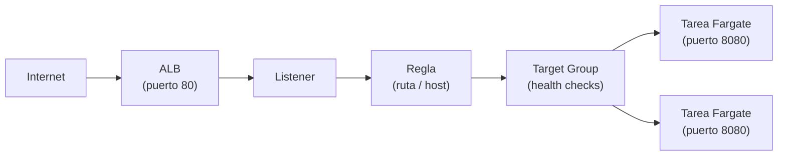
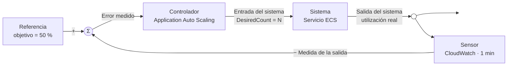
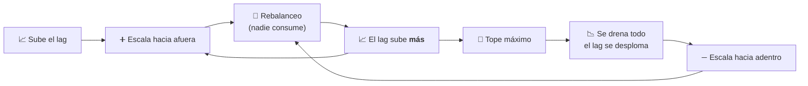

+++
title = "Operar el workload — red, escalado y fallas"
+++

:::title-slide Semana 3
:::

## De entender a operar

La Semana 2 terminó con el ambiente entendido: se lee el template, se actualiza el
stack, y se reconocen el clúster, la task definition, y el servicio. Esta semana se
**opera**. Tres preguntas guían la sesión: ¿cómo llega el tráfico al contenedor?, ¿cómo
crece el sistema cuando hay más carga?, y ¿qué ocurre cuando una tarea no arranca?

:::inline-slide light
### El camino de una petición

Cuando se abre la URL de la aplicación, la petición atraviesa una cadena de
recursos antes de llegar al contenedor. Conocer esa cadena es lo que permite diagnosticar
dónde se corta cuando algo falla.

:::skip
```
Internet
  → Application Load Balancer (puerto 80)
  → Listener
  → Regla (por ruta, o por nombre)
  → Target Group
  → Tarea de Fargate (contenedor, puerto 8080)
```
:::


:::

- El **ALB** recibe el tráfico HTTP en el puerto 80, en subredes públicas.
- El **listener** define en qué puerto escucha el ALB.
- La **regla** decide, por la ruta o por el nombre de host, a qué *target group* va cada
  petición. Con dos aplicaciones sobre el mismo balanceador, es la pieza que las separa.
- El **target group** agrupa los destinos —las tareas— y verifica su salud.
- La **tarea** corre en una subred, con un **grupo de seguridad** que permite el tráfico
  del ALB hacia el puerto del contenedor.

Los **grupos de seguridad** son la pieza que conecta —o bloquea— cada salto: uno permite
tráfico de internet hacia el ALB en el puerto 80; otro permite tráfico del ALB hacia la
tarea en el puerto 8080. Si una petición no llega, casi siempre es un grupo de seguridad
o un *health check* fallando.

### La cadena, vista desde el otro extremo

El diagrama describe la cadena; el servidor de eco de la Semana 2 la **muestra**. Cada
pedido a `/eco/` vuelve con un bloque `network` que es esa misma cadena, leída desde
adentro del contenedor:

```json
"network": {
  "local":  { "address": "10.0.1.100", "port": 8080 },
  "peer":   { "address": "10.0.0.5",   "port": 41234 },
  "client_ip": "203.0.113.7",
  "forwarded_for": ["203.0.113.7"],
  "forwarded_proto": "https"
}
```

- `local` es el último eslabón: la IP privada de la tarea, en el puerto 8080. Es la
  dirección exacta que el target group tiene registrada.
- `peer` es el eslabón anterior, y **no es el navegador**: es el balanceador. La
  dirección es de la VPC, y cambia entre pedidos, porque el ALB tiene un nodo por subred.
- `client_ip` y `forwarded_for` sí son el navegador. El ALB lo anotó en
  `X-Forwarded-For` antes de reenviar.

De ahí sale una regla práctica de operación: una aplicación detrás de un balanceador que
registre `peer` como dirección del cliente va a registrar siempre la del balanceador. Un
log de acceso con dos o tres IPs privadas repitiéndose es ese error, visto de lejos.

Repetir el pedido varias veces alterna el valor de `local` entre las tareas sanas del
target group. Eso es el reparto del balanceador, hecho visible.

:::inline-slide
### Health checks

El target group verifica periódicamente que cada tarea responda en una ruta de salud
(en el template del taller, `GET /health`). Una tarea que responde es **healthy** y
recibe tráfico; una que no responde es **unhealthy** y el ALB deja de enviarle
peticiones. Si todas las tareas están unhealthy, el ALB devuelve `503` aunque los
contenedores estén corriendo.

Conviene notar que el health check **no pasa por la regla**: el target group habla
directo con la tarea, en su IP privada y en el puerto 8080. Por eso una aplicación
publicada bajo `/eco/*` igual necesita contestar en `/health`.
:::

Este es otro punto importante a conversar con el equipo de desarrollo, dado que
ellos, por defecto, pueden no verle valor a esta práctica. Pero para DevOps, u
Operaciones, es imprescindible.

Además, esto puede beneficiar a la aplicación en sí de hacerse correctamente. Los
chequeos de salud garantizan que el tráfico llegue a una instancia saludable de la
aplicación. Esto puede, por ejemplo, evitar peticiones lentas, producidas por un
consumo excesivo de CPU. O evitar peticiones que fallen por problemas con servicios
de terceros, ajenos a la aplicación.

### Más que un `200` fijo

Un `/health` que devuelve `200` siempre, sin mirar nada, es un chequeo decorativo:
nunca detecta una tarea enferma, y da una sensación falsa de cobertura. El extremo
opuesto, un endpoint que verifica todo en cada llamada, tampoco sirve, porque
convierte el chequeo en carga. Las prácticas que resuelven ese punto medio son cuatro.

#### 1. Separar los tipos de chequeo

Un solo endpoint no puede responder tres preguntas distintas. Conviene separarlas,
porque la consecuencia de cada falla es diferente.

| Ruta | Pregunta | Quién la consulta | Qué ocurre si falla |
| --- | --- | --- | --- |
| `/health/live` | ¿El proceso está vivo, y no colgado? | Health check del contenedor (ECS) | La tarea se detiene, y se reemplaza |
| `/health/ready` | ¿Puede atender tráfico **ahora**? | Health check del target group (ALB) | Sale de rotación, y sigue viva |
| `/health/startup` | ¿Terminó de arrancar? | Período de gracia del servicio | Se espera; no se mata |

El error más caro es usar una sola ruta para las tres cosas: una dependencia lenta al
arrancar termina matando tareas que solo necesitaban unos segundos más.

#### 2. Distinguir dependencias duras de blandas

En `/health/ready`, cada dependencia se clasifica:

- **Dura** (sin ella no hay respuesta útil, como la base de datos principal): devuelve
  `503`.
- **Blanda** (admite degradación, como una caché, o un servicio de recomendaciones):
  devuelve `200`, y reporta el estado en el cuerpo de la respuesta.

Marcar todo como duro convierte cualquier hipo de un servicio lateral en una caída
total. Y si varias aplicaciones comparten esa dependencia, caen todas juntas.

#### 3. Verificar en segundo plano, y responder desde memoria

El chequeo no debe ejecutarse dentro del pedido. Una tarea de fondo verifica cada pocos
segundos, con un tiempo límite corto, y guarda el resultado; el endpoint solo lee ese
resultado. Así la respuesta es inmediata, y el health check no agrega carga sobre la
base de datos. Con veinte tareas, y un chequeo cada diez segundos, esa carga no es
despreciable.

#### 4. Drenar antes de apagar

Es el beneficio más concreto, y el que suele cerrar la conversación con desarrollo. Al
recibir la señal de apagado, la aplicación empieza a devolver `503` en `/health/ready`
**antes** de dejar de aceptar conexiones:

```
SIGTERM
  → /health/ready responde 503
  → esperar (intervalo × umbral del target group, más un margen)
  → dejar de aceptar conexiones nuevas
  → terminar las peticiones en curso
  → salir
```

El balanceador necesita dos o tres chequeos fallidos para dar de baja el destino. Si el
proceso cierra el puerto de inmediato, esas peticiones en vuelo se pierden. Este
detalle es lo que elimina los errores `502` en cada despliegue.

::: warning
El health check **no debe medir la carga** (ni CPU, ni memoria, ni profundidad de cola)
para sacarse de rotación. La carga sube en todas las tareas a la vez, así que todas
fallarían el chequeo juntas; ECS las reemplazaría por tareas frías, que consumen todavía
más CPU. Una tarea con la CPU saturada por un defecto se detecta igual, porque deja de
responder dentro del tiempo límite. El exceso de carga legítima se resuelve con **auto
scaling**, no con el health check.
:::

::: extra Cuerpo de respuesta con información útil
El balanceador solo lee el código de estado; las personas, y los tableros, leen el
cuerpo. Un formato útil:

```json
{
  "status": "degraded",
  "version": "1.4.2",
  "commit": "a3f9c21",
  "checks": {
    "database": { "status": "ok",   "latency_ms": 3 },
    "cache":    { "status": "fail", "critical": false, "error": "timeout" }
  }
}
```

La regla: una dependencia blanda cambia el campo `status`, para las alarmas, pero nunca
el código HTTP, que es para el balanceador.

Un endpoint aparte, `/health/deep`, puede hacer verificaciones caras y reales (escribir
y leer un registro de prueba, validar credenciales). Lo consulta el monitoreo, nunca el
balanceador, y conviene no exponerlo, porque revela la topología interna.
:::

### Verlo funcionar

Esta guía la sirve un servidor que implementa las tres rutas, con una dependencia dura
(`dynamodb`), y una blanda (`content`). El control rompe la dependencia elegida durante
el tiempo indicado, y la restaura sola al vencer el plazo. El tablero consulta los tres
endpoints una vez por segundo.

:::app
<cb-health seconds="60"></cb-health>
:::

:::app
<cb-http endpoint="/health/live"></cb-http>
:::

:::app
<cb-http endpoint="/health/ready"></cb-http>
:::

:::app
<cb-http endpoint="/health/startup"></cb-http>
:::

Al romper `dynamodb`, `/health/ready` pasa a `503`, mientras `/health/live` sigue en
`200`: el balanceador saca la instancia de rotación, y nadie reemplaza el contenedor. Al
romper `content`, el código sigue en `200`, y solo cambia el campo `status` a
`degraded`. Es la diferencia entre dependencia dura, y blanda, vista en vivo.

Si el tablero muestra `404`, el servidor tiene la función apagada (se habilita con la
variable `CB_HEALTH_CHECKS`).

### Cablearlo en el template

Que la aplicación tenga las tres rutas no sirve de nada mientras AWS siga consultando
`/health`. Falta el otro lado: decirle al balanceador, y a ECS, cuál ruta mirar. El
template de la Semana 3 es el mismo de la Semana 2, con cuatro cambios.

| Dónde | Semana 2 | Semana 3 |
| --- | --- | --- |
| Target group | `HealthCheckPath: /health` | `/health/ready`, con intervalo y umbrales explícitos |
| Contenedor | `HealthCheck` contra `/health` | la misma, contra `/health/live` |
| Servicio | `HealthCheckGracePeriodSeconds: 60` | `90`, para cubrir el arranque completo |
| Apagado | `StopTimeout: 30`, sin drenaje | `CB_HEALTH_DRAIN_SECS: 25`, y `StopTimeout: 60` |


:::app
<cb-file path="./infra/templates/taller-aws-devops-semana3-app.yaml" type="yaml" toggleable full-path></cb-file>
:::

Los números están encadenados, y ese es el punto de la sección:

```
detectar la falla     intervalo (10) × umbral (2)   = 20 s
drenar                CB_HEALTH_DRAIN_SECS          = 25 s   (mayor que 20)
vaciar en vuelo       deregistration_delay          = 15 s
antes del SIGKILL     StopTimeout                   = 60 s   (mayor que 25 + cola)
```

Bajar el intervalo detecta antes, y cuesta más chequeos por minuto. Subir el umbral
tolera mejor un pico aislado, y demora la baja. Cambiar uno obliga a revisar el drenaje,
porque drenar menos que lo que tarda la detección equivale a no drenar.

#### El problema del `curl`

Los dos chequeos parecen lo mismo, y no lo son. El del balanceador es una petición HTTP
por la red: el target group tiene la IP privada de la tarea, y la consulta desde afuera.
Por eso se configura con una ruta. El del contenedor lo ejecuta ECS **adentro** del
contenedor, sin pasar por la red, así que no se configura con una ruta, sino con un
comando. Y ese comando tiene que existir en la imagen.

La receta que aparece en todos los ejemplos es esta:

```json
"healthCheck": {
  "command": ["CMD-SHELL", "curl -f http://localhost:8080/health || exit 1"]
}
```

Funciona con una imagen `ubuntu`, o `python`, porque traen `curl` adentro. Con una imagen
mínima, no. Y las imágenes de producción tienden a ser mínimas.


| Imagen base | ¿Trae `curl`? | ¿Trae shell? |
| --- | --- | --- |
| `ubuntu`, `debian` | sí | sí |
| `debian:bookworm-slim` (la del taller) | **no** | sí |
| `alpine` | no, trae `wget` de BusyBox | sí |
| `distroless` | **no** | **no** |
| `scratch` | **no** | **no** |


El síntoma cuesta una tarde. El comando falla porque el binario no existe, ECS lo lee
como contenedor enfermo, mata la tarea, y levanta otra, que falla igual. Queda un bucle
de reemplazo, con `stoppedReason` diciendo `Task failed container health checks`, y los
logs de la aplicación **limpios**, porque la aplicación estaba sana todo el tiempo. Se
busca el problema en el lugar equivocado. Las imágenes `distroless`, y `scratch`, suman
la segunda mitad del problema: sin shell, `CMD-SHELL` tampoco arranca.

Hay cuatro salidas.

1. **Instalar `curl` en la imagen.** Es la más rápida, y la peor. Suma peso, suma un
   paquete más que parchear cada vez que aparece un CVE, y deja adentro del contenedor
   una herramienta para descargar archivos de internet. Quien consiga ejecutar código ahí
   la va a usar.
2. **Usar lo que la imagen ya trae.** En Alpine, `wget -q -O /dev/null http://...`.
   Correcto mientras la base sea Alpine, y roto el día que alguien la cambia.
3. **Agregar un binario chico de chequeo**, compilado estático, junto a la aplicación.
   Funciona hasta en `scratch`, y es una dependencia más que versionar, y actualizar.
4. **Que la aplicación se chequee a sí misma.** El binario ya está en la imagen, ya sabe
   hablar HTTP, y se despliega junto con la aplicación, así que nunca queda desfasado.

Este taller usa la cuarta, y la usa desde la Semana 2. El servidor tiene un subcomando
que pide una ruta por loopback, y traduce la respuesta a un código de salida:

```
courses_server healthcheck --path /health/live
```

En el template queda así, con `CMD` en vez de `CMD-SHELL`, porque sin shell de por medio
hay un proceso menos, y una dependencia menos:

```yaml
HealthCheck:
  Command: [CMD, courses_server, healthcheck, --path, /health/live]
  Interval: 15
  Timeout: 5
  Retries: 3
  StartPeriod: 60
```

El bloque ya estaba en el template de la Semana 2, apuntando a `/health`. Lo que cambia
esta semana no es el mecanismo, sino la pregunta: `/health` solo dice si el proceso
contesta, y `/health/live` dice si además está sano. Vale la pena notar que el chequeo
contra un `200` fijo no es decorativo del todo: detecta el proceso **colgado**, que
mantiene el puerto abierto sin atender a nadie. Sin él, ECS solo se entera cuando el
proceso termina.

Tres detalles que suelen morder, sea cual sea la salida elegida:

- **El contrato es el código de salida.** `0` es sano; cualquier otro valor es enfermo.
  Por eso la receta con `curl` lleva `|| exit 1`: sin eso, algunos errores de `curl`
  devuelven códigos que no son `1`, y el comportamiento depende de la versión.
- **`127.0.0.1`, no `localhost`.** En una imagen con IPv6, `localhost` puede resolver a
  `::1` mientras el servidor escucha solo en IPv4. El chequeo falla, la aplicación anda
  bien, y el error no aparece en ningún log.
- **El chequeo consume la CPU de la tarea**, que en el taller es un cuarto de vCPU. Un
  comando pesado, o sin tiempo límite propio, compite con la aplicación a la que dice
  estar cuidando.

:::slide light
## El chequeo que no encuentra `curl`

El del balanceador es una ruta. El del contenedor corre **adentro**, y es un comando.

- `debian-slim`, `distroless`, `scratch`: sin `curl`, y a veces sin shell.
- Falla siempre, la tarea se reemplaza en bucle, y los logs de la aplicación
  salen limpios.
- Salida: que el binario de la aplicación traiga su propio `healthcheck`.

Sano es `exit 0`. Y se pide a `127.0.0.1`, no a `localhost`.
:::

Se despliega como actualización del stack de aplicación que ya existe, no como stack
nuevo:

```bash
aws cloudformation deploy \
  --stack-name taller-aws-<su-nombre>-app \
  --template-file taller-aws-devops-semana3-app.yaml \
  --parameter-overrides ImageUri=... RedStackName=... DatosStackName=... PlataformaStackName=... \
  --capabilities CAPABILITY_IAM \
  --no-execute-changeset
```

Con `--no-execute-changeset` el comando calcula el change set, y se detiene. Conviene
leerlo antes de aplicar: la lista de cambios debe ser corta, y debe coincidir con la
tabla de arriba.

::: warning
El servidor de eco solo tiene `/health`. Desplegarlo con los valores por defecto lo
mata en un bucle: el chequeo de contenedor recibe `404`, ECS reemplaza la tarea, y la
nueva falla igual. Para esa aplicación se despliega con
`RutaSaludBalanceador=/health`, y `RutaSaludContenedor=` vacío. Es la regla general: los
tres niveles se cablean solo si la aplicación los implementa.
:::

:::slide
## Un health check que sirve

1. **Separar**: `live` (¿vivo?), `ready` (¿puede atender?), `startup` (¿ya arrancó?).
2. **Clasificar**: dependencia dura → `503`; dependencia blanda → `200` degradado.
3. **Verificar en segundo plano**, y responder desde memoria.
4. **Drenar** en el apagado: `503` primero, cerrar después. Adiós a los `502` del
   despliegue.

Nunca mirar la carga: para eso está el auto scaling.
:::

## Escalar el servicio

En la Semana 2 se cambió `DesiredCount` a mano. En producción la carga varía, y ajustarla
manualmente no escala. El **auto scaling** del servicio ajusta el número de tareas según
una métrica.

La forma más común es **target tracking**: se fija un objetivo (por ejemplo, "mantener
el uso de CPU promedio en 50%") y ECS agrega o quita tareas para sostenerlo. Si la CPU
sube por encima del objetivo, lanza más tareas; si baja, las reduce, sin bajar del
mínimo definido.

:::slide light
## Auto scaling por seguimiento de objetivo

Se fija una métrica objetivo (ej. **CPU 50%**).

- CPU sube → ECS **agrega** tareas.
- CPU baja → ECS **quita** tareas (hasta el mínimo).

El número de tareas sigue la carga, sin intervención.
:::

Ese es el ejemplo de manual, y es el que se configura en la práctica guiada. Pero "CPU al
50%" es, en la mayoría de las aplicaciones reales, la respuesta equivocada. Vale la pena
entender por qué antes de aplicarlo a un sistema propio.

### Qué hace útil a una métrica de escalado

Una métrica sirve para escalar solo si cumple **dos** condiciones:

1. **Está correlacionada con la demanda.** Con la capacidad fija, si la demanda sube, la
   métrica sube; si la demanda baja, la métrica baja.
2. **Es proporcional a la capacidad.** Con la demanda fija, al **duplicar** el número de
   tareas la métrica debe caer **a la mitad**.

La segunda condición es la que casi nadie verifica, y es la que rompe la mayoría de las
políticas. El escalado automático es un lazo de control: calcula cuántas tareas hacen
falta dividiendo el valor actual por el objetivo. Si la métrica no responde en proporción
al número de tareas, esa cuenta no significa nada.

:::inline-slide light
### El lazo de control



La segunda condición dice que **el sistema tiene ganancia**: mover la entrada debe mover
la salida. Sin ganancia, el controlador no tiene autoridad sobre nada.

:::skip
Cada bloque del diagrama tiene un nombre concreto en ECS:

| Bloque del lazo | En ECS |
| --- | --- |
| Referencia | El valor objetivo de la política |
| Error medido | La diferencia entre el objetivo y lo que informa el sensor |
| Controlador | Application Auto Scaling: convierte el error en una cantidad de tareas |
| Entrada del sistema | El `DesiredCount` que se le pide al servicio |
| Sistema | El servicio: atiende la demanda con las tareas que tiene |
| Salida del sistema | La utilización real del recurso |
| Sensor | CloudWatch, que publica esa utilización cada minuto |


Falta un bloque que el diagrama clásico no dibuja, y que acá es el protagonista: la
**perturbación**. El tráfico de los usuarios entra directo al sistema, sin pasar por el
controlador. El lazo no existe para seguir una referencia que alguien mueve: existe para
rechazar esa perturbación.

Con ganancia nula, el error nunca se cierra: la política escala hasta el máximo
persiguiendo un valor inalcanzable, o no escala nunca. Y conviene retener el **sensor**:
mide cada minuto, así que el lazo siempre actúa sobre información vieja. Ese retardo es
el motivo de los cooldowns, y reaparece al final de la sección.
:::
:::

La forma de comprobarlo es una prueba de carga: sostener un ritmo de peticiones constante,
anotar la métrica, duplicar las tareas sin tocar la carga, y volver a anotar. Si el valor
se partió por dos, la métrica sirve. Si quedó igual, no sirve, por más que suba y baje con
la carga.

:::inline-slide light
### La prueba de las dos condiciones

Con carga constante, **duplicar** las tareas.

| Resultado | Veredicto |
| --- | --- |
| La métrica cae a la mitad | Sirve para target tracking |
| La métrica casi no cambia | **No** sirve: mide un cuello de botella externo |

:::skip
Una métrica que sube con la carga pero no baja con la capacidad describe el problema, no
la solución. Sirve como alarma; no sirve como señal de escalado.
:::
:::

:::inline-slide light
### Por qué la CPU miente

:::skip
La CPU cumple las dos condiciones en **un** tipo de aplicación: la que hace todo su
trabajo dentro del proceso (cálculo, serialización, compresión) y no espera a nadie. Ahí
la CPU se satura antes que cualquier otro recurso, y agregar tareas la reparte.

La mayoría de los servicios de negocio no son así. Son lo que la documentación de AWS
llama **el servidor que espera**: cada petición hace una o varias llamadas a una base de
datos, a una API interna, o a un tercero, y pasa la mayor parte de su vida **bloqueada**.
Esperar no consume CPU. Una aplicación con la latencia por las nubes y todas las peticiones
encoladas puede mostrar 12% de CPU, porque literalmente no está haciendo nada: está
esperando.
:::

Los cuellos de botella típicos que la CPU no ve:


| Cuello de botella | Qué pasa realmente | Qué muestra la CPU |
| --- | --- | --- |
| Base de datos saturada | Las consultas tardan 10× más; el tiempo se va en `wait` | Baja |
| Pool de conexiones agotado | Las peticiones hacen cola *dentro* de la aplicación esperando una conexión libre | Baja |
| API de un tercero lenta | El cliente HTTP espera el timeout | Baja |
| Contención de locks | Los hilos se serializan sobre un recurso compartido | Baja |
| Límite de workers alcanzado | El servidor acepta la conexión y la deja en backlog | Baja |


:::skip
En todos esos casos una política de CPU al 50% **nunca dispara**. El servicio se degrada,
los usuarios ven timeouts, y el gráfico de escalado está plano. La política existe, está
"configurada", y no hace nada.
:::

::: warning
Y hay un caso peor: que **sí** dispare. Si el cuello de botella es la base de datos, agregar
tareas agrega conexiones y consultas a un motor que ya no da abasto. El auto scaling
multiplica la carga sobre la dependencia saturada, y acelera la caída. Escalar hacia
afuera no arregla una dependencia agotada; la termina de romper.
:::
:::

:::inline-slide
### Métricas que sí representan la carga

:::skip
La métrica correcta es la del **recurso que se agota primero**. Identificarlo es el
trabajo previo, y es una conversación con el equipo de desarrollo, porque la respuesta
está en el código, no en la consola.
:::

:::add visibility=slide
La métrica correcta es la del **recurso que se agota primero**.
:::


| Patrón de aplicación | Recurso que se agota primero | Métrica de escalado |
| --- | --- | --- |
| Cómputo puro | CPU | `ECSServiceAverageCPUUtilization` |
| Memoria por petición, liberada al terminar | RAM | `ECSServiceAverageMemoryUtilization` |
| Límite de workers, o de pool | Ranuras de concurrencia | Concurrencia promedio por tarea (métrica propia) |
| El que espera (I/O) | Conexiones del pool | Saturación del pool (métrica propia) |
| Throughput parejo, peticiones homogéneas | — | `ALBRequestCountPerTarget` |
| Consumidor de cola | Trabajo pendiente | Backlog por tarea (ver más abajo) |

:::

Dos observaciones prácticas sobre esta tabla:

- **La concurrencia y la saturación del pool casi siempre hay que publicarlas.** No existen
  como métrica de AWS: viven dentro de la aplicación. Publicar cada minuto "conexiones en
  uso / tamaño del pool" es una línea de código, y es la métrica que de verdad describe a
  un servidor que espera. Un valor cercano a 1 significa que las peticiones están haciendo
  cola aunque la CPU esté ociosa.
- **`ALBRequestCountPerTarget` es la métrica de arranque más honesta** para un servicio
  HTTP genérico. La publica el balanceador, cumple las dos condiciones (al duplicar tareas
  el ALB reparte y el valor cae a la mitad), y no requiere tocar la aplicación. Su límite
  es que asume que todas las peticiones cuestan parecido; con una mezcla de peticiones
  baratas y carísimas, deja de representar la carga.

::: info
No siempre hace falta publicar una métrica nueva. CloudWatch permite componer métricas
existentes con **metric math**, y Application Auto Scaling acepta el resultado como
métrica de una política. `RequestCount / RunningTaskCount` es una división que se escribe
en la política, sin escribir código ni pagar por una métrica propia.
:::

:::inline-slide with-title
#### Latencia y tasa de errores: alarmas, no políticas

La tentación es escalar por el tiempo de respuesta, o por la relación entre `5xx` y `2xx`.
Suena razonable porque es lo que le duele al usuario, pero rompe la segunda condición:

- **`TargetResponseTime` no baja en proporción a la capacidad.** Si la latencia viene de la
  base de datos, duplicar las tareas no la mueve. AWS lo dice explícitamente: la latencia
  del balanceador no sirve para target tracking.
- **La tasa de errores es un síntoma, y puede ser catastróficamente engañosa.** Un
  despliegue malo lleva los `5xx` a 100%. Una política que escala por errores responde
  lanzando más copias de la versión rota, más rápido.
:::

El lugar de estas dos señales es el otro: son las **alarmas de SLO**, las que despiertan a
alguien y las que definen si el sistema cumple su compromiso. Sirven además como
disparador de una política de **step scaling** con escalones explícitos (donde uno decide
cuánto agregar) pero no como objetivo de un lazo proporcional.

:::inline-slide light with-title
#### Colas y streams: la profundidad no alcanza

Los consumidores de colas (SQS, Kinesis, Kafka) son el caso donde la métrica obvia falla
de la forma más clara. El número de mensajes en la cola sube con la demanda (condición 1),
pero **no cambia en proporción al número de consumidores** (condición 2): 5.000 mensajes
son 5.000 mensajes con 2 tareas o con 20.

La métrica correcta es el **backlog por tarea**, y su objetivo se deriva del compromiso de
latencia:

```
backlog por tarea  = mensajes pendientes / tareas en ejecución
backlog aceptable  = latencia tolerada / tiempo promedio por mensaje
```

Con 1.500 mensajes pendientes, 10 tareas, 0,1 s de proceso por mensaje, y una latencia
tolerada de 10 segundos: el valor actual es `1500 / 10 = 150` mensajes por tarea, y el
objetivo es `10 / 0,1 = 100`. **Ese 100 es el valor que se configura** como `TargetValue`
de la política, sobre una métrica de metric math
`ApproximateNumberOfMessagesVisible / RunningTaskCount`. Con ese objetivo la política lleva
el servicio a 15 tareas (`1500 / 100`). La cuenta es proporcional, y por eso funciona.
:::

::: extra Por qué esta fórmula, y no otra
El objetivo de un consumidor no es "tener la cola vacía": es **no atrasarse más de lo
tolerable**. Una cola con 10.000 mensajes que se vacía en 3 segundos está sana; una con
50 mensajes atascados hace 20 minutos está rota. La fórmula traduce el compromiso de
negocio ("ningún mensaje espera más de 10 segundos") a un número de tareas, pasando por lo
único que la aplicación conoce de sí misma: cuánto tarda en procesar un mensaje.

Ese tiempo promedio hay que medirlo, y hay que revisarlo. Si el proceso por mensaje se
duplica porque se agregó una llamada a otro servicio, el objetivo de la política quedó
obsoleto y el sistema se atrasa sin que ninguna alarma lo note.
:::

:::inline-slide with-title light
Alrededor de esa métrica principal conviene tener otras dos, que **no** son objetivos de
escalado sino señales:

| Señal | Qué dice | Uso |
| --- | --- | --- |
| Edad del mensaje más viejo (`ApproximateAgeOfOldestMessage`, `MillisBehindLatest`, *consumer lag*) | Cuánto se atrasó el trabajo más antiguo | **Alarma de SLO.** Es la verdad sobre el atraso. No sirve como objetivo: un mensaje envenenado que falla en bucle la hace crecer para siempre, y ninguna cantidad de tareas la baja |
| Ritmo de llegada (`NumberOfMessagesSent`) | Cuánto trabajo entra por minuto | **Indicador adelantado.** Sube *antes* que el backlog. Útil como disparador de step scaling para anticipar un pico conocido |

::: warning
En Kafka, el número de consumidores útiles está limitado por el número de **particiones**
del topic. Escalar a 20 tareas sobre un topic de 6 particiones deja 14 consumidores
ociosos, pagando. El techo de la política (`MaxCapacity`) debe ser el número de
particiones, no un número redondo elegido a ojo.
::: #warning
::: #inline-slide

### Los mecanismos, y cuándo usar cada uno

Application Auto Scaling —el servicio que ECS usa por debajo— ofrece cuatro mecanismos.
No compiten: se combinan.

| Mecanismo | Cómo decide | Cuándo conviene |
| --- | --- | --- |
| **Target tracking** | Mantiene una métrica en un valor objetivo; AWS calcula el ajuste | El caso por defecto, si la métrica es proporcional a la capacidad |
| **Step scaling** | Escalones explícitos según **cuánto** se pasó del umbral de una alarma | La métrica no es proporcional, o hace falta controlar exactamente cuánto se agrega y cuánto se quita |
| **Scheduled** | Reloj: cambia mínimo y máximo a una hora fija | Patrón conocido: apertura de sucursales, cierre de mes, campaña anunciada |
| **Predictive** | Historia: detecta ciclos diarios o semanales y adelanta la capacidad | Tráfico cíclico. Se combina con uno dinámico, que cubre lo imprevisto |


#### Target tracking: cómodo, y deliberadamente asimétrico

Vale conocer dos detalles del comportamiento, porque explican quejas frecuentes.

**Escala hacia afuera con ganas, y hacia adentro con desconfianza.** Cuando la métrica pasa
el objetivo, la política asume que la aplicación está sufriendo y agrega capacidad
proporcional al desvío, lo más rápido que puede. Cuando la métrica baja, en cambio, no
quita nada si calcula que quitar una tarea volvería a pasar el objetivo, y espera a que el
valor esté bastante por debajo (del orden de un 10%) antes de reducir. Esa asimetría es
intencional: prioriza disponibilidad sobre costo, y evita la oscilación.

**Los cooldowns existen, y su valor por omisión en ECS es 300 segundos.** El *scale-out
cooldown* no bloquea: si hace falta un escalado **mayor**, la política lo hace igual, y
cuenta lo ya agregado como parte del total. El *scale-in cooldown* sí bloquea, y se cancela
si aparece una razón para escalar hacia afuera.

Con varias políticas de target tracking sobre el mismo servicio (por ejemplo, CPU y
`ALBRequestCountPerTarget`), la regla es: escala hacia afuera si **alguna** lo pide, y hacia
adentro solo si **todas** lo permiten. Eso hace que combinar dos métricas sea seguro, y es
la forma recomendada de cubrir una aplicación con dos cuellos de botella posibles.

#### Step scaling: cuando hace falta decidir a mano

Step scaling separa las dos piezas que target tracking une: la **alarma** de CloudWatch, que
se define y se administra manualmente, y los **escalones**, que dicen cuánto ajustar según
el tamaño de la infracción. Los límites de cada escalón se expresan **relativos al umbral de
la alarma**, no en valor absoluto:

Alarma de salida: `CPU > 60%`


| Límite inferior | Límite superior | Ajuste | Se aplica cuando |
| --- | --- | --- | --- |
| `0` | `10` | `+1` | CPU entre 60% y 70% |
| `10` | `20` | `+2` | CPU entre 70% y 80% |
| `20` | *(nulo)* | `+4` | CPU 80% o más |


Alarma de entrada: `CPU < 40%`

| Límite inferior | Límite superior | Ajuste | Se aplica cuando |
| --- | --- | --- | --- |
| `-10` | `0` | `0` | CPU entre 30% y 40% |
| *(nulo)* | `-10` | `-1` | CPU menos de 30% |


El ajuste puede expresarse como `ChangeInCapacity` (± un número de tareas),
`PercentChangeInCapacity` (± un porcentaje, con un mínimo opcional), o `ExactCapacity` (un
número fijo). Los rangos no pueden solaparse ni dejar huecos.

Ese ejemplo muestra el motivo principal para elegir step scaling: **la asimetría explícita**.
Sube de a 4, baja de a 1. Y con un margen ancho entre los dos umbrales (60% y 40%) para que
un escalado no active inmediatamente al del sentido contrario.

::: warning
Mezclar target tracking y step scaling sobre el mismo servicio requiere cuidado: son dos
lazos que no se conocen. Un step scaling que reduce capacidad antes de que el target
tracking considere que corresponde reducir no queda bloqueado, y el target tracking puede
volver a agregar lo que el otro acaba de quitar. La combinación segura es usar target
tracking **con scale-in desactivado** para crecer, y step scaling solo para reducir.
:::

:::slide light
## Tres mecanismos

| | Decide por | Uso |
| --- | --- | --- |
| **Target tracking** | Un valor objetivo | Métrica proporcional a la capacidad |
| **Step scaling** | Escalones por tamaño del desvío | Control explícito, asimetría |
| **Scheduled** | El reloj | Patrón conocido de antemano |

Se combinan. Scheduled fija el piso; el dinámico cubre lo imprevisto.
:::

### El costo de escalar

Hasta acá el escalado se trató como si fuera gratis. No lo es, y ese costo es la causa de
la falla más difícil de diagnosticar en un sistema con auto scaling.

**Agregar una tarea cuesta tiempo.** Bajar la imagen, arrancar el proceso, llenar el pool
de conexiones, calentar cachés, registrarse en el target group, y pasar los health checks:
en Fargate, entre 30 y 90 segundos antes de recibir su primera petición. Durante esa
ventana la capacidad no subió, pero el escalado ya ocurrió.

**Quitar una tarea también cuesta.** Hay que drenar las peticiones en vuelo (de ahí el
apartado de health checks de más arriba) y, si la tarea era un consumidor, el trabajo que
tenía a medio hacer vuelve a la cola.

**Y en algunos sistemas, escalar detiene el trabajo.** Es el caso de los consumidores de
Kafka: cuando un consumidor entra o sale del grupo, se dispara un **rebalanceo**, y las
particiones se reparten de nuevo entre los miembros. El rebalanceo es un evento *stop the
world*: **nadie consume** mientras dura. Kinesis tiene el equivalente con la reasignación
de leases.

#### El espiral

Aca es cuando el modelo como lazo de control es más evidente.

Supongemos que la política escala por *consumer lag* (el atraso del grupo de
consumidores), y escalar aumenta el lag:

1. Llega un pico. El lag sube y cruza el umbral.
2. La política agrega consumidores. Eso dispara un rebalanceo, y el consumo **se detiene**
   unos segundos.
3. Durante la pausa siguen llegando mensajes y **ninguno se procesa**: el lag sube más que
   antes del escalado.
4. La política ve el lag más alto y agrega **más** consumidores. Nuevo rebalanceo, nueva
   pausa, nuevo salto del lag.
5. El ciclo se repite hasta el máximo de la política.
6. Ahora hay capacidad de sobra. El backlog se drena de golpe y el lag cae muy por debajo
   del objetivo.
7. La política reduce. Rebalanceo, pausa, el lag salta, y arranca de nuevo el ciclo, esta
   vez hacia arriba.

El resultado es un servicio que oscila entre el mínimo y el máximo indefinidamente, con la
peor latencia y el costo más alto posibles, y con métricas que parecen mostrar un tráfico
errático que en realidad nunca existió.

:::inline-slide light
### El lazo que se alimenta solo



:::skip
La forma general: **el acto de escalar perturba la métrica que dispara el escalado**. No es
exclusivo de Kafka. Ocurre con cachés que arrancan frías (la latencia sube al agregar
tareas), con pools que se llenan de golpe contra la base de datos, y con cualquier arranque
lento medido por una métrica de latencia.
:::

:::add visibility=slide
::: info
El acto de escalar perturba la métrica que dispara el escalado
::: #info
::: #add
::: #inline-slide

:::inline-slide with-title
#### Cómo se rompe la espiral

No hace falta otra herramienta. El auto scaling tiene los controles; hace falta conocer el
problema y elegir los valores a conciencia.

| Ajuste | Por qué funciona |
| --- | --- |
| **Cooldown de salida ≥ arranque + estabilización** | La métrica medida mientras el sistema todavía se acomoda no cuenta como una razón nueva para escalar |
| **Ventana de evaluación más larga para reducir que para crecer** | Crecer con 3 minutos de evidencia, reducir con 15. Es exactamente lo que hace target tracking por omisión |
| **Escalones asimétricos** (`+4` / `-1`) | Cada reducción perturba menos: un rebalanceo de una partición, no de todas |
| **Margen ancho entre umbrales** (salir a 60%, entrar a 30%) | Después de un escalado, la métrica cae dentro de la zona muerta y no dispara el sentido contrario |
| **Mínimo y máximo cercanos** | Limita la amplitud de la oscilación. `1..50` permite una espiral enorme; `4..12`, una pequeña |
| **Métrica promediada sobre una ventana mayor que la perturbación** | Si el rebalanceo dura 20 segundos, una métrica de 5 minutos lo suaviza en vez de amplificarlo |
| **Suspender el escalado durante los despliegues** | ECS ya desactiva el scale-in mientras hay un despliegue en curso, por esta misma razón |
| **Protección de instancia en trabajos largos** | Evita matar un worker a mitad de un mensaje, y que ese trabajo vuelva a la cola |
| **Membresía estática y rebalanceo cooperativo** (Kafka) | Reduce el costo del evento en el origen: un rebalanceo que no detiene a todo el grupo rompe el lazo desde la raíz |

De todo eso, la regla que resume el resto:

> **El período de decisión del escalado debe ser bastante mayor que el tiempo que tarda un
> escalado en surtir efecto.** Si una acción cuesta 40 segundos de degradación y la política
> decide cada 60, la espiral está garantizada.
:::

Como referencia, un cooldown de tres a cinco veces el tiempo de estabilización es un punto
de partida razonable, que después se ajusta mirando el historial de actividades de
escalado.

::: info
Y la pregunta que hay que hacerse antes de tocar cualquier política: **¿el problema se
resuelve con más tareas?** Si el cuello de botella es la base de datos, un tercero lento, o
un lock, la respuesta es no, y el auto scaling solo va a empeorarlo. Ahí el trabajo es
otro: límites de concurrencia, caché, backpressure, o un pool compartido. El escalado
automático multiplica capacidad; no fabrica la que falta aguas abajo.
:::

## Cuando una tarea no arranca

Un servicio que no logra mantener sus tareas sanas es el problema operativo más común.
ECS no oculta el motivo: lo deja escrito en la tarea detenida.

Cuando una tarea termina inesperadamente, aparece en la lista de tareas **detenidas**
(*stopped*), con un campo **`stoppedReason`** que dice por qué. Las causas habituales:

| `stoppedReason` (resumen) | Causa |
| --- | --- |
| `CannotPullContainerError` | El URI de la imagen es incorrecto, o el rol no tiene permiso sobre ECR. |
| `Essential container ... exited` | El contenedor arrancó y se cerró solo —error de la aplicación; revise los logs. |
| `Task failed ELB health checks` | La tarea corre pero no pasa el health check; el ALB la da de baja. |

La regla de diagnóstico: una tarea detenida siempre tiene un `stoppedReason`, y cuando
ese motivo apunta a la aplicación, la respuesta está en los **logs**.

:::slide
## Por qué falla una tarea

1. Mire la tarea **detenida** y su **`stoppedReason`**.
2. ¿No puede bajar la imagen? → URI o permisos de ECR.
3. ¿El contenedor salió solo? → los **logs** de la aplicación.
4. ¿No pasa el health check? → la ruta de salud, o el puerto.
:::

:::inline-slide light
## Práctica guiada: configurar auto scaling
:::add visibility=slide
:::app
<cb-goto path="Práctica guiada: configurar auto scaling"></cb-goto>
::: #app
::: #add
::: #inline-slide

### Definir la política

1. Abrir [**ECS → Clusters**](https://console.aws.amazon.com/ecs/home), entrar al clúster,
   y seleccionar el servicio **de la aplicación** —no el del eco: el clúster tiene los
   dos, y la política es de un servicio, no del clúster.
2. En la pestaña **Configuration and tasks**, buscar **Service auto scaling** y pulsar
   **Update**.
3. Activar **Service auto scaling**, y fijar el número **mínimo** de tareas en `1` y el
   **máximo** en `4`.
4. Agregar una política de tipo **Target tracking**, métrica
   **ECSServiceAverageCPUUtilization**, con un valor objetivo de `50`.
5. Guardar los cambios.

### Verificar los destinos sanos

1. Abrir [**EC2 → Target Groups**](https://console.aws.amazon.com/ec2/home#TargetGroups:) y seleccionar el target group de la aplicación.
2. En la pestaña **Targets**, confirmar que las tareas aparecen como **healthy**. Esos
   son los destinos a los que el ALB reparte el tráfico.

:::app
<cb-cpu-burst seconds="120" intensity="high" label="Generar carga de CPU"></cb-cpu-burst>
:::

---

{#ejercicio-13}
### Ejercicio 13 — Configurar el escalado y verificar la salud

Configurar auto scaling para el servicio con seguimiento de CPU (objetivo 50%, mínimo 1,
máximo 4 tareas). Luego, en el target group del ALB, confirmar que las tareas están
registradas como sanas.

::: solucion
1. Abrir [**ECS → Clusters**](https://console.aws.amazon.com/ecs/home), entrar al clúster,
   y seleccionar el servicio de la aplicación.
2. En **Configuration and tasks → Service auto scaling**, pulsar **Update**.
3. Activar el auto scaling; fijar **mínimo 1**, **máximo 4**.
4. Agregar una política **Target tracking** sobre
   **ECSServiceAverageCPUUtilization** con objetivo **50**. Guardar.
5. Abrir [**EC2 → Target Groups**](https://console.aws.amazon.com/ec2/home#TargetGroups:), seleccionar el target group de la aplicación, y abrir la
   pestaña **Targets**.
6. Confirmar que las tareas aparecen con estado **healthy** —son los destinos activos
   detrás del balanceador.
:::
