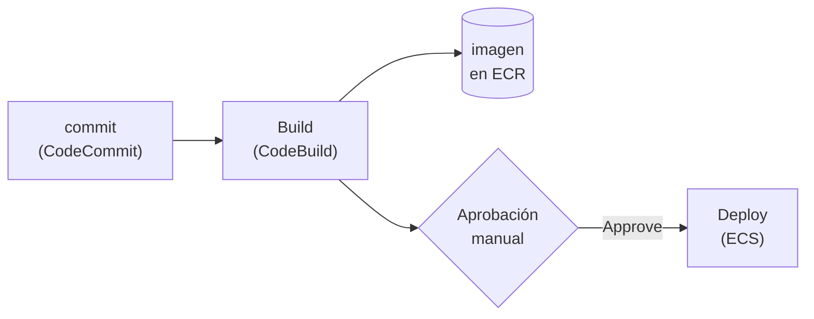

+++
title = "Construir el pipeline"
+++

## Automatizar el flujo de punta a punta

Va a construir el pipeline que automatiza lo que hoy hace a mano: un commit en
CodeCommit dispara un build en CodeBuild, y la imagen resultante se despliega en ECS
—con una pausa de aprobación manual antes del despliegue.

## Lo que la etapa de Deploy necesita

La acción de despliegue a ECS de CodePipeline no toma la imagen directamente: toma un
pequeño archivo, `imagedefinitions.json`, que indica qué contenedor actualizar y con qué
imagen. Ese archivo lo produce el build. Antes de crear el pipeline, agregue a su
`buildspec.yml` una fase que lo genere y lo declare como artefacto:

```yaml
  post_build:
    commands:
      - echo Publicando la imagen en ECR...
      - docker push $IMAGE_URI:$IMAGE_TAG
      - printf '[{"name":"app","imageUri":"%s"}]' "$IMAGE_URI:$IMAGE_TAG" > imagedefinitions.json

artifacts:
  files:
    - imagedefinitions.json
```

El nombre `app` debe coincidir con el nombre del contenedor en la task definition (el que
leyó en la Semana 2). Suba este cambio a CodeCommit antes de continuar —el pipeline
tomará la versión más reciente.

::: warning
Si el nombre del contenedor en `imagedefinitions.json` no coincide exactamente con el de
la task definition, la etapa de Deploy falla. Verifíquelo antes de lanzar el pipeline.
:::

## Práctica guiada: crear el pipeline

### Iniciar la creación

1. Abra [**CodePipeline**](https://console.aws.amazon.com/codesuite/codepipeline/home) y pulse **Create pipeline**.
2. En **Pipeline name**, escriba `taller-aws-<su-nombre>-pipeline`.
3. Deje que CodePipeline cree un **nuevo rol de servicio**. Pulse **Next**.

### Etapa Source

1. En **Source provider**, seleccione **AWS CodeCommit**.
2. Elija su repositorio `taller-aws-<su-nombre>` y la rama `main`.
3. En el método de detección de cambios, deje **Amazon CloudWatch Events** (la opción
   recomendada): así un `git push` a `main` **dispara el pipeline automáticamente**.
4. Pulse **Next**.

### Etapa Build

1. En **Build provider**, seleccione **AWS CodeBuild**.
2. Elija su proyecto `taller-aws-<su-nombre>-build` (el de la Semana 1).
3. Pulse **Next**.

### Etapa Deploy

1. En **Deploy provider**, seleccione **Amazon ECS**.
2. Elija su **clúster** y su **servicio**.
3. Pulse **Next**, revise, y pulse **Create pipeline**.

CodePipeline ejecuta el pipeline por primera vez de inmediato: verá las tres etapas
correr de izquierda a derecha.

### Agregar la aprobación manual

El pipeline recién creado despliega sin pausa. Agregue una aprobación antes del Deploy:

1. En la vista del pipeline, pulse **Edit**.
2. Pulse **Add stage** entre **Build** y **Deploy**; nómbrela `Aprobacion`.
3. Dentro de esa etapa, **Add action group**: tipo de acción **Manual approval**.
   Nómbrela y guarde.
4. Pulse **Save** para confirmar la edición del pipeline.

Ahora, entre Build y Deploy, el pipeline se detiene y espera una aprobación explícita.

### Probar el flujo completo

1. Haga un cambio pequeño en el código, y súbalo:

   ```bash
   git commit -am "Probar el pipeline"
   git push codecommit main
   ```

2. En CodePipeline, observe el avance: Source detecta el commit, Build construye y
   publica la imagen, y el pipeline se **detiene en la etapa de aprobación**.
3. Pulse **Review** en la etapa de aprobación y **Approve**. El Deploy actualiza el
   servicio de ECS con la nueva imagen.
4. Confirme en ECS que el servicio realizó un despliegue nuevo, y recargue la URL del
   ALB.

---

{#ejercicio-11}
### Ejercicio 11 — Cree y ejecute el pipeline

Cree un pipeline con etapas Source (CodeCommit `main`), Build (su proyecto de CodeBuild)
y Deploy (su servicio de ECS), con una etapa de **aprobación manual** antes del Deploy.
Suba un commit, observe el flujo, apruebe el despliegue, y confirme que la nueva imagen
llegó a ECS.

::: solucion
1. Agregue a su `buildspec.yml` la generación de `imagedefinitions.json` y la sección
   `artifacts`, y súbalo a CodeCommit.
2. En [**CodePipeline**](https://console.aws.amazon.com/codesuite/codepipeline/home), pulse **Create pipeline** y nómbrelo
   `taller-aws-<su-nombre>-pipeline`. Deje crear un nuevo rol de servicio.
3. **Source**: **AWS CodeCommit**, repositorio `taller-aws-<su-nombre>`, rama `main`,
   detección por **CloudWatch Events**.
4. **Build**: **AWS CodeBuild**, proyecto `taller-aws-<su-nombre>-build`.
5. **Deploy**: **Amazon ECS**, su clúster y su servicio. Cree el pipeline.
6. **Edit** → **Add stage** entre Build y Deploy, llamada `Aprobacion`, con una acción
   **Manual approval**. **Save**.
7. Suba un commit a `main`:

   ```bash
   git commit -am "Probar el pipeline"
   git push codecommit main
   ```

8. Observe Source → Build → (pausa) **Aprobacion**. Pulse **Review → Approve**.
9. La etapa **Deploy** actualiza el servicio de ECS. Confirme el nuevo despliegue en la
   consola de ECS.
:::

:::slide light
{{ejercicio-11}}
:::

:::slide light
## El pipeline, de punta a punta


:::

:::slide
## Aprobación manual

```
Source → Build → [ Aprobación ] → Deploy
                       ⏸ espera
```

El pipeline se detiene antes de desplegar, hasta que alguien pulsa **Approve**.
:::
