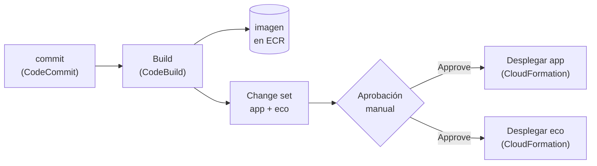

+++
title = "Construir el pipeline"
+++

:::inline-slide
## Automatizar el flujo de punta a punta

Se va a construir el pipeline que automatiza lo que hoy se hace a mano: un commit en
CodeCommit dispara un build en CodeBuild, el build publica la imagen, y CloudFormation
actualiza los stacks de las **dos** aplicaciones —la plataforma de cursos, y el eco—
después de una aprobación manual.
:::

## Desplegar con CloudFormation, no con la acción de ECS

CodePipeline trae una acción de despliegue a **Amazon ECS** que actualiza el servicio
directamente. Es la más corta de configurar, y es la equivocada acá: registra una revisión
nueva de la task definition **por fuera de CloudFormation**. El stack queda con *drift*, y
el siguiente `update` del stack —el de la Semana 3, o cualquier otro— vuelve a poner la
imagen que el parámetro `ImageUri` todavía tiene guardada. El despliegue se deshace solo, y
el motivo no aparece en ningún log de la aplicación.

La regla es la misma de toda la semana: lo que nació en un stack se cambia por el stack. La
acción de **AWS CloudFormation** actualiza el mismo stack que se lanzó a mano, con el mismo
template, y cambia un único parámetro: el URI de la imagen recién construida.

::: info
La acción de ECS no es un error en sí: sirve cuando el servicio **no** vive en un stack, o
cuando el pipeline es el único que lo toca. El problema es tener dos dueños para el mismo
recurso.
:::

:::inline-slide light
### Lo que la etapa de Deploy necesita

:::skip
La acción de CloudFormation necesita dos cosas del build: el **template** con el que
actualizar el stack, y el **URI de la imagen** para pasárselo como parámetro. Las dos
viajan en el artefacto de salida del build, así que `buildspec.yml` gana una línea que
escribe el URI en un JSON, y una sección `artifacts` que declara ese archivo junto con los
templates:
:::

```yaml
  post_build:
    commands:
      - echo Verificando la imagen publicada en ECR...
      - aws ecr describe-images --repository-name "$IMAGE_REPO_NAME" --image-ids imageTag="$IMAGE_TAG"
      - printf '{"ImageUri":"%s"}' "$IMAGE_URI:$IMAGE_TAG" > imagen.json
      - echo Build completado.

artifacts:
  files:
    - imagen.json
    - infra/templates/*.yaml
```
:::

La imagen ya se publicó en la fase `build` con `docker buildx build --push`, así que
`post_build` solo agrega el archivo. `$IMAGE_URI` y `$IMAGE_TAG` siguen disponibles: las
variables definidas en `pre_build` se conservan durante todo el build.

Los templates entran al artefacto con su ruta, así que dentro del `.zip` quedan en
`infra/templates/…`, igual que en el repositorio. Que viajen con la imagen no es un
detalle de comodidad: el template y el binario que despliega salen del **mismo commit**, y
avanzan juntos por las mismas etapas. Subir este cambio a CodeCommit antes de continuar.

::: info
La alternativa es darle a la acción **dos** artefactos de entrada, `SourceArtifact` para el
template y `BuildArtifact` para `imagen.json`. Funciona igual, y evita reconstruir la
imagen cuando solo cambió el template. A cambio, el template que se aplica puede no ser el
que se construyó.
:::

::: warning
Un parámetro que **no** se indica en la acción vuelve a su valor por omisión: la acción de
CloudFormation no tiene un `UsePreviousValue`. Antes de configurarla, conviene abrir la
pestaña **Parameters** de cada stack, y copiar los valores que hoy tiene.
:::

:::inline-slide
## Práctica guiada: crear el pipeline
:::app
<cb-goto path="Práctica guiada: crear el pipeline"></cb-goto>
::: # add
:::

### Paso previo: el rol que despliega

En el resto del taller, quien crea los stacks es la persona que está en la consola, con sus
propios permisos. Acá deja de ser así: el que despliega es el pipeline, y un pipeline no
tiene permisos propios sobre los recursos. Trabaja con **dos** roles, y conviene separarlos
desde el principio:

| Rol | Quién lo asume | Para qué |
| --- | --- | --- |
| El del pipeline (`AWSCodePipelineServiceRole-…`) | CodePipeline | Leer el repositorio, lanzar el build, llamar a CloudFormation, y **pasar** el segundo rol |
| `taller-aws-<su-nombre>-cfn-deploy` | CloudFormation | Crear, modificar, y borrar los recursos del stack |

El asistente crea el primero. El segundo hay que crearlo a mano, **antes** de configurar la
etapa de despliegue: el formulario de la acción lo pide por nombre, y no ofrece crearlo.

1. Abrir [**IAM → Roles**](https://console.aws.amazon.com/iam/home#/roles) y pulsar **Create role**.
2. En **Trusted entity type**, elegir **AWS service**, y en **Use case**, **CloudFormation**.
   Ese paso escribe la política de confianza, que es lo que permite que el servicio
   CloudFormation (no una persona) asuma el rol.
3. Pulsar **Next**, y adjuntar las políticas **PowerUserAccess** y **IAMFullAccess**.
   `IAMFullAccess` no es opcional: el template de la aplicación crea el rol de tarea y el
   de ejecución, y sin permiso sobre IAM el stack falla a mitad de camino.
4. En **Role name**, escribir `taller-aws-<su-nombre>-cfn-deploy`, y pulsar **Create role**.

El mismo rol, desde CloudShell:

```bash
aws iam create-role \
  --role-name taller-aws-<su-nombre>-cfn-deploy \
  --assume-role-policy-document '{"Version":"2012-10-17","Statement":[{"Effect":"Allow","Principal":{"Service":"cloudformation.amazonaws.com"},"Action":"sts:AssumeRole"}]}'

for P in PowerUserAccess IAMFullAccess; do
  aws iam attach-role-policy \
    --role-name taller-aws-<su-nombre>-cfn-deploy \
    --policy-arn "arn:aws:iam::aws:policy/$P"
done
```

::: warning
El campo **Role name** de la acción es una caja de texto con búsqueda: acepta un nombre que
no existe, y no se queja hasta que se pulsa **Save**. Ahí aparece

```
AccessDeniedException
User: arn:aws:sts::…:assumed-role/… is not authorized to perform:
iam:PassRole on resource: taller-aws-<su-nombre>-cfn-deploy
```

y se lee como un problema de permisos, aunque quien guarda sea administrador. No lo es: el
rol **no existe**, IAM no puede resolver el nombre a un ARN (por eso el mensaje muestra el
nombre pelado, y no un ARN), y la respuesta a un recurso que no existe es `AccessDenied`.
Se verifica con `aws iam get-role --role-name taller-aws-<su-nombre>-cfn-deploy`: si
contesta `NoSuchEntity`, falta este paso.
:::

::: info
`iam:PassRole` es el permiso de **entregarle** un rol a un servicio, distinto del de
asumirlo. Existe para que nadie pueda darle a un servicio más permisos de los que tiene:
sin él, cualquiera que pueda crear un pipeline podría hacerlo desplegar con un rol de
administrador.
:::

::: warning
Los dos permisos del rol son anchos a propósito, para que el taller no se trabe en un
`AccessDenied`. En producción el rol lleva solo lo que los stacks tocan, y es **el** límite
de seguridad del pipeline: quien pueda cambiar el template puede usar ese rol.
:::

### Iniciar la creación

Abrir [**CodePipeline**](https://console.aws.amazon.com/codesuite/codepipeline/home) y pulsar **Create pipeline**. El asistente
abre en **Choose creation option**, la ventana que decide **cómo se arma** el pipeline.
Tiene dos bloques:

- **Category** — el tipo de pipeline. **Deployment**, **Continuous Integration**, y
  **Automation** ofrecen plantillas ya armadas para un caso concreto. **Build custom
  pipeline** abre el asistente clásico, que se arma etapa por etapa.
- **Template** — la plantilla concreta dentro de la categoría elegida (**Push to ECR**,
  **Deploy to ECS Fargate**, **Deploy to CloudFormation**, **Terraform Deploy To AWS**).
  Al seleccionar **Build custom pipeline**, este bloque desaparece: no hay plantilla que
  elegir.

Cada plantilla cubre **una sola** mitad del flujo: **Push to ECR** construye la imagen y
la publica, pero no despliega; **Deploy to CloudFormation** actualiza un stack a partir de
un artefacto que ya existe, pero no construye. El pipeline de este taller encadena las dos
mitades más una aprobación manual, así que se arma a mano.

1. En **Category**, seleccionar **Build custom pipeline**. El bloque **Template**
   desaparece.
2. Pulsar **Next**.

::: info
El encabezado dice **Step 1 of 3** porque cuenta los pasos del flujo con plantilla
(**Choose creation option** → **Choose source** → **Configure template**). Al elegir
**Build custom pipeline**, el asistente cambia al flujo clásico, y el contador pasa a
**of 7**: **Choose pipeline settings**, **Add source stage**, **Add build stage**, **Add
test stage**, **Add deploy stage**, y **Review**.
:::

### Choose pipeline settings (Step 2 of 7)

1. En **Pipeline name**, escribir `taller-aws-<su-nombre>-pipeline`.
2. En **Service role**, dejar **New service role**: CodePipeline crea el rol con los
   permisos que el pipeline necesita.
3. Dejar **Advanced settings** como viene, y pulsar **Next**.

### Add source stage (Step 3 of 7)

1. En **Source provider**, seleccionar **AWS CodeCommit**.
2. En **Repository name**, elegir `taller-aws-<su-nombre>`; en **Branch name**, `main`.
3. Dejar marcado **Create EventBridge rule to automatically detect source changes**: esa
   regla es la que hace que un `git push` a `main` **dispare el pipeline
   automáticamente**. Sin ella, el pipeline solo corre a mano.
4. En **Output artifact format**, dejar **CodePipeline default**.
5. Dejar marcado **Enable automatic retry on stage failure**.
6. Pulsar **Next**.

**Output artifact format** decide qué recibe la etapa de Build:

- **CodePipeline default** — un `.zip` con los archivos del commit, **sin** el directorio
  `.git`. Dentro del build no hay historia: `git log`, `git describe`, o `git rev-parse`
  no funcionan.
- **Full clone** — CodePipeline pasa la metadata del repositorio, y la acción siguiente
  puede hacer un `git clone` completo. Solo lo soportan las acciones de CodeBuild.

El `buildspec.yml` de este taller no ejecuta ningún comando `git`: el SHA sale de
`CODEBUILD_RESOLVED_SOURCE_VERSION`, la variable que CodeBuild expone con la revisión que
le entregó CodePipeline (el commit ID de CodeCommit). Esa variable se llena igual con el
zip por omisión, así que `GIT_SHA` y `GIT_SHA_SHORT` siguen resolviendo bien, y **Full
clone** no hace falta.

::: extra Cuándo sí hace falta Full clone
Cuando el build necesita la historia del repositorio: `git describe --tags` para derivar
una versión, un changelog entre dos commits, o un análisis que compara ramas. Activarlo
tiene tres requisitos:

1. Agregar `git-credential-helper: yes` en el bloque `env` del `buildspec.yml`.
2. Agregar el permiso `codecommit:GitPull` al **rol de servicio de CodeBuild**. Sin él, la
   primera ejecución del pipeline falla.
3. La acción de CodeCommit y la de CodeBuild deben estar en la misma cuenta de AWS.
:::

**Enable automatic retry on stage failure** reintenta la etapa por su cuenta cuando falla,
sin esperar a que alguien pulse **Retry**. Ayuda con fallos transitorios; un error real,
un `buildspec.yml` mal escrito, un permiso que falta, vuelve a fallar igual.

### Add build stage (Step 4 of 7)

1. En **Build provider**, seleccionar **Other build providers -> AWS CodeBuild**, y dejar la **Region** del
   pipeline.
2. En **Project name**, elegir `taller-aws-<su-nombre>-build` (el de la Semana 1).
3. Pulsar **Next**.

### Add test stage (Step 5 of 7)

El asistente ofrece una etapa de pruebas aparte. Este pipeline no la usa (las
verificaciones corren dentro del build), así que pulsar **Skip test stage**.

### Add deploy stage (Step 6 of 7)

Pulsar **Skip deploy stage**, y confirmar. El despliegue de este taller no entra en el
asistente: son **dos** etapas de CloudFormation: una que propone el cambio, y otra que lo
aplica. Con **dos** acciones cada una, y el asistente solo admite una acción, en una etapa
que además se llama `Deploy`. Se arman a continuación, en el editor del pipeline.

### Review (Step 7 of 7)

Revisar el resumen, y pulsar **Create pipeline**. CodePipeline ejecuta Source y Build de
inmediato. Ese primer build es el que deja `imagen.json` y los templates en el artefacto,
que es justo lo que las etapas siguientes necesitan.

### La etapa que propone el cambio

Un `update` de stack se puede aplicar directo, o se puede **calcular primero**, mirar, y
aplicar después. Eso segundo es un change set, el mismo que en la sesión anterior se pedía
con `--no-execute-changeset`. En un pipeline, cada mitad es una acción.

1. En la vista del pipeline, pulsar **Edit**, y **Add stage** debajo de **Build**.
   Nombrarla `ChangeSet`.
2. Dentro de la etapa, **Add action group**. Se abre el panel **Edit action**, con los
   campos en este orden:

| Campo | Valor |
| --- | --- |
| **Action name** | `app-changeset` |
| **Action provider** | **AWS CloudFormation** |
| **Region** | la del pipeline |
| **Input artifacts** | `BuildArtifact` |
| **Action mode** | **Create or replace a change set** |
| **Stack name** | `taller-aws-<su-nombre>-app` |
| **Change set name** | `taller-aws-<su-nombre>-app-cs` |
| **Template — Artifact name** | `BuildArtifact` |
| **Template — File name** | `infra/templates/taller-aws-devops-semana3-app.yaml` |
| **Capabilities** | `CAPABILITY_IAM` |

Los campos que quedan —**Template configuration**, **Output file name**, **Variable
namespace**, **Output artifacts**— se dejan vacíos.

3. Más abajo, en **Role name**, elegir `taller-aws-<su-nombre>-cfn-deploy`.
4. Abrir **Advanced**, y en **Parameter overrides** pegar:

   ```json
   {
     "ImageUri": { "Fn::GetParam": ["BuildArtifact", "imagen.json", "ImageUri"] },
     "RedStackName": "taller-aws-<su-nombre>-red",
     "DatosStackName": "taller-aws-<su-nombre>-datos",
     "PlataformaStackName": "taller-aws-<su-nombre>-plataforma"
   }
   ```

5. Guardar la acción.

`Fn::GetParam` es la única función que la acción entiende, y hace exactamente una cosa:
leer una clave de un archivo JSON de un artefacto de entrada. Ahí se cierra el circuito.
El tag que el build calculó a partir del commit llega al parámetro del stack sin que nadie
lo escriba a mano.

Los tres nombres de stack van fijos porque el template los importa, y no tienen valor por
omisión. Los demás parámetros (`RutaPath`, `Prioridad`, los de health check) se quedan con
el suyo, que es el de la aplicación. Si el stack se desplegó con `UsarHttps=si`, o con
`NombreHost`, esos valores también tienen que estar en la lista, o el change set los
revierte.

### La aprobación manual

1. **Add stage** debajo de `ChangeSet`; nombrarla `Approval`.
2. Dentro de esa etapa, **Add action group**: tipo de acción **Manual approval**.
   Nombrarla `revisar-cambios`, y guardar.

La aprobación ya no es un trámite: mientras el pipeline espera, el change set está creado
en CloudFormation, con la lista exacta de lo que va a cambiar. Se revisa en
[**CloudFormation → el stack → Change sets**](https://console.aws.amazon.com/cloudformation/home) antes de aprobar.

### La etapa que aplica el cambio

1. **Add stage** debajo de `Aprobacion`; nombrarla `Deployment`.
2. **Add action group**, y completar el panel **Edit action**:

| Campo | Valor |
| --- | --- |
| **Action name** | `app-deploy` |
| **Action provider** | **AWS CloudFormation** |
| **Region** | la del pipeline |
| **Input artifacts** | vacío |
| **Action mode** | **Execute a change set** |
| **Stack name** | `taller-aws-<su-nombre>-app` |
| **Change set name** | `taller-aws-<su-nombre>-app-cs` |

3. Guardar la acción, y pulsar **Save** para confirmar la edición del pipeline.

Al elegir **Execute a change set**, el formulario se acorta solo: desaparecen el template,
las capacidades, el rol, y los parámetros. No es una omisión de esta guía (todo eso ya
quedó adentro del change set cuando se lo creó, incluido el rol con el que CloudFormation
lo va a aplicar). La acción solo lo nombra, y lo aplica.

### Agregar la segunda aplicación: el eco

El clúster corre dos aplicaciones, y el pipeline construye **una sola** imagen para las
dos: el eco es el mismo binario con otro comando. Falta que la imagen nueva llegue también
a su stack.

Dentro de una etapa, las acciones que comparten el mismo **run order** corren **en
paralelo**. En el editor, eso es agregar la acción **al lado** de la que ya está, y no en
un grupo nuevo debajo.

1. Pulsar **Edit**, y en la etapa `ChangeSet` usar el signo **+** que aparece **a la
   derecha** de `app-changeset` (**Add action**), no el de abajo.
2. Configurar la acción igual que la de la aplicación, con cuatro diferencias:

| Campo | Valor |
| --- | --- |
| **Action name** | `eco-changeset` |
| **Stack name** | `taller-aws-<su-nombre>-eco` |
| **Change set name** | `taller-aws-<su-nombre>-eco-cs` |
| **Template — File name** | `infra/templates/taller-aws-devops-semana2-app.yaml` |

3. En **Parameter overrides**, los mismos cuatro valores, más los tres que hacen que ese
   template sea el eco, y no una segunda copia de la aplicación:

   ```json
   {
     "ImageUri": { "Fn::GetParam": ["BuildArtifact", "imagen.json", "ImageUri"] },
     "RedStackName": "taller-aws-<su-nombre>-red",
     "DatosStackName": "taller-aws-<su-nombre>-datos",
     "PlataformaStackName": "taller-aws-<su-nombre>-plataforma",
     "ComandoContenedor": "courses_server,echo",
     "RutaPath": "/eco/*",
     "Prioridad": "10"
   }
   ```

   El eco sale del **mismo** template que la aplicación: lo que lo hace otra aplicación son
   esos tres parámetros. Omitirlos es la trampa de más arriba en su forma más cara: vuelven
   a los valores por omisión (el comando de la imagen, `/*`, y prioridad `100`), así que el
   stack del eco pasaría a servir la plataforma de cursos, con una regla que choca con la de
   la aplicación.

4. Repetir en la etapa `Desplegar`: **Add action** a la derecha de `app-deploy`, modo
   **Execute a change set**, stack `taller-aws-<su-nombre>-eco`, change set
   `taller-aws-<su-nombre>-eco-cs`.
5. Pulsar **Save**.

::: warning
Quien haya hecho la práctica de módulos de CloudFormation tiene el eco como una instancia de
`CloudBridge::Taller::App::MODULE`, y para ese stack el template es
`infra/templates/taller-aws-devops-semana2-eco-modulo.yaml`. Sus valores por omisión ya son
los del eco (comando, `/eco/*`, y prioridad `10`), así que los overrides se quedan en los
cuatro de la aplicación. Apuntarle el template de la aplicación **no** lo actualizaría: los
recursos del módulo llevan el prefijo `Eco` en el ID lógico, así que CloudFormation crearía
unos nuevos, borraría los viejos, y las dos reglas chocarían por usar la misma prioridad. Un
stack se actualiza con **su** propio template.
:::

### Probar el flujo completo

1. Hacer un cambio pequeño en el código, y subirlo:

   ```bash
   git commit -am "Probar el pipeline"
   git push codecommit main
   ```

2. En CodePipeline, observar el avance: Source detecta el commit, Build construye y
   publica la imagen, y las dos acciones de `ChangeSet` corren **a la vez**. El pipeline
   se detiene en `Aprobacion`.
3. Abrir cada stack en CloudFormation, entrar a **Change sets**, y leer los cambios
   propuestos. Deberían ser pocos: la task definition, y el servicio que la usa.
4. Volver al pipeline, pulsar **Review** en la etapa de aprobación, y **Approve**. Las dos
   acciones de `Desplegar` aplican los change sets en paralelo.
5. Confirmar en ECS que **los dos** servicios hicieron un despliegue nuevo, y recargar la
   URL del ALB, y la del eco.

::: warning
Un change set sobre un stack que no cambia en nada falla, con el mensaje
`The submitted information didn't contain changes`. Pasa al reejecutar el pipeline sobre el
**mismo** commit: el tag de la imagen es el SHA, así que el parámetro llega igual que la
vez anterior. Un commit nuevo siempre produce un cambio.
:::

---

{#ejercicio-14}
### Ejercicio 14 — Crear y ejecutar el pipeline

Crear un pipeline con etapas Source (CodeCommit `main`), Build (el proyecto de CodeBuild),
`ChangeSet`, **aprobación manual**, y `Desplegar`. Las dos etapas de CloudFormation llevan
**dos acciones en paralelo**: la de la aplicación, y la del eco. Subir un commit, revisar
los change sets, aprobar, y confirmar que la nueva imagen llegó a los dos servicios.

::: solucion
1. Agregar a `buildspec.yml` la generación de `imagen.json` y la sección `artifacts` con
   `imagen.json` y `infra/templates/*.yaml`, y subirlo a CodeCommit —desde el editor de la
   consola (**Code** → `buildspec.yml` → **Edit** → **Commit changes**), con
   `aws codecommit put-file`, o con `git push codecommit main`.
2. En IAM, crear el rol `taller-aws-<su-nombre>-cfn-deploy` para el servicio
   **CloudFormation**, con **PowerUserAccess** y **IAMFullAccess**.
3. En [**CodePipeline**](https://console.aws.amazon.com/codesuite/codepipeline/home), pulsar **Create pipeline**. En **Choose
   creation option**, elegir **Build custom pipeline**, y pulsar **Next**. Nombrar el
   pipeline `taller-aws-<su-nombre>-pipeline`, y dejar crear un nuevo rol de servicio.
4. **Add source stage**: **AWS CodeCommit**, repositorio `taller-aws-<su-nombre>`, rama
   `main`, con **Create EventBridge rule to automatically detect source changes** marcado,
   y **Output artifact format** en **CodePipeline default** —el build no usa comandos
   `git`—.
5. **Add build stage**: **AWS CodeBuild**, proyecto `taller-aws-<su-nombre>-build`.
   **Skip test stage**, y **Skip deploy stage**. **Review** → **Create pipeline**.
6. **Edit** → **Add stage** `ChangeSet`, con una acción **AWS CloudFormation** en modo
   **Create or replace a change set**, entrada `BuildArtifact`, stack
   `taller-aws-<su-nombre>-app`, change set `taller-aws-<su-nombre>-app-cs`, template
   `infra/templates/taller-aws-devops-semana3-app.yaml`, capacidad `CAPABILITY_IAM`, rol
   `taller-aws-<su-nombre>-cfn-deploy`, y en **Parameter overrides** el `Fn::GetParam`
   sobre `imagen.json` más los tres nombres de stack.
7. **Add stage** `Aprobacion`, con una acción **Manual approval**. **Add stage**
   `Desplegar`, con una acción en modo **Execute a change set** sobre el mismo stack, y el
   mismo change set.
8. En `ChangeSet`, **Add action** a la derecha de la acción existente: misma configuración,
   con stack `taller-aws-<su-nombre>-eco`, change set `taller-aws-<su-nombre>-eco-cs`,
   template `infra/templates/taller-aws-devops-semana2-app.yaml` —o el del módulo, si el eco
   se recreó con él—, y tres overrides más: `ComandoContenedor`, `RutaPath`, y `Prioridad`.
   Repetir en `Desplegar` con el modo **Execute a change set**. **Save**.
9. Subir un commit a `main`:

   ```bash
   git commit -am "Probar el pipeline"
   git push codecommit main
   ```

10. Observar Source → Build → `ChangeSet` (dos acciones en paralelo) → pausa en
    `Aprobacion`. Leer los dos change sets en CloudFormation, y pulsar
    **Review → Approve**.
11. La etapa `Desplegar` aplica los dos change sets. Confirmar el despliegue nuevo en los
    dos servicios de ECS.
:::

:::slide light
{{ejercicio-14}}
:::

:::slide light
## El pipeline, de punta a punta


:::

:::slide
## Dos aplicaciones, una sola imagen

```
Source → Build → ChangeSet → [ Aprobación ] → Desplegar
                 app  eco         ⏸ espera     app  eco
                (paralelo)                    (paralelo)
```

Las acciones con el mismo **run order** corren en paralelo. Cada stack se actualiza con
**su** template, y con la misma imagen.
:::

:::slide
## Aprobación manual

El pipeline se detiene con el change set ya calculado: lo que espera aprobación no es un
despliegue a ciegas, sino una **lista de cambios** que se puede leer.

Ejecutar un change set no vuelve a calcularlo. Lo que se aprueba es lo que se aplica.
:::
