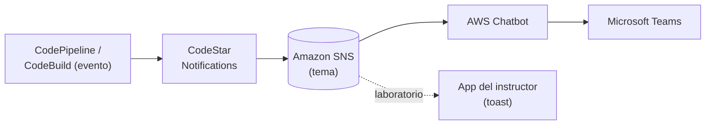

+++
title = "Notificaciones — del pipeline a Teams"
+++

## Que el pipeline avise solo

El pipeline ya corre sin intervención, pero todavía hay que mirarlo para saber cómo le
fue. La última pieza de la automatización es que **el pipeline avise solo**: cuando una
ejecución termina, o falla, o se detiene esperando aprobación, el equipo se entera por el
canal donde ya conversa. En esta organización ese canal es **Microsoft Teams**.

## El flujo de notificación

El evento del pipeline viaja por una cadena de servicios hasta llegar a Teams:

:::inline-slide light
## De un evento a un canal de Teams

```
CodePipeline / CodeBuild (evento)
  → CodeStar Notifications (regla)
  → Amazon SNS (tema)
  → AWS Chatbot
  → canal de Microsoft Teams
```
:::



- Una **regla de notificación** (CodeStar Notifications) escucha eventos del pipeline:
  ejecución exitosa, fallida, o detenida en una aprobación.
- La regla publica el evento en un **tema de Amazon SNS**, el servicio de mensajería que
  desacopla a quien emite de quien recibe.
- **AWS Chatbot** está suscrito al tema y entrega el mensaje, ya formateado, a un canal
  de **Microsoft Teams**.

Cada paso tiene una sola responsabilidad: la regla decide *qué* eventos importan, SNS los
*transporta*, y Chatbot los *entrega* al canal. Cambiar el destino (otro canal, otro
equipo) no toca el pipeline: solo cambia la suscripción.

::: extra Una aclaración de nombres: CodeStar
El servicio **AWS CodeStar** —el de proyectos y dashboards unificados— fue
**discontinuado en 2024**. Las **reglas de notificación** que se usan aquí son otra cosa:
forman parte de los *Developer Tools* (su prefijo técnico es `codestar-notifications`),
siguen plenamente vigentes, y no tienen relación con el servicio discontinuado. Cuando la
documentación habla de "CodeStar Notifications", se refiere a estas reglas, no al servicio
de proyectos.
:::

## Por qué en el laboratorio lo vemos distinto

Conectar Teams de verdad requiere una suscripción de AWS Chatbot al espacio de Teams de
la organización —algo que cada participante no puede montar en su cuenta del taller. Para
no perder el aprendizaje, el laboratorio usa un **espejo** del mismo flujo: los eventos
de la cuenta llegan a la **aplicación del instructor**, que los muestra como avisos
(*toasts*) sobre esta misma guía.

El mecanismo cambia, la idea no: lo que en el lab aparece como un *toast* en la guía, en
la organización aparecería en un canal de Teams. La regla de notificación, el tema de
SNS, y la lógica de "qué eventos importan" son idénticos; solo difiere el último salto.

:::slide
## Real vs. laboratorio

| Producción | Laboratorio |
| --- | --- |
| → AWS Chatbot → Teams | → app del instructor → *toast* |

Mismo evento, misma regla, mismo SNS. Cambia solo el último salto.
:::

## Práctica guiada: crear la regla de notificación

### Definir la regla sobre el pipeline

1. Abrir [**CodePipeline**](https://console.aws.amazon.com/codesuite/codepipeline/home) y entrar al pipeline.
2. Pulsar **Notify → Create notification rule**.
3. En **Detail type**, elegir **Full**. En **Events**, marcar al menos:
   - **Pipeline execution: Succeeded**
   - **Pipeline execution: Failed**
   - **Manual approval: Needed**
4. En **Targets**, seleccionar el **tema de SNS** que indique el instructor (el que
   alimenta la aplicación del taller). Pulsar **Submit**.

### Disparar la regla y observar el aviso

1. Subir un commit a `main` para iniciar una ejecución del pipeline.
2. A medida que el pipeline avanza, los eventos seleccionados llegan a la aplicación del
   instructor y aparecen como *toasts* en la guía, identificados con el *pod*.
3. Cuando el pipeline se detenga en la aprobación, se verá el aviso **Manual approval:
   Needed**; al aprobar y completarse, se verá **Succeeded**.

> **Nota:** la recepción de los *toasts* depende de que el instructor haya configurado el
> tema de SNS y la aplicación del taller. Si aún no está disponible, esta sección se sigue
> como demostración: el flujo y la regla son reales; el último salto lo muestra el
> instructor.

---

{#ejercicio-12}
### Ejercicio 12 — Notificar los eventos del pipeline

Crear una regla de notificación sobre el pipeline que publique, en el tema de SNS del
taller, los eventos de ejecución exitosa, fallida, y de aprobación pendiente. Disparar una
ejecución y observar los avisos.

::: solucion
1. En [**CodePipeline**](https://console.aws.amazon.com/codesuite/codepipeline/home), abrir el pipeline y pulsar
   **Notify → Create notification rule**.
2. **Detail type: Full**. Marcar los eventos **Pipeline execution: Succeeded**,
   **Pipeline execution: Failed**, y **Manual approval: Needed**.
3. En **Targets**, seleccionar el tema de SNS indicado por el instructor. **Submit**.
4. Subir un commit a `main` para disparar el pipeline.
5. Observar los avisos a medida que el pipeline avanza: el evento de aprobación pendiente,
   y luego el de ejecución exitosa tras aprobar. En el laboratorio aparecen como *toasts*
   en la guía; en producción llegarían a un canal de Teams.
:::

:::slide light
{{ejercicio-12}}
:::
