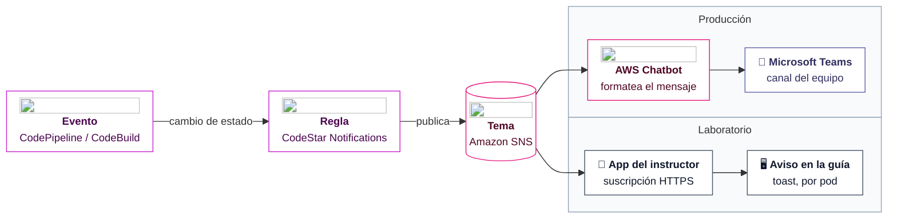

+++
title = "Notificaciones — del pipeline a Teams"
+++

## Que el pipeline avise solo

El pipeline ya corre sin intervención, pero todavía hay que mirarlo para saber cómo le
fue. La última pieza de la automatización es que **el pipeline avise solo**: cuando una
ejecución termina, o falla, o se detiene esperando aprobación, el equipo se entera por el
canal donde ya conversa. En esta organización ese canal es **Microsoft Teams**.

## El flujo de notificación

El evento del pipeline viaja por una cadena de servicios hasta llegar a Teams:

:::inline-slide light
## De un evento a un canal de Teams

:::

- Una **regla de notificación** (CodeStar Notifications) escucha eventos del pipeline:
  ejecución exitosa, fallida, o detenida en una aprobación.
- La regla publica el evento en un **tema de Amazon SNS**, el servicio de mensajería que
  desacopla a quien emite de quien recibe.
- **AWS Chatbot** está suscrito al tema y entrega el mensaje, ya formateado, a un canal
  de **Microsoft Teams**.

Cada paso tiene una sola responsabilidad: la regla decide *qué* eventos importan, SNS los
*transporta*, y Chatbot los *entrega* al canal. Cambiar el destino (otro canal, otro
equipo) no toca el pipeline: solo cambia la suscripción.

::: extra Una aclaración de nombres: CodeStar
El servicio **AWS CodeStar** —el de proyectos y dashboards unificados— fue
**discontinuado en 2024**. Las **reglas de notificación** que se usan aquí son otra cosa:
forman parte de los *Developer Tools* (su prefijo técnico es `codestar-notifications`),
siguen plenamente vigentes, y no tienen relación con el servicio discontinuado. Cuando la
documentación habla de "CodeStar Notifications", se refiere a estas reglas, no al servicio
de proyectos.
:::

## Por qué en el laboratorio lo vemos distinto

Conectar Teams de verdad requiere una suscripción de AWS Chatbot al espacio de Teams de
la organización. Algo que cada participante no puede montar en su cuenta del taller. Para
no perder el aprendizaje, el laboratorio usa un **espejo** del mismo flujo: los eventos
de la cuenta llegan a la **aplicación del instructor**, que los muestra como avisos
(*toasts*) sobre esta misma guía.

El mecanismo cambia, la idea no: lo que en el lab aparece como un *toast* en la guía, en
la organización aparecería en un canal de Teams. La regla de notificación, el tema de
SNS, y la lógica de "qué eventos importan" son idénticos; solo difiere el último salto.

:::slide
## Real vs. laboratorio

| Producción | Laboratorio |
| --- | --- |
| → AWS Chatbot → Teams | → app del instructor → *toast* |

Mismo evento, misma regla, mismo SNS. Cambia solo el último salto.
:::

:::inline-slide with-title
### Ver cómo se ve un aviso

:::skip
Antes de disparar el pipeline de verdad, conviene reconocer el formato del aviso. El
botón siguiente pide a la aplicación del instructor que emita un *toast* de ejemplo: el
servidor arma una notificación de prueba (atribuida al *pod* `demo`) y la difunde por el
mismo canal que usan los eventos reales. Cada pulsación produce uno de los tres estados
que la regla selecciona, con su color: ejecución **exitosa** (verde), **fallida** (rojo),
y **aprobación pendiente** (azul).
:::

:::app
<cb-toast-demo label="Mostrar un aviso de ejemplo"></cb-toast-demo>
:::

:::app
<cb-goto path="Práctica guiada: crear la regla de notificación"></cb-goto>
::: #app
::: #inline-slide

El aviso aparece abajo a la derecha y se descarta solo a los pocos segundos. Es el mismo
componente que muestra los eventos del pipeline; solo cambia el origen del dato. En
producción, ese aviso llegaría a un canal de Teams.

## Práctica guiada: crear la regla de notificación

El destino de una regla de notificación es un **tema de SNS de la misma cuenta, y la
misma región, que la regla**. Cada pod trabaja en su propia cuenta, así que el tema se
crea en la cuenta del participante; lo que conecta ese tema con la aplicación del taller
es una **suscripción HTTPS** al endpoint del instructor.

### Crear la regla sobre el pipeline

1. Abrir
   [**CodePipeline**](https://console.aws.amazon.com/codesuite/codepipeline/home)
   y entrar al pipeline.
2. Abrir el menu de navegación para ir a la opción **Settings** y luego, hacer
   click en la pestaña **Notifications**, pulsar **Create notification rule**.
3. En **Notification name**, escribir `taller-pipeline-<su-nombre>`.
4. En **Detail type**, elegir **Full**. En **Events that trigger notifications**, marcar
   al menos:
   - **Pipeline execution: Succeeded**
   - **Pipeline execution: Failed**
   - **Manual approval: Needed**
5. En **Targets**, pulsar **Create target → SNS topic** y completar el nombre después del
   prefijo `codestar-notifications-`: `codestar-notifications-taller-<su-nombre>`. Pulsar
   **Create**. Crear el tema desde aquí aplica solo la política que permite a las reglas
   de notificación publicar en él.
6. Pulsar **Submit**.

::: extra Por qué no se usa un tema del instructor
Una regla de notificación solo puede apuntar a un tema de SNS de su propia cuenta y
región. Con un pod por cuenta, el tema del instructor no aparece en la lista de destinos.
Por eso cada pod publica en su tema, y es la suscripción —no el destino de la regla— la
que cruza hacia la aplicación del taller. En una organización con una sola cuenta, el
tema compartido sí sería el destino directo.
:::

### Suscribir la aplicación del taller al tema

1. Abrir [**SNS → Topics**](https://console.aws.amazon.com/sns/v3/home#/topics) y entrar al tema `codestar-notifications-taller-<su-nombre>`.
2. Pulsar **Create subscription**. En **Protocol**, elegir **HTTPS**.
3. En **Endpoint**, pegar la URL que indica el instructor, con la forma
   `https://<host-del-taller>/hooks/notifications?token=<token>`.
4. Pulsar **Create subscription**. La aplicación confirma la suscripción sola —responde
   al `SubscribeURL` que envía SNS—, así que basta refrescar hasta que el estado pase de
   **Pending confirmation** a **Confirmed**.

### Disparar la regla y observar el aviso

1. Subir un commit a `main` para iniciar una ejecución del pipeline.
2. A medida que el pipeline avanza, los eventos seleccionados llegan a la aplicación del
   instructor y aparecen como *toasts* en la guía. La regla no agrega una etiqueta de
   *pod*, así que cada aviso se identifica con el **número de cuenta** que lo emitió.
3. Cuando el pipeline se detenga en la aprobación, se verá el aviso **Manual approval:
   Needed**; al aprobar y completarse, se verá **Succeeded**.

> **Nota:** la recepción de los *toasts* depende de que el instructor haya publicado la
> aplicación del taller, y entregado el endpoint con su token. Si aún no está disponible,
> esta sección se sigue como demostración: el flujo, la regla, y el tema son reales; el
> último salto lo muestra el instructor.

---

{#ejercicio-15}
### Ejercicio 15 — Notificar los eventos del pipeline

Crear una regla de notificación sobre el pipeline que publique los eventos de ejecución
exitosa, fallida, y de aprobación pendiente en un tema de SNS del pod, y suscribir la
aplicación del taller a ese tema. Disparar una ejecución y observar los avisos.

::: solucion
1. En [**CodePipeline**](https://console.aws.amazon.com/codesuite/codepipeline/home), abrir el pipeline, ir a la pestaña
   **Settings** y, en **Notifications**, pulsar **Create notification rule**.
2. Nombre `taller-pipeline-<su-nombre>`, **Detail type: Full**. Marcar los eventos
   **Pipeline execution: Succeeded**, **Pipeline execution: Failed**, y **Manual
   approval: Needed**.
3. En **Targets**, **Create target → SNS topic**, nombre
   `codestar-notifications-taller-<su-nombre>`, **Create**. **Submit**.
4. En [**SNS → Topics**](https://console.aws.amazon.com/sns/v3/home#/topics), abrir el tema y crear una suscripción
   **HTTPS** hacia `https://<host-del-taller>/hooks/notifications?token=<token>`.
   Esperar a que el estado sea **Confirmed**.
5. Subir un commit a `main` para disparar el pipeline.
6. Observar los avisos a medida que el pipeline avanza: el evento de aprobación pendiente,
   y luego el de ejecución exitosa tras aprobar. En el laboratorio aparecen como *toasts*
   en la guía; en producción llegarían a un canal de Teams.
:::

:::slide light
{{ejercicio-15}}
:::
