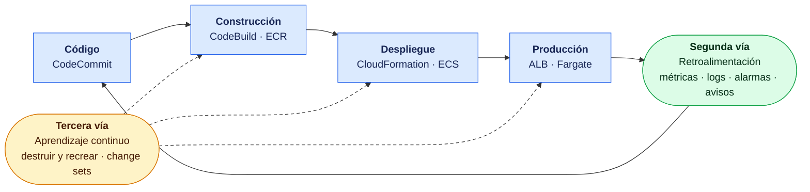
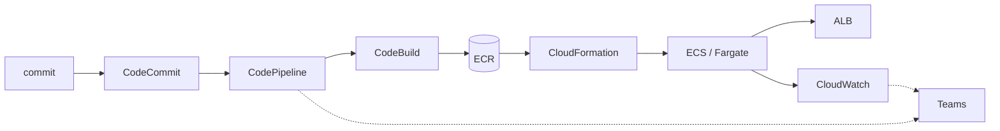

+++
title = "Cierre del curso"
+++

:::inline-slide with-title light
## Mandamientos DevOps

Existen varios manifestos o principios de DevOps como los siguientes.

| # | Mandamiento |
| --- | --- |
| 1 | Si no está monitorizado, no está en producción. |
| 2 | El trabajo no planificado le roba tiempo al planificado. |
| 3 | En TI estamos todos juntos. |
| 4 | Los requisitos operativos importan tanto como los funcionales. |
| 5 | Sacarlo a producción. |
| 6 | Llamarlo DevOps, NoOps o Devs & Ops. Se trata de personas. |
| 7 | La guardia es de todos. |
| 8 | Filosofía o marco de trabajo: hacer lo que funciona y vuelve eficiente al negocio. |
| 9 | DevOps abarca desarrollo, operaciones, dirección, administración, ventas, limpieza, diseño gráfico, baristas y más. |
| 10 | Leer *The Phoenix Project*, *The Goal* y *Critical Chain*. |
| 11 | Conseguir que el jefe lea *The Phoenix Project*, *The Goal* y *Critical Chain*. |
| 12 | «Proceso» no es una mala palabra. |
| 13 | Integrar continuamente, porque todo se puede romper. |
| 14 | Desplegar continuamente, porque el despliegue es un proceso central y la práctica hace al maestro. |
| 15 | Comunicar continuamente, porque las personas están en el centro del proceso. |
| 16 | Identificar los cuellos de botella. |
| 17 | Automatizar todo… salvo que se opere una central nuclear. |
| 18 | Automatizar todo igual. |

[Fuente: DevOps Madrid](https://madrid.devops.es/mandamientos-devops)

No son reglas: son recordatorios, escritos para
discutirse. Casi todos describen algo que en este taller se hizo con las manos.
:::

::: extra Los dieciocho, en su idioma original
1. *If it's not monitorized, it's not in production.*
2. *Unplanned work steals time from planned work.*
3. *We're all in IT together.*
4. *Operational requirements are as important as functional requirements.*
5. *Ship it.*
6. *Call it DevOps, NoOps or Devs & Ops. It's about people.*
7. *We're all on pagerduty together.*
8. *Philosophy or framework; do what works and makes business efficient.*
9. *DevOps encompasses development, operations, management, admin staff, sales, cleaning, graphic designers, baristas and more.*
10. *Read "The Phoenix Project", "The Goal" and "Critical Chain".*
11. *Get your boss to read "The Phoenix Project", "The Goal" and "Critical Chain".*
12. *Process isn't a dirty word.*
13. *Integrate continuously, because anything can break.*
14. *Deploy continuously, because deployment is a core process and practice makes perfect.*
15. *Communicate continuously, because people are at the core of the process.*
16. *Identify your bottlenecks.*
17. *Automate everything... unless you're a nuclear plant.*
18. *Automate everything anyway!*
:::

:::inline-slide
## De dónde vienen estas frases

Ninguna de las dieciocho es original. Todas comprimen ideas que se publicaron antes, con
autor y fecha. Conocer el linaje evita tratarlas como dogma:

| Año | Documento | Autoría | Qué aportó |
| --- | --- | --- | --- |
| 1984 | *The Goal* | Eliyahu Goldratt | La teoría de restricciones: un sistema va tan rápido como su cuello de botella. Origen del mandamiento 16. |
| 1997 | *Critical Chain* | Eliyahu Goldratt | La misma teoría aplicada a proyectos: las estimaciones no fallan por optimismo, fallan por multitarea. |
| 2001 | **Manifiesto Ágil** | 17 firmantes, Snowbird | Cuatro valores y doce principios. El formato «lista corta de frases discutibles» que los mandamientos imitan. |
| 2010 | **CAMS** | Damon Edwards y John Willis, tras el primer DevOpsDays de EE. UU. | Cultura, Automatización, Medición, Compartir. Jez Humble le agregó la *L* de *Lean*: **CALMS**. |
| 2011 | **The Twelve-Factor App** | Adam Wiggins (Heroku) | Doce reglas sobre cómo debe construirse la aplicación para que se pueda operar. |
| 2012 | **Las tres vías** | Gene Kim | Flujo, retroalimentación, y aprendizaje continuo: los tres principios bajo todas las prácticas DevOps. |
| 2013 | *The Phoenix Project* | Gene Kim, Kevin Behr, George Spafford | *The Goal* reescrita en un departamento de TI. Origen de los mandamientos 2, 10 y 11. |
| 2016 | *The DevOps Handbook* | Kim, Debois, Willis, Humble | Las tres vías convertidas en prácticas concretas. |

:::

::: warning
Los mandamientos 10 y 11 no son un chiste sobre leer libros. Los tres títulos que citan
son de teoría de restricciones, y explican por qué la lista habla de cuellos de botella
y de trabajo no planificado en vez de hablar de herramientas.
:::

:::slide light
## Las tres vías


:::

## Primera vía: el flujo

> «El desempeño del sistema entero, y no el de un silo de trabajo en particular.»
> — Gene Kim, *The Three Ways*, 2012

La primera vía mira el camino de izquierda a derecha: de la idea al cliente. Todo lo que
lo acorta, lo hace visible, o reduce el tamaño del lote, pertenece acá. Fue el objeto de
las Semanas 1 a 3.

:::inline-slide
## Primera vía · Flujo

- **5** — Sacarlo a producción.
- **12** — «Proceso» no es una mala palabra.
- **13** — Integrar continuamente, porque todo se puede romper.
- **14** — Desplegar continuamente; la práctica hace al maestro.
- **16** — Identificar los cuellos de botella.
- **17 y 18** — Automatizar todo.
:::

**«Sacarlo a producción» (5)** fue el objetivo de la Semana 1 entera. No hubo teoría de
contenedores antes de tener la aplicación en línea: CodeCommit guardó el código, CodeBuild
construyó la imagen, ECR la publicó, y un template de CloudFormation —usado como caja
negra a propósito— la dejó respondiendo detrás de un balanceador el primer día. El orden
importa: lo que no llega a producción no enseña nada sobre producción.

**«Proceso no es una mala palabra» (12)** es lo que sostiene la Semana 2. Un template de
CloudFormation es un proceso escrito: estado deseado, reconciliación, dependencias,
ciclo de vida. `click-ops` es más rápido una vez, y sale caro todas las demás. La
separación en cuatro stacks por ritmo de cambio —red, datos, plataforma, aplicación— es
proceso puro: define quién cambia qué, y con qué frecuencia, antes de que alguien tenga
que cambiarlo con apuro.

**«Integrar continuamente, porque todo se puede romper» (13)** apareció en el
`buildspec.yml`. Cada etapa existe porque algo puede fallar ahí: `install` verifica las
herramientas, `pre_build` pasa `hadolint` sobre el `Dockerfile` y hace login en ECR,
`build` construye y publica con caché de registro, `post_build` verifica con
`describe-images` que la imagen realmente está donde se dice. El *build* no es un paso:
es la primera línea de defensa.

**«Desplegar continuamente» (14)** es la Semana 3. El pipeline hace lo mismo que se venía
haciendo a mano, y esa es exactamente la razón por la que vale: un despliegue manual que
sale bien no demuestra nada, porque no se repite igual dos veces. La segunda mitad de la
frase —*la práctica hace al maestro*— es literal: un pipeline que corre diez veces por
día es un procedimiento de despliegue ensayado diez veces por día.

**«Identificar los cuellos de botella» (16)** se practicó dos veces, y en dos escalas
distintas:

- En el **build**: el primer build tardaba entre diez y veinte minutos porque
  recompilaba los más de 240 *crates* del SDK de AWS en cada corrida. El cuello no era el
  compilador, era el ordenamiento de las capas del `Dockerfile`. Separar la compilación
  de dependencias con `cargo-chef` bajó una edición de contenido a unos diez segundos.
- En el **servicio**: el auto scaling es teoría de restricciones aplicada en caliente.
  Una métrica sirve como objetivo solo si es proporcional a la capacidad —duplicar las
  tareas con carga constante debe partirla a la mitad— y por eso la CPU miente para «el
  servidor que espera». Elegir mal la métrica es escalar algo que no es el cuello.

**«Automatizar todo» (17 y 18)** es la broma que se toma en serio. El taller automatizó
la construcción, la publicación, la infraestructura, el despliegue, la aprobación, y el
aviso. Y dejó a la vista lo que queda cuando no se automatiza: la tabla de
«Lo que nunca estuvo en un stack», al final de esta misma sección.

## Segunda vía: la retroalimentación

> «Crear los ciclos de retroalimentación de derecha a izquierda.»
> — Gene Kim, *The Three Ways*, 2012

La segunda vía va en sentido contrario: lo que producción le devuelve a quien escribe el
código. Fue el objeto de la Semana 4, y de la mitad de la Semana 3.

:::inline-slide
## Segunda vía · Retroalimentación

- **1** — Si no está monitorizado, no está en producción.
- **4** — Los requisitos operativos importan tanto como los funcionales.
- **7** — La guardia es de todos.
- **15** — Comunicar continuamente.
:::

**«Si no está monitorizado, no está en producción» (1)** es el mandamiento que más
kilómetros hizo en este taller, y el más fácil de decir sin cumplirlo. La escalera
completa aparece en las Semanas 3 y 4, y cada peldaño responde una pregunta distinta:

| Herramienta | Pregunta que responde | Semana |
| --- | --- | --- |
| Métricas de CloudWatch | ¿Cuánto, y cuándo? | 3 |
| Logs, y Logs Insights | ¿Qué pasó exactamente? | 3 |
| Live Tail | ¿Qué está pasando ahora mismo? | 3 |
| Métricas personalizadas (EMF) | ¿Qué mide el negocio, y no la infraestructura? | 3 |
| Container Insights | ¿Cuál de las tareas, y no el promedio del servicio? | 3 |
| Dashboards | ¿Está sano el sistema, de un vistazo? | 4 |
| Alarmas | ¿Y si nadie está mirando? | 4 |

El salto real está en la última fila. Un dashboard sirve cuando alguien lo mira; una
alarma vigila sin que nadie esté presente. Todo lo anterior es instrumentación: recién
la alarma es monitoreo.

**«Los requisitos operativos importan tanto como los funcionales» (4)** fue el tema de la
sesión de *health checks*, y es la frase que más incomoda a un equipo de desarrollo. Un
`200` fijo en `/health` no dice nada: responde igual con la base de datos caída. La
distinción entre *liveness*, *readiness*, y *startup* —y entre dependencias duras y
blandas— no es una preferencia de operaciones, es una decisión de diseño de la
aplicación. Lo mismo vale para el drenaje ante `SIGTERM`, para el tiempo de arranque que
el auto scaling paga en cada escalado, y para el formato de los logs.

::: info
Este es el mandamiento que el «contrato de despliegue» de la primera sesión anticipaba:
artefacto, configuración, dependencias, y exposición se definen entre los dos equipos, o
los define uno solo y el otro los descubre en producción.
:::

**«Comunicar continuamente» (15)** y **«la guardia es de todos» (7)** son las dos caras
del canal de notificaciones. El flujo de la Semana 3 —CodeStar Notifications → SNS →
Chatbot → Teams— y las alarmas de la Semana 4 terminan en el **mismo tema de SNS**, y por
lo tanto en el mismo canal. Eso no es una economía de configuración: es una decisión
sobre quién se entera. Si el aviso de despliegue y el aviso de degradación llegan al
mismo lugar, «desarrollo» y «operaciones» dejan de tener bandejas de entrada distintas.

## Tercera vía: el aprendizaje continuo

> «Experimentación continua, asumir riesgos y aprender del fracaso; y entender que la
> repetición y la práctica son el requisito previo de la maestría.»
> — Gene Kim, *The Three Ways*, 2012

La tercera vía no tiene una semana asignada, porque fue el método del taller entero.

:::inline-slide
## Tercera vía · Aprendizaje continuo

- **2** — El trabajo no planificado le roba tiempo al planificado.
- **8** — Hacer lo que funciona y vuelve eficiente al negocio.
- **10 y 11** — Leer los libros. Y conseguir que el jefe los lea.
:::

**Repetición y práctica** es, literalmente, «el seguro del taller». Destruir el ambiente
y recrearlo desde cero se practicó desde el primer día, no como ejercicio de destrucción
sino para volver barato el error: el costo de equivocarse quedó reducido a minutos de
espera. Un procedimiento de recuperación que solo se ejecuta durante un incidente es un
procedimiento que nadie probó.

**Aprender del fracaso sin pagarlo** es lo que hacen los *change sets*. Ver el cambio
antes de aplicarlo, distinguir una modificación de un reemplazo leyendo *Update
requires*, y saber qué hacer cuando el propio *rollback* falla
(`UPDATE_ROLLBACK_FAILED`, *Continue update rollback*, preservar los recursos
aprovisionados para diagnosticar) es tratar la falla como información en vez de como
accidente.

**«El trabajo no planificado le roba tiempo al planificado» (2)** es el argumento central
de *The Phoenix Project*, y explica casi todo lo que se automatizó acá. Un despliegue
manual no es solo lento: es una interrupción que consume a la persona más escasa del
equipo, y que llega siempre en el peor momento. La alarma, la notificación, el
*rollback* automático, y el teardown reproducible existen para que el trabajo no
planificado no defina la agenda.

**«Hacer lo que funciona» (8)** es el permiso para no seguir el resto al pie de la letra.
El taller lo aplicó varias veces: la aprobación manual quedó en el pipeline aunque
«desplegar continuamente» sugiera lo contrario, porque en un taller —y en muchas
organizaciones reales— el paso humano es lo que hace aceptable la automatización. No
hubo stack de seguridad separado porque, con dos roles, no lo justificaba. Y la regla
para dividir stacks terminó siendo *empezar juntos y separar cuando duela*, no separar
por prolijidad.

## El flujo completo, de una pieza

Vale la pena verlo entero una vez más, porque cada semana fue un eslabón de la misma
cadena:

:::inline-slide light
## El flujo completo

```
commit → CodeCommit
       → CodePipeline
       → CodeBuild → ECR
       → CloudFormation → ECS / Fargate (detrás del ALB)
       → CloudWatch (métricas, logs, alarmas)
       → Teams (notificaciones)
```
:::



- **CodeCommit** guarda el código versionado (Semana 1).
- **CodeBuild** construye la imagen y la publica en **ECR** (Semana 1).
- **CloudFormation** define la infraestructura como código (Semana 2).
- **ECS/Fargate** ejecuta los contenedores detrás de un **ALB** (Semanas 2–3).
- **CodePipeline** automatiza el camino del commit al despliegue, con aprobación manual y
  despliegue por change set (Semana 3).
- **CloudWatch** observa el sistema: métricas, logs, dashboards, alarmas, Container
  Insights (Semanas 3–4).
- **Teams** recibe las notificaciones del pipeline y de las alarmas (Semanas 3–4).

Ninguna pieza es un ejemplo aislado: es el sistema que se ha venido construyendo, y desde
el cual se lee esta misma guía.

## La caja de herramientas de diagnóstico

El mandamiento 1 dice qué instrumentar. No dice en qué orden mirarlo cuando algo se sale
de lo esperado. Para eso el taller deja un método, y la secuencia es siempre la misma:

1. **¿Qué cambió?** Un despliegue reciente, un commit, un cambio manual. El pipeline y
   los eventos de CloudFormation dejan el rastro.
2. **¿El tráfico llega?** ALB → regla del listener → target group → tarea. Un 503 con
   tareas corriendo apunta a *health checks* o grupos de seguridad.
3. **¿La tarea está sana?** Una tarea detenida tiene un `stoppedReason`. Si apunta a la
   aplicación, la respuesta está en los logs.
4. **¿Qué dicen las métricas?** Latencia, errores 5XX, CPU. Acotan *dónde* y *cuándo*.
5. **¿Qué dice el log?** En el grupo de logs, en la ventana del síntoma, con Logs
   Insights. Casi siempre, la respuesta final.

:::slide
## El método de diagnóstico

1. ¿Qué **cambió**?
2. ¿El **tráfico** llega? (ALB → regla → tarea)
3. ¿La **tarea** está sana? (`stoppedReason`)
4. ¿Qué dicen las **métricas**? (acotan)
5. ¿Qué dice el **log**? (explica)
:::

Las métricas acotan, los logs explican. Invertir el orden —abrir Logs Insights sin saber
la ventana de tiempo— es el error más caro, y también el más común.

## Los mandamientos que un taller no puede enseñar

Cuatro de las dieciocho frases no tienen práctica guiada, y no es un descuido: hablan de
personas, y una consola de AWS no las demuestra.

:::inline-slide light
## Lo que no cabe en una consola

- **3** — En TI estamos todos juntos.
- **6** — Llamarlo DevOps, NoOps o Devs & Ops. Se trata de personas.
- **9** — DevOps abarca desarrollo, operaciones, dirección, administración, ventas,
  limpieza, diseño gráfico, baristas y más.
- **7** — La guardia es de todos.
:::

El mandamiento 9 es el más provocador de la lista, y el más serio. Enumera a los baristas
para hacer evidente lo que las otras frases suponen: si el objetivo es el desempeño del
sistema entero —la primera vía—, entonces el sistema no termina en el borde del
departamento de TI. Un despliegue automatizado no arregla un proceso de aprobación que
tarda tres semanas en otra área.

El 7 es donde el taller sí dejó una prueba concreta. Que la alarma de CPU y el aviso de
despliegue lleguen al mismo canal es la versión técnica de «la guardia es de todos». La
versión organizacional —quién atiende, con qué rotación, y con qué autoridad para
revertir— no se configura en CloudWatch.

::: extra Las doce reglas de una aplicación
El taller trató la aplicación casi siempre como un dado. La contraparte de estos
mandamientos, del lado del código, es **The Twelve-Factor App** (Adam Wiggins, Heroku,
2011 — [12factor.net/es](https://12factor.net/es/)): doce reglas sobre cómo debe
construirse una aplicación para que se pueda desplegar y operar. Buena parte del taller
las asume sin nombrarlas.

| # | Factor | Dónde apareció |
| --- | --- | --- |
| I | Código base | Un repositorio en CodeCommit, muchos despliegues del mismo commit. |
| II | Dependencias | El `Dockerfile` las declara y las aísla; nada se instala en el servidor. |
| III | Configuraciones | Variables de entorno en la task definition; los secretos con `secrets` y `valueFrom`, nunca en el template. |
| IV | *Backing services* | La tabla de DynamoDB llega por variable de entorno: se puede cambiar sin tocar el código. |
| V | Construir, desplegar, ejecutar | Las tres etapas separadas del pipeline. La imagen se construye una vez y se promueve. |
| VI | Procesos | Sin estado en la tarea: todo el estado vive en DynamoDB, por eso escalar es sumar copias. |
| VII | Asignación de puertos | El contenedor publica un puerto; el target group lo consume. |
| VIII | Concurrencia | `DesiredCount` y el auto scaling: se escala sumando procesos, no agrandándolos. |
| IX | Desechabilidad | Arranque rápido y apagado limpio: el drenaje ante `SIGTERM`, y `StopTimeout`. |
| X | Paridad desarrollo/producción | La misma imagen corre local y en Fargate. |
| XI | Historiales | Logs a `stdout`; el driver `awslogs` los lleva a CloudWatch. La aplicación no escribe archivos. |
| XII | Administración de procesos | Los subcomandos del binario (`echo`, `healthcheck`) corren como tareas de un solo uso. |

Los factores III, VI, IX y XI son los que más se sienten en operación: son la diferencia
entre un servicio que se puede reiniciar, escalar y mover, y uno que hay que cuidar.
:::

## Qué sigue, más allá del taller

Lo construido es una base sólida, no el final del camino. Hacia dónde seguir, ordenado
por vía:

- **Flujo** — *Despliegues sin interrupción*: estrategias *blue/green* con CodeDeploy,
  para desplegar sin cortar el servicio ni arriesgar un rollback manual.
- **Flujo** — *El pipeline también como código*: definir el propio pipeline en
  CloudFormation, de modo que la automatización sea tan reproducible como la
  infraestructura que despliega.
- **Flujo** — *Múltiples ambientes*: separar desarrollo, *staging*, y producción, cada
  uno con su stack y su rama, promoviendo cambios entre ellos.
- **Retroalimentación** — *Pruebas en el pipeline*: agregar una etapa de pruebas
  automáticas entre Build y Deploy, para que solo avance lo que pasa las verificaciones.
- **Retroalimentación** — *Objetivos de nivel de servicio*: convertir las alarmas de hoy
  en SLO con presupuesto de error, para que «está lento» tenga un umbral acordado.
- **Aprendizaje** — *Ensayos de falla*: repetir el ejercicio final en un día tranquilo,
  a propósito, con el equipo mirando.

Cada uno de estos pasos reutiliza lo ya aprendido: son extensiones del mismo flujo, no
temas nuevos desde cero.

::: extra Más allá del YAML a mano
El taller escribió CloudFormation directo, y eso es lo correcto para aprender: es la
capa sobre la que se apoya todo lo demás. En un equipo, el YAML a mano rara vez es la
última palabra. Tres caminos, de menor a mayor distancia del archivo original:

- **`Transform`** — una sección que le pide a CloudFormation procesar el template antes
  de desplegarlo. `AWS::Serverless-2016-10-31` activa **SAM**, que convierte veinte
  líneas de función Lambda, rol, y API en cinco. `AWS::LanguageExtensions` agrega lo que
  falta en el lenguaje base, como bucles (`Fn::ForEach`) e `Fn::Length`. El resultado
  sigue siendo un stack de CloudFormation, con sus change sets y sus eventos.
- **CDK** — define la infraestructura en TypeScript, Python, o Java, y **sintetiza** un
  template de CloudFormation. Se gana lo que da un lenguaje de verdad —clases, tests,
  el autocompletado del editor— y se paga con una capa más entre lo que se escribe y lo
  que se despliega. Todo lo de esta semana sigue aplicando: `cdk deploy` crea un stack
  de CloudFormation normal, y cuando algo falla se lee la pestaña **Events**.
- **Terraform** — de HashiCorp, ajeno a AWS y por eso capaz de gestionar varios
  proveedores con un solo lenguaje. Guarda el estado en un archivo propio en vez de
  dejarlo en el servicio, lo que da más control y agrega una responsabilidad: ese
  archivo hay que guardarlo, bloquearlo, y no perderlo. Su `terraform plan` es el
  equivalente exacto del change set.

Los conceptos no cambian entre las tres: estado deseado contra estado real,
reconciliación, vista previa antes de aplicar, dependencias entre recursos, y ciclos de
vida distintos en stacks distintos. Aprendida la idea en CloudFormation, cambiar de
herramienta es cambiar de sintaxis.
:::

## Ejercicio final (opcional): las tres vías en una vuelta

Para cerrar el taller con todo en movimiento a la vez, este ejercicio integrador recorre
el sistema entero de punta a punta. Recorre también las tres vías, en orden: se rompe el
flujo, la retroalimentación lo reporta, y la corrección vuelve por el mismo camino.

{#ejercicio-19}
### Ejercicio 19 — Del error a la corrección, por el pipeline

Provocar una falla en la aplicación, detectarla por la observabilidad montada,
diagnosticarla con el método de la caja de herramientas, y corregirla con un commit que
fluya por el pipeline hasta el despliegue.

::: solucion
1. **Provocar**: introducir un cambio que rompa la aplicación (por ejemplo, una variable
   de entorno faltante o un error de arranque), hacer commit, y subirlo a `main`.
2. **Avanzar por el pipeline**: el pipeline construye y, tras la aprobación, aplica el
   change set. El servicio intenta levantar la nueva tarea.
3. **Detectar**: observar la señal —la tarea entra en estado detenido, el target group
   pierde destinos sanos, y la alarma o el aviso de Teams (o el *toast*) lo reporta.
4. **Diagnosticar**: aplicar el método. Mirar el `stoppedReason` de la tarea detenida; si
   apunta a la aplicación, abrir el grupo de logs en Logs Insights y leer el error de
   arranque.
5. **Corregir**: revertir o arreglar el cambio, hacer commit, y subirlo. El pipeline
   reconstruye, se aprueba, y el Deploy restaura el servicio.
6. **Confirmar**: las tareas vuelven a `healthy`, el ALB responde, y el aviso de
   recuperación llega por el mismo canal. Se cerró el ciclo completo: del error a la
   corrección, todo por el flujo automatizado.
:::

:::slide light
{{ejercicio-19}}
:::

---

## Desarmar el ambiente

Queda un último paso, y no es un trámite administrativo: el teardown es donde
«automatizar todo» (17 y 18) muestra la factura de lo que no se automatizó. Al terminar
el taller, el ambiente son **cinco stacks** y una tabla que sobrevive a todos ellos.
Borrarlos en cualquier orden no funciona.

La razón se explicó en la Semana 2: mientras un stack importe un export, ese export no
se puede borrar. Empezar por el stack de red termina en un `DELETE_FAILED` con un
mensaje explícito:

```
Export taller-aws-maria-red-vpc-id cannot be deleted as it is in use by
taller-aws-maria-plataforma
```

No es una falla: es la garantía funcionando. El orden de borrado es el orden de
creación, al revés.

:::slide
## El orden inverso

```
-eco → -app → -datos → -plataforma → -red
```

Un export no se borra mientras alguien lo importe.

**Borrar es crear, al revés.**
:::

### Antes de empezar: apagar lo que reconstruye

El pipeline vigila `main` y despliega sobre el servicio de ECS. Si se dispara en medio
del teardown, vuelve a tocar recursos que se están borrando.

1. Abrir [**CodePipeline**](https://console.aws.amazon.com/codesuite/codepipeline/home),
   entrar a `taller-aws-<su-nombre>-pipeline`, y pulsar **Delete pipeline**. La regla de
   notificación de la Semana 3 se va con él.
2. El auto scaling no hace falta tocarlo: la política vive dentro del servicio, y
   desaparece con el stack de aplicación.

### Borrar los stacks, de arriba hacia abajo

En [**CloudFormation**](https://console.aws.amazon.com/cloudformation/home), borrar en
este orden, esperando el `DELETE_COMPLETE` de cada uno antes de seguir:

| Orden | Stack | Qué se lleva |
| --- | --- | --- |
| 1 | `taller-aws-<su-nombre>-eco` (si se creó) | El servicio de eco, su task definition, su target group, su regla del listener, y su grupo de logs. |
| 2 | `taller-aws-<su-nombre>-app` | Lo mismo, para la aplicación principal. |
| 3 | `taller-aws-<su-nombre>-datos` | El stack, pero **no la tabla**. |
| 4 | `taller-aws-<su-nombre>-plataforma` | El clúster, el balanceador, los listeners, y —si se activó HTTPS— el certificado de ACM y los registros de Route 53. |
| 5 | `taller-aws-<su-nombre>-red` | La VPC, las subredes, y los grupos de seguridad. |

Los stacks 1 y 2 se pueden borrar a la vez —ninguno importa nada del otro—, y lo mismo
vale para el 3 y el 4 entre sí. Lo que no se puede es adelantar el 5.

Con la CLI, el orden se expresa esperando:

```bash
TALLER=taller-aws-<su-nombre>
for stack in "$TALLER-eco" "$TALLER-app" "$TALLER-datos" \
             "$TALLER-plataforma" "$TALLER-red"; do
  aws cloudformation delete-stack --stack-name "$stack"
  aws cloudformation wait stack-delete-complete --stack-name "$stack"
done
```

::: warning
Si el stack de red queda en `DELETE_FAILED` sobre una subred o un grupo de seguridad,
casi siempre es una interfaz de red (ENI) que todavía no se liberó —una tarea de Fargate
que tarda en apagarse—. Esperar un par de minutos y reintentar el borrado suele alcanzar.
:::

### La tabla que sobrevive

Al borrar el stack de datos, la pestaña **Events** muestra la tabla como
`DELETE_SKIPPED`. Es exactamente lo que se pidió en la migración con
`DeletionPolicy: Retain`, y recién ahora se ve el otro lado de esa decisión: la tabla
queda **sin stack y sin dueño**, viva, facturando, y ocupando su nombre.

Ese es el precio de `Retain`, y se paga a mano:

```bash
aws dynamodb delete-table --table-name "$TABLA"
```

La lección operativa: `Retain` no es "más seguro" sin más. Traslada la responsabilidad
del borrado de CloudFormation a una persona. Un recurso retenido y olvidado es una
factura que nadie revisa — trabajo no planificado (mandamiento 2), agendado para dentro
de tres meses.

### Lo que nunca estuvo en un stack

Los cinco stacks no cubren todo el taller. Buena parte de la Semana 1, y de la Semana 4,
se creó a mano por la consola, y por eso no se borra sola:

| Recurso | Servicio |
| --- | --- |
| Repositorio `taller-aws-<su-nombre>` | CodeCommit |
| Proyecto `taller-aws-<su-nombre>-build` | CodeBuild |
| Repositorio `taller-aws-<su-nombre>`, con sus imágenes | ECR |
| El bucket de artefactos que creó CodePipeline (`codepipeline-<región>-…`) | S3 |
| El dashboard, y la alarma `cpu-alta-<su-nombre>` | CloudWatch |
| El grupo de logs `/aws/codebuild/taller-aws-<su-nombre>-build` | CloudWatch Logs |
| Los roles de servicio que crearon las consolas (`codebuild-…`, `AWSCodePipelineServiceRole-…`) | IAM |
| El tipo `CloudBridge::Taller::App::MODULE`, si se hizo la práctica de módulos | CloudFormation Registry |

Un bucket de S3 con objetos no se borra hasta vaciarlo, y un repositorio de ECR con
imágenes pide `--force`.

El módulo se saca del registro al revés de como entró: primero cada versión que no
sea la default, y al final el tipo entero, que se lleva la default consigo:

```bash
aws cloudformation deregister-type --type MODULE \
  --type-name CloudBridge::Taller::App::MODULE --version-id "00000001"
aws cloudformation deregister-type --type MODULE \
  --type-name CloudBridge::Taller::App::MODULE
```

Y `cfn submit` dejó su propio stack, `CloudFormationManagedUploadInfrastructure`,
con dos buckets adentro. Como todo bucket, hay que vaciarlos antes de que el stack
se deje borrar.

::: extra La lista se hace sola cuando todo es un stack
Esta tabla existe porque el taller creó recursos por la consola para poder enseñarlos
uno a uno. Un ambiente definido enteramente como código no la necesita: se borran los
stacks en orden inverso, y no queda nada.

Ese es el argumento más práctico a favor de la infraestructura como código, y es el
único que solo se aprecia al desarmar: **lo que no está en un template se borra a mano,
o no se borra.**

Los mandamientos 17 y 18 se leen como una exageración graciosa hasta que aparece esta
tabla. Entonces se leen como una advertencia.
:::

### Confirmar que no queda nada

1. En [**CloudFormation**](https://console.aws.amazon.com/cloudformation/home), filtrar
   por `taller-aws-<su-nombre>`. La lista debe quedar vacía.
2. Abrir la última **UrlBase** conocida: el navegador debe dar un error de conexión.
3. Pasar un barrido por lo que suele quedar atrás:

   ```bash
   aws dynamodb list-tables \
     --query "TableNames[?contains(@, '$TALLER')]"
   aws ecr describe-repositories \
     --query "repositories[?contains(repositoryName, '$TALLER')].repositoryName"
   aws logs describe-log-groups --log-group-name-prefix "/ecs/$TALLER" \
     --query "logGroups[].logGroupName"
   ```

   Tres listas vacías cierran el taller.

## Del código a la operación

Se construyó, desplegó, automatizó, y observó un sistema real en AWS. Las dieciocho
frases del principio no son la conclusión del taller: son el índice de las conversaciones
que quedan por tener, ahora que hay un sistema concreto sobre el cual tenerlas.

:::slide
## Del código a la operación

Se construyó, desplegó, automatizó, y observó un sistema real en AWS.

**Flujo · Retroalimentación · Aprendizaje continuo**

**Gracias por participar en el taller.**
:::
