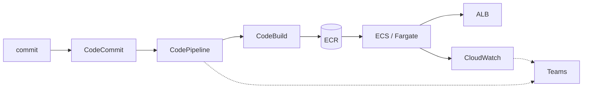

+++
title = "Cierre del curso"
+++

## El flujo completo, de una pieza

El taller comenzó con código en una máquina. Termina con un sistema que se construye, se
despliega, se opera, y se reporta solo, sobre infraestructura de AWS. Vale la pena verlo
entero, porque cada semana fue un eslabón de la misma cadena:

:::inline-slide light
## El flujo completo

```
commit → CodeCommit
       → CodePipeline
       → CodeBuild → ECR
       → ECS / Fargate (detrás del ALB)
       → CloudWatch (métricas, logs, alarmas)
       → Teams (notificaciones)
```
:::



- **CodeCommit** guarda el código versionado (Semana 1).
- **CodeBuild** construye la imagen y la publica en **ECR** (Semana 1).
- **CloudFormation** define la infraestructura como código (Semana 2).
- **ECS/Fargate** ejecuta los contenedores detrás de un **ALB** (Semanas 2–3).
- **CodePipeline** automatiza el camino del commit al despliegue, con aprobación manual
  (Semana 3).
- **CloudWatch** observa el sistema: métricas, logs, dashboards, alarmas, Container
  Insights (Semanas 3–4).
- **Teams** recibe las notificaciones del pipeline y de las alarmas (Semanas 3–4).

Ninguna pieza es un ejemplo aislado: es el sistema que se ha venido construyendo, y desde el
cual se lee esta misma guía.

## La caja de herramientas de diagnóstico

Más allá de los servicios, el taller deja un método para cuando algo se sale de lo
esperado. La secuencia es siempre la misma:

1. **¿Qué cambió?** Un despliegue reciente, un commit, un cambio manual. El pipeline y
   los eventos de CloudFormation dejan el rastro.
2. **¿El tráfico llega?** ALB → target group → tarea. Un 503 con tareas corriendo apunta
   a *health checks* o grupos de seguridad.
3. **¿La tarea está sana?** Una tarea detenida tiene un `stoppedReason`. Si apunta a la
   aplicación, la respuesta está en los logs.
4. **¿Qué dicen las métricas?** Latencia, errores 5XX, CPU. Acotan *dónde* y *cuándo*.
5. **¿Qué dice el log?** En el grupo de logs, en la ventana del síntoma, con Logs
   Insights. Casi siempre, la respuesta final.

:::slide
## El método de diagnóstico

1. ¿Qué **cambió**?
2. ¿El **tráfico** llega? (ALB → tarea)
3. ¿La **tarea** está sana? (`stoppedReason`)
4. ¿Qué dicen las **métricas**? (acotan)
5. ¿Qué dice el **log**? (explica)
:::

## Qué sigue, más allá del taller

Lo construido es una base sólida, no el final del camino. Hacia dónde seguir:

- **Despliegues sin interrupción**: estrategias *blue/green* con CodeDeploy, para
  desplegar sin cortar el servicio ni arriesgar un rollback manual.
- **El pipeline también como código**: definir el propio pipeline en CloudFormation, de
  modo que la automatización sea tan reproducible como la infraestructura que despliega.
- **Múltiples ambientes**: separar desarrollo, *staging*, y producción, cada uno con su
  stack y su rama, promoviendo cambios entre ellos.
- **Pruebas en el pipeline**: agregar una etapa de pruebas automáticas entre Build y
  Deploy, para que solo avance lo que pasa las verificaciones.

Cada uno de estos pasos reutiliza lo ya aprendido: son extensiones del mismo flujo, no
temas nuevos desde cero.

## Ejercicio final (opcional): el ciclo completo

Para cerrar el taller con todo en movimiento a la vez, este ejercicio integrador
recorre el sistema entero de punta a punta.

{#ejercicio-16}
### Ejercicio 16 — Del error a la corrección, por el pipeline

Provocar una falla en la aplicación, detectarla por la observabilidad montada,
diagnosticarla con el método de la caja de herramientas, y corregirla con un commit que
fluya por el pipeline hasta el despliegue.

::: solucion
1. **Provocar**: introducir un cambio que rompa la aplicación (por ejemplo, una variable
   de entorno faltante o un error de arranque), hacer commit, y subirlo a `main`.
2. **Avanzar por el pipeline**: el pipeline construye y, tras la aprobación, despliega.
   El servicio intenta levantar la nueva tarea.
3. **Detectar**: observar la señal —la tarea entra en estado detenido, el target group
   pierde destinos sanos, y la alarma o el aviso de Teams (o el *toast*) lo reporta.
4. **Diagnosticar**: aplicar el método. Mirar el `stoppedReason` de la tarea detenida; si
   apunta a la aplicación, abrir el grupo de logs en Logs Insights y leer el error de
   arranque.
5. **Corregir**: revertir o arreglar el cambio, hacer commit, y subirlo. El pipeline
   reconstruye, se aprueba, y el Deploy restaura el servicio.
6. **Confirmar**: las tareas vuelven a `healthy`, el ALB responde, y el aviso de
   recuperación llega por el mismo canal. Se cerró el ciclo completo: del error a la
   corrección, todo por el flujo automatizado.
:::

:::slide light
{{ejercicio-16}}
:::

:::slide
## Del código a la operación

Se construyó, desplegó, automatizó, y observó un sistema real en AWS.

**Gracias por participar en el taller.**
:::
