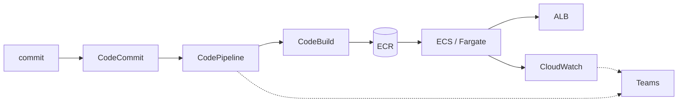

+++
title = "Cierre del curso"
+++

## El flujo completo, de una pieza

El taller comenzó con código en una máquina. Termina con un sistema que se construye, se
despliega, se opera, y se reporta solo, sobre infraestructura de AWS. Vale la pena verlo
entero, porque cada semana fue un eslabón de la misma cadena:

:::inline-slide light
## El flujo completo

```
commit → CodeCommit
       → CodePipeline
       → CodeBuild → ECR
       → ECS / Fargate (detrás del ALB)
       → CloudWatch (métricas, logs, alarmas)
       → Teams (notificaciones)
```
:::



- **CodeCommit** guarda el código versionado (Semana 1).
- **CodeBuild** construye la imagen y la publica en **ECR** (Semana 1).
- **CloudFormation** define la infraestructura como código (Semana 2).
- **ECS/Fargate** ejecuta los contenedores detrás de un **ALB** (Semanas 2–3).
- **CodePipeline** automatiza el camino del commit al despliegue, con aprobación manual
  (Semana 3).
- **CloudWatch** observa el sistema: métricas, logs, dashboards, alarmas, Container
  Insights (Semanas 3–4).
- **Teams** recibe las notificaciones del pipeline y de las alarmas (Semanas 3–4).

Ninguna pieza es un ejemplo aislado: es el sistema que se ha venido construyendo, y desde el
cual se lee esta misma guía.

## La caja de herramientas de diagnóstico

Más allá de los servicios, el taller deja un método para cuando algo se sale de lo
esperado. La secuencia es siempre la misma:

1. **¿Qué cambió?** Un despliegue reciente, un commit, un cambio manual. El pipeline y
   los eventos de CloudFormation dejan el rastro.
2. **¿El tráfico llega?** ALB → target group → tarea. Un 503 con tareas corriendo apunta
   a *health checks* o grupos de seguridad.
3. **¿La tarea está sana?** Una tarea detenida tiene un `stoppedReason`. Si apunta a la
   aplicación, la respuesta está en los logs.
4. **¿Qué dicen las métricas?** Latencia, errores 5XX, CPU. Acotan *dónde* y *cuándo*.
5. **¿Qué dice el log?** En el grupo de logs, en la ventana del síntoma, con Logs
   Insights. Casi siempre, la respuesta final.

:::slide
## El método de diagnóstico

1. ¿Qué **cambió**?
2. ¿El **tráfico** llega? (ALB → tarea)
3. ¿La **tarea** está sana? (`stoppedReason`)
4. ¿Qué dicen las **métricas**? (acotan)
5. ¿Qué dice el **log**? (explica)
:::

## Qué sigue, más allá del taller

Lo construido es una base sólida, no el final del camino. Hacia dónde seguir:

- **Despliegues sin interrupción**: estrategias *blue/green* con CodeDeploy, para
  desplegar sin cortar el servicio ni arriesgar un rollback manual.
- **El pipeline también como código**: definir el propio pipeline en CloudFormation, de
  modo que la automatización sea tan reproducible como la infraestructura que despliega.
- **Múltiples ambientes**: separar desarrollo, *staging*, y producción, cada uno con su
  stack y su rama, promoviendo cambios entre ellos.
- **Pruebas en el pipeline**: agregar una etapa de pruebas automáticas entre Build y
  Deploy, para que solo avance lo que pasa las verificaciones.

Cada uno de estos pasos reutiliza lo ya aprendido: son extensiones del mismo flujo, no
temas nuevos desde cero.

::: extra Más allá del YAML a mano
El taller escribió CloudFormation directo, y eso es lo correcto para aprender: es la
capa sobre la que se apoya todo lo demás. En un equipo, el YAML a mano rara vez es la
última palabra. Tres caminos, de menor a mayor distancia del archivo original:

- **`Transform`** — una sección que le pide a CloudFormation procesar el template antes
  de desplegarlo. `AWS::Serverless-2016-10-31` activa **SAM**, que convierte veinte
  líneas de función Lambda, rol, y API en cinco. `AWS::LanguageExtensions` agrega lo que
  falta en el lenguaje base, como bucles (`Fn::ForEach`) e `Fn::Length`. El resultado
  sigue siendo un stack de CloudFormation, con sus change sets y sus eventos.
- **CDK** — define la infraestructura en TypeScript, Python, o Java, y **sintetiza** un
  template de CloudFormation. Se gana lo que da un lenguaje de verdad —clases, tests,
  el autocompletado del editor— y se paga con una capa más entre lo que se escribe y lo
  que se despliega. Todo lo de esta semana sigue aplicando: `cdk deploy` crea un stack
  de CloudFormation normal, y cuando algo falla se lee la pestaña **Events**.
- **Terraform** — de HashiCorp, ajeno a AWS y por eso capaz de gestionar varios
  proveedores con un solo lenguaje. Guarda el estado en un archivo propio en vez de
  dejarlo en el servicio, lo que da más control y agrega una responsabilidad: ese
  archivo hay que guardarlo, bloquearlo, y no perderlo. Su `terraform plan` es el
  equivalente exacto del change set.

Los conceptos no cambian entre las tres: estado deseado contra estado real,
reconciliación, vista previa antes de aplicar, dependencias entre recursos, y ciclos de
vida distintos en stacks distintos. Aprendida la idea en CloudFormation, cambiar de
herramienta es cambiar de sintaxis.
:::

## Ejercicio final (opcional): el ciclo completo

Para cerrar el taller con todo en movimiento a la vez, este ejercicio integrador
recorre el sistema entero de punta a punta.

{#ejercicio-19}
### Ejercicio 19 — Del error a la corrección, por el pipeline

Provocar una falla en la aplicación, detectarla por la observabilidad montada,
diagnosticarla con el método de la caja de herramientas, y corregirla con un commit que
fluya por el pipeline hasta el despliegue.

::: solucion
1. **Provocar**: introducir un cambio que rompa la aplicación (por ejemplo, una variable
   de entorno faltante o un error de arranque), hacer commit, y subirlo a `main`.
2. **Avanzar por el pipeline**: el pipeline construye y, tras la aprobación, despliega.
   El servicio intenta levantar la nueva tarea.
3. **Detectar**: observar la señal —la tarea entra en estado detenido, el target group
   pierde destinos sanos, y la alarma o el aviso de Teams (o el *toast*) lo reporta.
4. **Diagnosticar**: aplicar el método. Mirar el `stoppedReason` de la tarea detenida; si
   apunta a la aplicación, abrir el grupo de logs en Logs Insights y leer el error de
   arranque.
5. **Corregir**: revertir o arreglar el cambio, hacer commit, y subirlo. El pipeline
   reconstruye, se aprueba, y el Deploy restaura el servicio.
6. **Confirmar**: las tareas vuelven a `healthy`, el ALB responde, y el aviso de
   recuperación llega por el mismo canal. Se cerró el ciclo completo: del error a la
   corrección, todo por el flujo automatizado.
:::

:::slide light
{{ejercicio-19}}
:::

---

## Desarmar el ambiente

Queda un último paso, y no es un trámite administrativo: el teardown es la prueba final
del contrato entre stacks. Al terminar el taller, el ambiente son **cinco stacks** y una
tabla que sobrevive a todos ellos. Borrarlos en cualquier orden no funciona.

La razón se explicó en la Semana 2: mientras un stack importe un export, ese export no
se puede borrar. Empezar por el stack de red termina en un `DELETE_FAILED` con un
mensaje explícito:

```
Export taller-aws-maria-red-vpc-id cannot be deleted as it is in use by
taller-aws-maria-plataforma
```

No es una falla: es la garantía funcionando. El orden de borrado es el orden de
creación, al revés.

:::slide
## El orden inverso

```
-eco → -app → -datos → -plataforma → -red
```

Un export no se borra mientras alguien lo importe.

**Borrar es crear, al revés.**
:::

### Antes de empezar: apagar lo que reconstruye

El pipeline vigila `main` y despliega sobre el servicio de ECS. Si se dispara en medio
del teardown, vuelve a tocar recursos que se están borrando.

1. Abrir [**CodePipeline**](https://console.aws.amazon.com/codesuite/codepipeline/home),
   entrar a `taller-aws-<su-nombre>-pipeline`, y pulsar **Delete pipeline**. La regla de
   notificación de la Semana 3 se va con él.
2. El auto scaling no hace falta tocarlo: la política vive dentro del servicio, y
   desaparece con el stack de aplicación.

### Borrar los stacks, de arriba hacia abajo

En [**CloudFormation**](https://console.aws.amazon.com/cloudformation/home), borrar en
este orden, esperando el `DELETE_COMPLETE` de cada uno antes de seguir:

| Orden | Stack | Qué se lleva |
| --- | --- | --- |
| 1 | `taller-aws-<su-nombre>-eco` (si se creó) | El servicio de eco, su task definition, su target group, su regla del listener, y su grupo de logs. |
| 2 | `taller-aws-<su-nombre>-app` | Lo mismo, para la aplicación principal. |
| 3 | `taller-aws-<su-nombre>-datos` | El stack, pero **no la tabla**. |
| 4 | `taller-aws-<su-nombre>-plataforma` | El clúster, el balanceador, los listeners, y —si se activó HTTPS— el certificado de ACM y los registros de Route 53. |
| 5 | `taller-aws-<su-nombre>-red` | La VPC, las subredes, y los grupos de seguridad. |

Los stacks 1 y 2 se pueden borrar a la vez —ninguno importa nada del otro—, y lo mismo
vale para el 3 y el 4 entre sí. Lo que no se puede es adelantar el 5.

Con la CLI, el orden se expresa esperando:

```bash
TALLER=taller-aws-<su-nombre>
for stack in "$TALLER-eco" "$TALLER-app" "$TALLER-datos" \
             "$TALLER-plataforma" "$TALLER-red"; do
  aws cloudformation delete-stack --stack-name "$stack"
  aws cloudformation wait stack-delete-complete --stack-name "$stack"
done
```

::: warning
Si el stack de red queda en `DELETE_FAILED` sobre una subred o un grupo de seguridad,
casi siempre es una interfaz de red (ENI) que todavía no se liberó —una tarea de Fargate
que tarda en apagarse—. Esperar un par de minutos y reintentar el borrado suele alcanzar.
:::

### La tabla que sobrevive

Al borrar el stack de datos, la pestaña **Events** muestra la tabla como
`DELETE_SKIPPED`. Es exactamente lo que se pidió en la migración con
`DeletionPolicy: Retain`, y recién ahora se ve el otro lado de esa decisión: la tabla
queda **sin stack y sin dueño**, viva, facturando, y ocupando su nombre.

Ese es el precio de `Retain`, y se paga a mano:

```bash
aws dynamodb delete-table --table-name "$TABLA"
```

La lección operativa: `Retain` no es "más seguro" sin más. Traslada la responsabilidad
del borrado de CloudFormation a una persona. Un recurso retenido y olvidado es una
factura que nadie revisa.

### Lo que nunca estuvo en un stack

Los cinco stacks no cubren todo el taller. Buena parte de la Semana 1, y de la Semana 4,
se creó a mano por la consola, y por eso no se borra sola:

| Recurso | Servicio |
| --- | --- |
| Repositorio `taller-aws-<su-nombre>` | CodeCommit |
| Proyecto `taller-aws-<su-nombre>-build` | CodeBuild |
| Repositorio `taller-aws-<su-nombre>`, con sus imágenes | ECR |
| El bucket de artefactos que creó CodePipeline (`codepipeline-<región>-…`) | S3 |
| El dashboard, y la alarma `cpu-alta-<su-nombre>` | CloudWatch |
| El grupo de logs `/aws/codebuild/taller-aws-<su-nombre>-build` | CloudWatch Logs |
| Los roles de servicio que crearon las consolas (`codebuild-…`, `AWSCodePipelineServiceRole-…`) | IAM |
| El tipo `CloudBridge::Taller::App::MODULE`, si se hizo la práctica de módulos | CloudFormation Registry |

Un bucket de S3 con objetos no se borra hasta vaciarlo, y un repositorio de ECR con
imágenes pide `--force`.

El módulo se saca del registro al revés de como entró: primero cada versión que no
sea la default, y al final el tipo entero, que se lleva la default consigo:

```bash
aws cloudformation deregister-type --type MODULE \
  --type-name CloudBridge::Taller::App::MODULE --version-id "00000001"
aws cloudformation deregister-type --type MODULE \
  --type-name CloudBridge::Taller::App::MODULE
```

Y `cfn submit` dejó su propio stack, `CloudFormationManagedUploadInfrastructure`,
con dos buckets adentro. Como todo bucket, hay que vaciarlos antes de que el stack
se deje borrar.

::: extra La lista se hace sola cuando todo es un stack
Esta tabla existe porque el taller creó recursos por la consola para poder enseñarlos
uno a uno. Un ambiente definido enteramente como código no la necesita: se borran los
stacks en orden inverso, y no queda nada.

Ese es el argumento más práctico a favor de la infraestructura como código, y es el
único que solo se aprecia al desarmar: **lo que no está en un template se borra a mano,
o no se borra.**
:::

### Confirmar que no queda nada

1. En [**CloudFormation**](https://console.aws.amazon.com/cloudformation/home), filtrar
   por `taller-aws-<su-nombre>`. La lista debe quedar vacía.
2. Abrir la última **UrlBase** conocida: el navegador debe dar un error de conexión.
3. Pasar un barrido por lo que suele quedar atrás:

   ```bash
   aws dynamodb list-tables \
     --query "TableNames[?contains(@, '$TALLER')]"
   aws ecr describe-repositories \
     --query "repositories[?contains(repositoryName, '$TALLER')].repositoryName"
   aws logs describe-log-groups --log-group-name-prefix "/ecs/$TALLER" \
     --query "logGroups[].logGroupName"
   ```

   Tres listas vacías cierran el taller.

:::slide
## Del código a la operación

Se construyó, desplegó, automatizó, y observó un sistema real en AWS.

**Gracias por participar en el taller.**
:::
